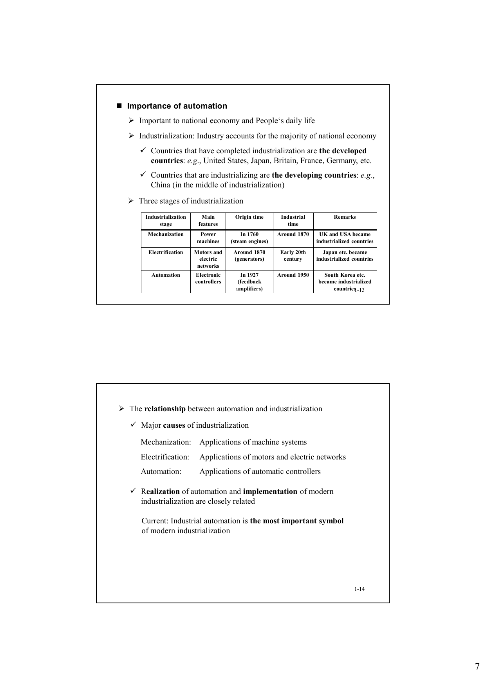
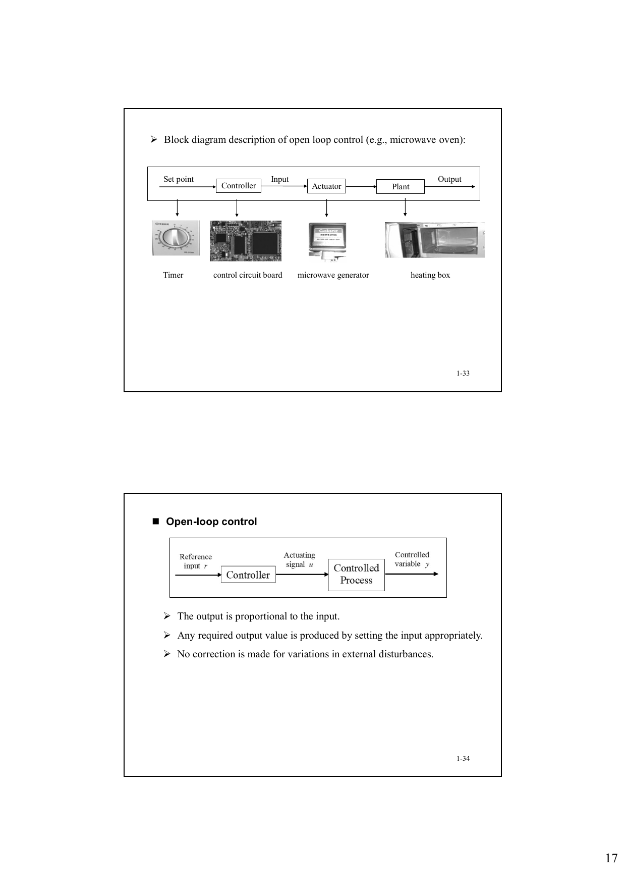
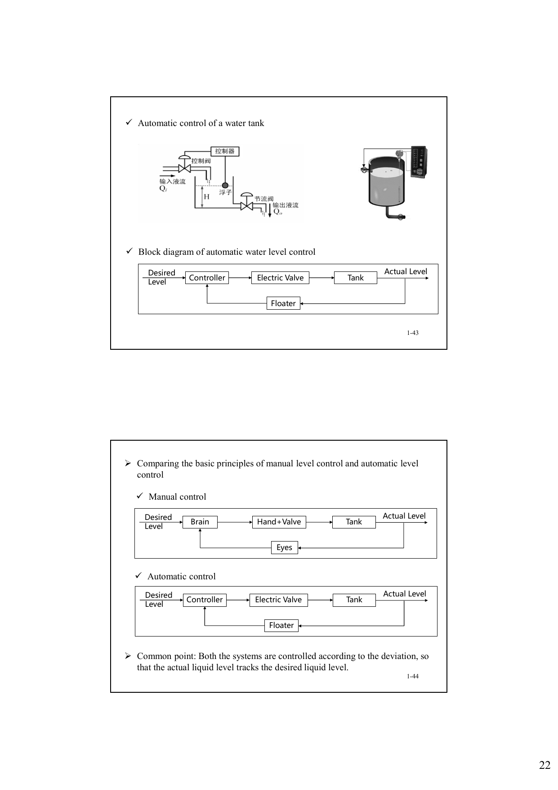
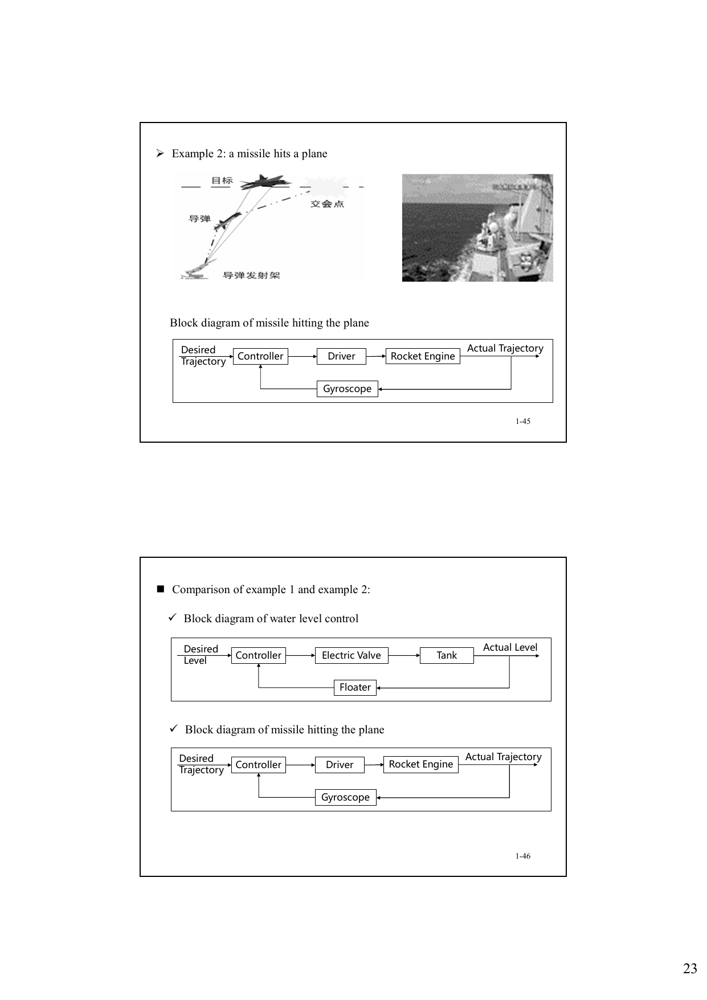
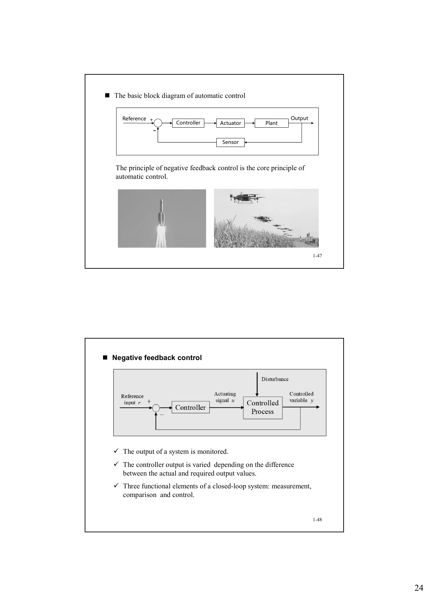
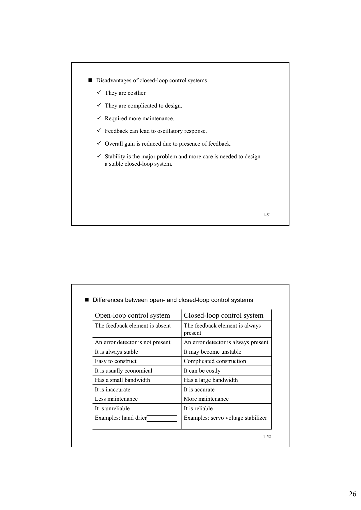
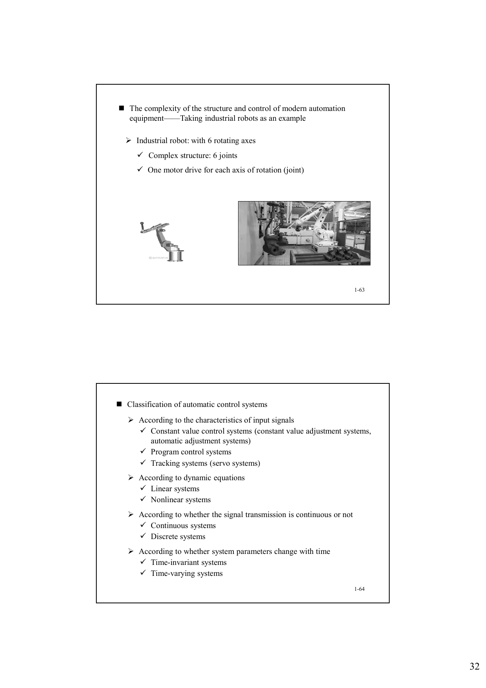
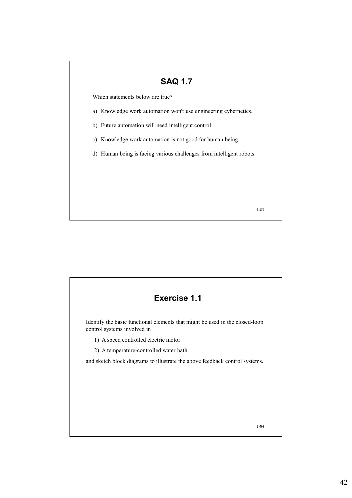

# SDM263 自动控制理论 Chapter 1: Introduction to Automation

来源：`SDM263-ACT-Chapter1-Introduction-BW.pdf`

## 本讲内容

本章是自动控制理论的导论，目标不是立即进入数学建模，而是先建立几个基本问题：

- 什么是自动化，自动化为什么重要
- 自动化的发展历史与自动控制的里程碑
- 如何实现自动化：开环控制与闭环控制
- 控制系统由哪些基本部分构成
- 未来自动化，尤其是知识工作自动化，会如何发展

---

## 1.1 What Is Automation

### 自动化就在日常生活中

课件从身边的例子引入自动化：全自动洗衣机、自动相机、微波炉、电饭煲、笔记本电脑等。它们的共同点是：某些动作或过程不再需要人直接持续参与，而是由设备、算法或系统按预设目标执行。

自动化与国民经济的三大产业密切相关：

| 产业 | 对应自动化类型 |
|---|---|
| 第一产业 | 农业自动化 |
| 第二产业 | 工业自动化 |
| 第三产业 | 服务自动化 |

其中工业自动化起步最早、应用最广、对人类生产方式影响最大。

### 工业自动化

工业自动化主要体现在自动化生产线中。不同制造业产品对应不同类型的自动生产线：

- 离散制造：汽车、机械、计算机、手机主板等生产线
- 流程制造：冶金、化工、食品、医药等生产线

离散制造更强调单件产品、装配和工序流转；流程制造更强调连续物料、反应过程和工艺参数控制。

### 服务、军事与航天自动化

服务自动化起步较晚，但发展潜力大、覆盖范围广。典型场景包括医院、交通、智能家居、智能交通灯、电子收费系统等。服务自动化的作用主要是提高效率与服务质量，并降低服务成本，尤其适用于人口老龄化和劳动力成本上升的背景。

军事自动化是自动控制最早的重要应用领域之一。例如精确制导武器可以自动搜索、跟踪、识别、选择和打击目标；自动火炮可以接收目标信息后快速射击。航天工程同样广泛依赖自动化，如飞船与轨道舱自动对接、月球探测等。

### 自动化的定义

自动化指的是：一个设备、过程或系统在没有人直接参与的情况下，通过自动检测、信息处理、分析、决策和操纵控制，实现预期目标。

这个定义中有几个关键词：

- 自动检测：获取系统状态或环境信息
- 信息处理与分析：把测量数据转化为可用判断
- 决策：确定接下来该采取什么动作
- 操纵控制：通过执行机构影响被控对象
- 预期目标：自动化不是“自己动”，而是为了实现明确目标

### 自动化的作用

自动化的作用可以概括为三类：

- 做人做不到的事情：如管道机器人、高压线巡检机器人、水下机器人
- 把人从繁重和危险工作中解放出来：如采矿、核电站巡检、消防、反恐
- 提高质量、效率和可靠性：工业生产中尤其明显

### 自动化与工业化

自动化不仅影响生活便利性，也是现代工业化的重要标志。课件把工业化分成三个阶段：机械化、电气化、自动化。



| 工业化阶段 | 主要特征 | 起源时间 | 工业化时间 | 备注 |
|---|---|---|---|---|
| 机械化 | 动力机器 | 1760 年左右，蒸汽机 | 1870 年左右 | 英国、美国等成为工业化国家 |
| 电气化 | 电机与电力网络 | 1870 年左右，发电机 | 20 世纪初 | 日本等成为工业化国家 |
| 自动化 | 电子控制器 | 1927 年，反馈放大器 | 1950 年左右 | 韩国等进入工业化 |

三者的关系可以理解为：

- 机械化：机器系统的应用
- 电气化：电机与电力网络的应用
- 自动化：自动控制器的应用

现代工业化的实现与自动化密切相关，工业自动化是现代工业化最重要的标志之一。

---

## 1.2 History of Automation

### 古代自动化思想与装置

自动化并不是现代才出现的思想。课件列举了若干早期例子：

- 中国西汉时期的自动计时漏壶
- 张衡在公元 132 年发明的地动仪，用于自动测量地震
- 自动指示方向的指南车

这些装置虽然没有现代控制理论，但已经体现了“检测、响应、按目标运行”的自动化思想。

### 近现代自动控制里程碑

自动控制的发展与工业革命、电子技术、计算机、航天和网络技术密切相关。

重要节点包括：

- 1788 年：Watt 发明蒸汽机离心调速器，这是自动控制的里程碑。
- 1926 年：美国出现第一条汽车自动生产线。
- 1927 年：H. S. Black 提出用于改善放大器性能的负反馈方法。
- 1928 年：MIT 研制第一台大型机械模拟计算机。
- 1946 年：美国研制世界第一台电子数字计算机。
- 1957 年：苏联发射世界第一颗人造卫星。
- 1959 年：第一台工业机器人出现。
- 1981 年：美国发射“哥伦比亚”号航天飞机。
- 2003 年：中国成功发射“神舟五号”载人飞船。
- 1990s：互联网兴起。
- 2010s：物联网兴起。

### 自动控制系统的发展阶段

课件总结了自动控制系统的几个阶段：

| 时期 | 发展重点 | 代表内容 |
|---|---|---|
| 1769 左右 | 机械方式自动控制 | James Watt 飞球调速器 |
| 1915-1940 | 控制基本概念形成 | 反馈控制 |
| 1940-1950 | 数学理论体系形成 | PID、经典控制理论 |
| 1950-1980 | 数字计算机推动发展 | 现代控制、数字计算机控制 |
| 1980 以后 | AI 与网络推动快速发展 | 高级控制、智能控制、网络化控制 |

### 控制论与工程控制论

控制论是自动化科学的一般理论，可分为：

- 工程控制论
- 生物控制论
- 经济控制论等

现代自动化的大量成果建立在工程控制论基础上。1954 年，钱学森出版英文著作 *Engineering Cybernetics*，这是工程控制论的奠基性工作。

---

## 1.3 How to Automate

### 什么是控制系统

控制系统的例子包括：

- 建筑物温度控制
- 汽车与飞机控制
- 制造过程控制
- 人体运动控制

控制系统通过一定的控制策略实现某些目标。课件给出的定义是：控制系统是由若干部件相互连接形成的系统结构，这些部件包括过程、控制器和仪表等，它们共同提供期望的系统响应。

其中：

- Process / Plant：被控制的对象或过程
- Controller：产生控制动作的部件
- Instrumentation / Sensor：测量、检测或反馈信息的部件

### 为什么要学习控制系统

工业系统的自动控制能够带来：

- 更低成本的产品
- 更可靠、更高质量的产品
- 对市场变化的快速适应

控制系统广泛存在于家电、通信系统、过程工业、军事、航空、3D 打印等应用中。

### 控制方法 1：开环控制

开环控制是最基本的自动控制方式之一，也常被称为前馈控制。典型例子是固定周期的交通灯、按时间加热的微波炉。

开环控制的基本结构是：

```text
Set point / Reference input -> Controller -> Actuator -> Plant -> Output
```



开环控制的特点：

- 输出与输入成比例或按预设关系变化。
- 想得到某个输出，就设置相应输入。
- 不根据实际输出修正外部扰动造成的偏差。

#### 例：直流电机速度开环控制

在恒定负载下，直流电机转速与施加电压近似成比例。给定电压时，只要负载不变，速度就近似保持不变；如果负载变化，速度也会变化。

因此，开环控制适合以下情况：

- 负载变化不大
- 对速度精度要求不高
- 输出难以测量或无需精确反馈

例如输送带电机可以采用这种控制方式。

#### 开环控制的实际例子

- 烘手机：只要手在机器下方，热风就会吹出，不管手是否已经干了。
- 自动洗衣机：按预设程序运行，不实时判断衣服是否真正洗净。
- 面包机、微波炉：加热时间由设定决定，不必然根据食物实际状态修正。

#### 开环控制的优缺点

优点：

- 结构和设计简单
- 成本低
- 维护容易
- 一般较稳定
- 当输出难以测量时使用方便

缺点：

- 精度低
- 可靠性较差
- 输出变化无法自动纠正

典型问题包括：固定时间交通灯无法根据实时车流清空拥堵；微波炉加热时间过长会把食物烤糊。

开环控制偏离目标的根本原因是：从给定量到被控量是单向作用，没有误差修正机制。要克服这个缺点，需要让控制器根据实际效果持续修正偏差，也就是引入反馈控制。

### 控制方法 2：闭环控制

闭环控制是自动控制的第二种基本方式。它的核心是反馈：测量实际输出，将其与期望输出比较，根据偏差调整控制动作。

#### 例：水箱水位控制

控制目标：保持水位在某个高度。

控制手段：调节控制阀开度。

主要部件：

- 控制阀：控制输入水流
- 节流阀：影响输出水流
- 浮子：显示或测量水位
- 控制器：根据水位偏差调整控制阀



人工水位控制与自动水位控制本质上具有相同结构：

| 功能 | 人工控制 | 自动控制 |
|---|---|---|
| 目标 | Desired Level | Desired Level |
| 控制器 | Brain | Controller |
| 执行机构 | Hand + Valve | Electric Valve |
| 被控对象 | Tank | Tank |
| 测量反馈 | Eyes | Floater |

共同点是：两者都根据偏差控制，使实际水位跟踪期望水位。

#### 例：导弹击中飞机

导弹控制同样可以抽象为闭环系统：

- 期望轨迹：Desired Trajectory
- 控制器：根据偏差生成控制指令
- 驱动器与火箭发动机：执行控制动作
- 陀螺仪：提供姿态或轨迹反馈
- 实际轨迹：Actual Trajectory

水箱控制和导弹控制的物理对象完全不同，但框图结构相似，这说明控制理论关注的是系统结构与信息流，而不只是具体设备。



### 自动控制的基本框图与负反馈

自动控制的基本闭环结构如下：

```text
Reference -> (+/- comparison) -> Controller -> Actuator -> Plant -> Output
                         ^                              |
                         |---------- Sensor ------------|
```



负反馈控制是自动控制的核心原则。其含义是：

- 监测系统输出。
- 将实际输出与期望输出比较。
- 控制器根据两者差值调整控制动作。
- 闭环系统包含三个基本功能：测量、比较、控制。

#### 闭环控制的实际例子

- 自动电熨斗：根据熨斗输出温度控制加热元件。
- 伺服稳压器：根据输出电压调节控制器动作。
- 水位控制器：根据水库或水箱水位控制输入水流。
- 雷达跟踪导弹：比较目标位置与导弹位置来控制导弹方向。
- 空调：根据室温控制制冷或制热动作。
- 汽车巡航控制：比较期望速度与实际速度来调整动力输出。

#### 闭环控制的优缺点

优点：

- 能减小偏差
- 能抵抗一定外部扰动
- 控制精度通常更高
- 输出变化可以被反馈并修正

缺点：

- 成本更高
- 设计更复杂
- 维护要求更高
- 反馈可能导致振荡响应
- 反馈会降低总体增益
- 稳定性是主要设计问题，需要特别关注



开环与闭环的关键差异：

| 维度 | 开环控制 | 闭环控制 |
|---|---|---|
| 反馈元件 | 没有 | 总是存在 |
| 误差检测 | 没有误差检测器 | 有误差检测器 |
| 稳定性 | 通常稳定 | 可能不稳定 |
| 结构 | 容易构造 | 更复杂 |
| 成本 | 通常经济 | 可能成本较高 |
| 带宽 | 较小 | 较大 |
| 精度 | 不准确 | 准确 |
| 维护 | 较少 | 较多 |
| 可靠性 | 较低 | 较高 |

注意：闭环控制并不“绝对优于”开环控制。控制方式的选择取决于精度要求、扰动大小、成本、测量难度和稳定性要求。

---

## 1.4 Control Systems

### 控制系统的基本组成

控制系统的主要组成包括：

- 控制目标：Objectives of control
- 被控系统：Controlled system，也称 Plant 或 Process
- 结果：Results，也称输出或被控变量

目标通常对应输入，结果通常对应输出。

进一步分解，控制系统的基本组件包括：

| 组件 | 含义 |
|---|---|
| Setpoint / Reference | 被控变量的期望值或期望范围 |
| Sensors | 测量影响系统的变量 |
| Controller | 控制计算或控制算法 |
| Actuators | 根据控制计算结果调节系统的执行方式 |
| Plant | 被控制的物理过程或对象 |

控制工程还需要考虑通信、计算、体系结构和接口等问题。

### Plant：被控过程

Plant 是要控制的物理对象或过程。Plant 的物理布局本身就是控制问题的一部分，因为布局会影响：

- 信息如何被测量
- 扰动如何进入系统
- 执行机构如何影响过程
- 响应速度与稳定性

### Actuators：执行机构

执行机构的作用是驱动系统，把过程从当前状态推向期望状态。它们是控制动作真正作用到物理世界的接口。

### Design objectives：设定值与控制目标

控制设计目标回答“想实现什么”。例如：

- 降低能耗
- 提高产量
- 控制哪些变量才能实现目标
- 需要达到怎样的性能水平，如精度、速度、响应时间

### Controller：控制器

控制器输出的是操纵过程的变量。控制器输入通常包括：

- 期望输出值
- 实际输出测量值
- 可能的扰动信息或系统状态

控制器是闭环控制系统的关键部件，但不能孤立地看：传感器提供信息，执行机构提供作用能力，控制器负责策略。

### Sensors, Actuators, Control

课件用一句话总结控制系统：

> Sensors provide the eyes and actuators the muscle, but control science the finesse (strategy).

可以理解为：

- 更好的传感器提供更好的“视觉”
- 更好的执行机构提供更强的“肌肉”
- 更好的控制策略把传感器和执行机构以更智能的方式结合起来

### 系统的层级与复杂性

系统是非常宽泛的概念，可以小到水箱水位控制系统、电机速度控制系统，也可以大到包含成百上千设备的自动生产线、自动化车间、CIMS 和 CIPS。

现代自动化系统通常是大系统，常被分解为：

```text
大系统 -> 子系统 -> 子子系统 / 设备
```

以工业机器人为例，结构和控制都很复杂。一个 6 轴工业机器人有 6 个旋转关节，每个关节通常由一个电机驱动。

### 自动控制系统的分类



按输入信号特点分类：

- 恒值控制系统：又称恒值调节系统、自动调节系统
- 程序控制系统
- 跟踪系统：又称伺服系统

按动态方程分类：

- 线性系统
- 非线性系统

按信号传输是否连续分类：

- 连续系统
- 离散系统

按系统参数是否随时间变化分类：

- 时不变系统
- 时变系统

### 控制系统应用例子

课件列举了瓶装啤酒生产线和钢铁轧制自动化生产线：

- 啤酒厂灌装：瓶子自动运输，液体自动开关流入
- 过程制造自动化：如带钢轧制生产线

这些例子强调一点：控制系统不是只存在于单个设备中，也存在于整个生产流程中。

---

## 1.5 Future of Automation

### 身边将发生的自动化

未来自动化会出现在更多日常场景中，例如智能家居。有些自动化已经实现，但还不成熟或成本过高，尚未普及；另一些自动化会在未来 10 到 30 年逐渐成熟并普及。

### 从物理过程自动化到知识工作自动化

当前自动化主要是物理过程自动化，其理论基础主要是工程控制论。它利用信息促进质量和能量的转化。

未来自动化的新领域包括：

- 可能基于生物控制论的生命过程自动化
- 涉及思维过程的知识工作自动化

知识工作自动化可以理解为自动化“思维过程”。课件给出三个典型事件：

#### Case 1：IBM Deep Blue

1997 年，IBM Deep Blue 首次击败世界排名第一的国际象棋棋手 Kasparov，是知识工作自动化的重要里程碑。

Deep Blue 是 IBM 的超级国际象棋计算机，可以每秒计算 2 亿步。它不是像人类一样理解棋局，而是通过强大的搜索与评估实现决策自动化。

#### Case 2：AlphaGo

AlphaGo 由 Google DeepMind 开发，主要技术基础是人工智能中的深度学习。

重要事件：

- 2016 年 3 月以 4:1 击败围棋世界冠军李世石
- 2017 年 5 月以 3:0 击败世界排名第一的柯洁
- 与中日韩围棋高手对弈 60 局全胜

AlphaGo 表明，知识工作自动化已经可以超越人类专业水平。

#### Case 3：ChatGPT、Sora、DeepSeek

ChatGPT 是由人工智能技术驱动的自然语言处理工具，能够进行对话、写作、问答与信息处理。Sora 的代表能力是从文本生成视频。DeepSeek 是基于 Transformer 架构开发的大语言模型算法，2024 年 4 月发布，具有与 ChatGPT 相似的功能，且成本更低。

### 知识工作自动化与物理过程自动化的区别

| 类型 | 给定量与被控量 |
|---|---|
| 物理过程自动化 | 物理量，如温度、速度、位置、压力 |
| 知识工作自动化 | 形式化目标，如“回家”“写报告”“赢棋” |

未来的重要方向是二者结合。

#### 例：无人驾驶汽车

无人驾驶汽车的总目标可以是“回家”，这是形式化目标。系统需要通过知识工作自动化把这个目标分解为具体驾驶目标，再通过物理过程自动化实现加速、减速、转向等动作。

#### 例：智能机器人

智能机器人同样需要把高层目标转化为可执行动作。它既涉及感知、规划、语言理解等知识工作自动化，也涉及运动控制、力控制、轨迹跟踪等物理过程自动化。

### 知识工作自动化对学生的影响

智能手机和计算机已经在很多知识工作中引入自动化，例如多语言翻译、语音与文字互转等。全球突破性技术影响调查显示，知识工作自动化的重要性仅次于移动互联网。

未来自动化会把物理过程自动化与思维过程自动化结合起来，例如知识工作自动化和智能控制。它会深刻改变世界，也会改变每个人的学习与工作方式。

---

## 本章小结

- 自动化是通过检测、信息处理、决策和控制，在无人直接参与的情况下实现目标。
- 工业自动化是现代工业化的重要标志，服务自动化和知识工作自动化正在快速发展。
- 开环控制结构简单、成本低，但不能根据输出偏差自动修正。
- 闭环控制通过反馈修正误差，是自动控制的核心结构，但要面对成本、复杂度和稳定性问题。
- 控制系统通常由设定值、传感器、控制器、执行机构和被控对象组成。
- 未来自动化会把物理过程自动化与知识工作自动化结合起来，智能控制会更加重要。

---

## SAQ 与课后题

### SAQ 1.1

**原题：** Select incorrect statements in the following:

- a) Automation is popular around us.
- b) Military automation is one of three major types of automation.
- c) Automation technology makes people lazy.
- d) Automation played a key role in electrification in early 20th century.

**解答：** b、c、d 错误。

- a 正确：课件开头列举了洗衣机、相机、微波炉、电饭煲等日常自动化例子。
- b 错误：按三大产业划分，三类自动化是农业自动化、工业自动化、服务自动化；军事自动化是重要应用领域，但不是这里说的三大类型之一。
- c 错误：自动化的作用是让人从繁重、危险或低效工作中解放出来，并提升质量与效率，不是“让人懒惰”。
- d 错误：电气化阶段的主要推动因素是电机与电力网络；自动化对应后续阶段，核心是自动控制器。

### SAQ 1.2

**原题：** Which is correct in the following?

- a) Automation science does not need Shannon's information theory.
- b) Automatic control has had less impact on development and advancement of modern civilisation and technology.
- c) Wiener's cybernetics is as important as engineering cybernetics.
- d) Automatic control has a long history beginning in the 18th century.

**解答：** c、d 正确。

- a 错误：自动化科学与信息获取、传输、处理密切相关，不能说不需要 Shannon 信息论。
- b 错误：自动控制对现代文明和技术发展影响很大。
- c 正确：Wiener 的控制论与工程控制论都是自动化科学的重要理论基础。
- d 正确：现代自动控制的重要里程碑可追溯到 18 世纪 Watt 蒸汽机离心调速器。

### SAQ 1.3

**原题：** Which statement below is true?

- a) An air conditioner is an open-loop control system.
- b) An open-loop control system is unreliable and should not be used in practice.
- c) No correction is made for variations in external disturbances in a feed-forward control system.
- d) Open-loop control is not able to achieve some desired objectives.

**解答：** c 正确。

- a 错误：空调通常根据室温反馈调节制冷或制热动作，属于闭环控制例子。
- b 错误：开环控制虽然精度和抗扰能力较差，但结构简单、成本低，在很多场景仍可使用。
- c 正确：前馈/开环控制不根据实际输出偏差修正外部扰动造成的变化。
- d 错误：开环控制可以实现某些目标，只是不适合扰动大或精度要求高的场景。

### SAQ 1.4

**原题：** Which statement is true in the following?

- a) Closed-loop control is absolutely better than open-loop control.
- b) An automatic tea/coffee maker is a closed-loop control system.
- c) Closed-loop control can reject external disturbances.
- d) Manual control is always closed-loop control.

**解答：** c 正确。

- a 错误：闭环不绝对优于开环；选择控制方式要看成本、精度、扰动、测量难度和稳定性要求。
- b 错误：课件把 tea maker 作为开环控制例子；若只是按预设程序运行，不根据输出反馈修正，就是开环。
- c 正确：闭环控制通过反馈修正偏差，因此能抑制一定外部扰动。
- d 错误：人工控制不一定总是闭环；只有人根据实际输出持续观察并修正动作时才体现闭环结构。

### SAQ 1.5

**原题：** Which is correct in the following?

- a) The components of a control system include measurement but no sensors.
- b) The 'Objectives of control' is not a part of a control system.
- c) A control system considers uncertainties.
- d) The controller is not an important part of a control system.

**解答：** c 正确。

- a 错误：测量通常需要传感器，传感器是控制系统基本组件之一。
- b 错误：控制目标是控制系统的重要组成，通常对应输入或设定值。
- c 正确：控制系统设计需要考虑扰动、不确定性和实际输出偏差。
- d 错误：控制器是闭环控制系统的关键组成。

### SAQ 1.6

**原题：** Which is true in the following?

- a) The actuators of a closed-loop system is more important than its sensors.
- b) The controller plays a key role in a closed-loop system.
- c) A linear system must be a continuous system.
- d) A control system should have sensors.

**解答：** b、d 正确。

- a 错误：执行器与传感器承担不同功能，不能简单说执行器更重要；闭环控制离不开反馈测量。
- b 正确：控制器根据目标与反馈计算控制动作，在闭环系统中起关键作用。
- c 错误：线性/非线性与连续/离散是不同分类维度，线性系统不一定是连续系统。
- d 正确：控制系统通常需要传感器或测量环节来获得系统状态，闭环系统尤其如此。

### SAQ 1.7

**原题：** Which statements below are true?

- a) Knowledge work automation won't use engineering cybernetics.
- b) Future automation will need intelligent control.
- c) Knowledge work automation is not good for human being.
- d) Human being is facing various challenges from intelligent robots.



**解答：** b、d 正确。

- a 错误：知识工作自动化并不意味着完全不使用工程控制论；未来更可能是物理过程自动化与知识工作自动化结合。
- b 正确：未来自动化会需要智能控制。
- c 错误：课件没有把知识工作自动化简单判定为“对人类不好”。
- d 正确：智能机器人和知识工作自动化会给人类带来多种挑战。

### Exercise 1.1

**原题：** Identify the basic functional elements that might be used in the closed-loop control systems involved in

1. A speed controlled electric motor
2. A temperature-controlled water bath

and sketch block diagrams to illustrate the above feedback control systems.

**解答：**

#### 1. Speed controlled electric motor

| 功能 | 可能元素 |
|---|---|
| Reference | 期望转速 |
| Comparator | 比较器，计算期望转速与实际转速的误差 |
| Controller | 速度控制器 |
| Actuator | 电机驱动器 / 功率放大器 |
| Plant | 电机与负载 |
| Sensor | 转速传感器 / 编码器 / 测速发电机 |
| Output | 实际转速 |

反馈框图：

```text
期望转速 -> 比较器 -> 速度控制器 -> 电机驱动器 -> 电机+负载 -> 实际转速
              ^                                      |
              |--------- 转速传感器反馈 -------------|
```

解释：系统将实际转速反馈回来，与期望转速比较。若负载变化导致转速下降，误差增大，控制器会调整驱动电压或电流，使转速回到目标值附近。

#### 2. Temperature-controlled water bath

| 功能 | 可能元素 |
|---|---|
| Reference | 期望水温 |
| Comparator | 比较器，计算期望温度与实际温度的误差 |
| Controller | 温度控制器 |
| Actuator | 加热器 / 功率调节器 |
| Plant | 水浴槽及其中的水 |
| Sensor | 温度传感器 |
| Output | 实际水温 |

反馈框图：

```text
期望温度 -> 比较器 -> 温度控制器 -> 加热器 -> 水浴槽 -> 实际水温
              ^                              |
              |--------- 温度传感器反馈 -----|
```

解释：温度传感器测得实际水温并反馈给控制器。若实际水温低于设定温度，控制器增强加热；若高于设定温度，控制器减小或停止加热，从而维持水温。
