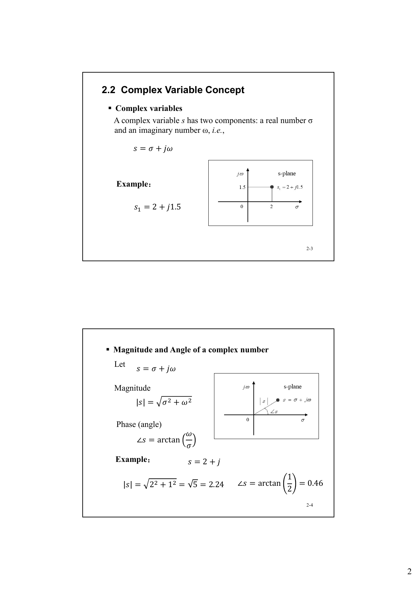
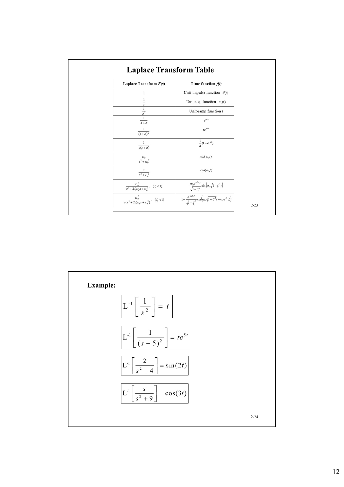
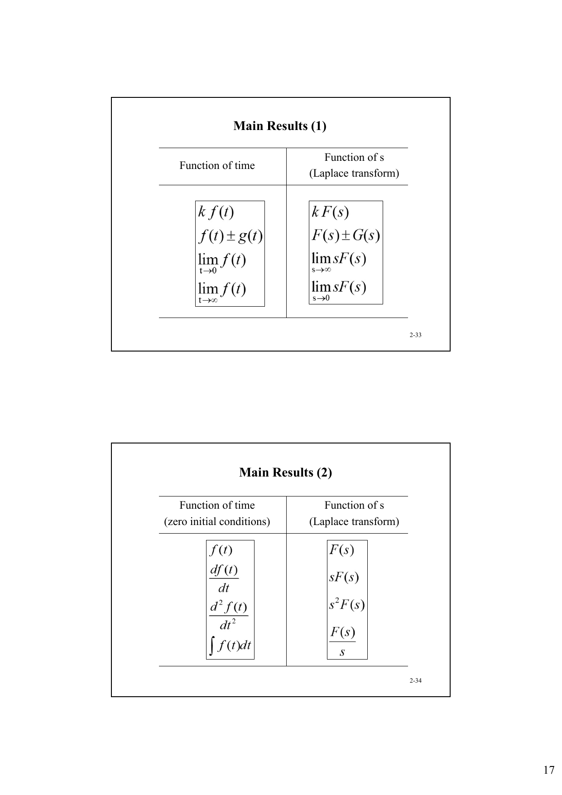

# 自动控制 class2 数学基础

> 来源：`SDM263-ACT-Chapter2-Maths-BW.pdf`

## 本讲内容

- 复变量与复函数：复数的表示、模、相角、基本运算。
- 传递函数相关概念：复函数、零点、极点。
- 微分方程：工程系统的数学建模形式。
- Laplace 变换：定义、反变换、常用变换表、基本运算技巧。
- Laplace 变换应用：由 s 域表达式或微分方程求时间响应。

## 2.1 Introduction

控制系统分析依赖应用数学。课程中使用数学工具的核心目的，是让设计者不必完全依赖实验或大规模仿真，也能对控制系统设计得到相对可预测、可靠的分析结果。

本章需要的数学背景包括：

- complex variables
- differential equations
- Laplace transform

## 2.2 Complex Variable Concept

### 复变量

复变量 `s` 由实部和虚部构成：

$$
s=\sigma+j\omega
$$

其中：

- `sigma` 是实部；
- `omega` 是虚部；
- `j` 是虚数单位。

例：

$$
s_1=2+j1.5
$$

复变量可以放在 `s-plane` 中理解：横轴为 `sigma`，纵轴为 `j omega`。

### 复数的模与相角

设：

$$
s=\sigma+j\omega
$$

模：

$$
|s|=\sqrt{\sigma^2+\omega^2}
$$

相角：

$$
\angle s=\arctan \left(\frac{\omega}{\sigma}\right)
$$

例：若 `s = 2 + j`，

$$
|s|=\sqrt{2^2+1^2}=\sqrt{5}=2.24
$$

$$
\angle s=\arctan\left(\frac{1}{2}\right)=0.46
$$

### 复数运算

设：

$$
s_1=\sigma_1+j\omega_1,\quad s_2=\sigma_2+j\omega_2
$$

加法：

$$
s_1+s_2=(\sigma_1+\sigma_2)+j(\omega_1+\omega_2)
$$

减法：

$$
s_1-s_2=(\sigma_1-\sigma_2)+j(\omega_1-\omega_2)
$$

乘法：

$$
\begin{aligned}
s_1s_2
&=(\sigma_1+j\omega_1)(\sigma_2+j\omega_2)\\
&=\sigma_1\sigma_2-\omega_1\omega_2+j(\sigma_1\omega_2+\omega_1\sigma_2)
\end{aligned}
$$

除法使用共轭复数化简：

$$
\frac{s_1}{s_2}
=\frac{(\sigma_1+j\omega_1)(\sigma_2-j\omega_2)}{\sigma_2^2+\omega_2^2}
$$

整理后：

$$
\frac{s_1}{s_2}
=\frac{\sigma_1\sigma_2+\omega_1\omega_2}{\sigma_2^2+\omega_2^2}
+j\frac{\omega_1\sigma_2-\sigma_1\omega_2}{\sigma_2^2+\omega_2^2}
$$

### 复变量函数

如果对每一个 `s` 的取值，都有一个或多个对应的 `G(s)`，则称 `G(s)` 是复变量 `s` 的函数。

例：

$$
G(s)=s^2+3s+2
$$

$$
G(s)=\frac{1}{s(s+1)}
$$

复函数可以写为实部与虚部：

$$
G(s)=\operatorname{Re}\{G(s)\}+j\operatorname{Im}\{G(s)\}
$$

例：

$$
G(s)=\frac{1}{s}=\frac{1}{\sigma+j\omega}
$$

用共轭复数化简：

$$
\begin{aligned}
G(s)
&=\frac{\sigma-j\omega}{(\sigma+j\omega)(\sigma-j\omega)}\\
&=\frac{\sigma-j\omega}{\sigma^2+\omega^2}\\
&=\frac{\sigma}{\sigma^2+\omega^2}-j\frac{\omega}{\sigma^2+\omega^2}
\end{aligned}
$$

所以：

$$
\operatorname{Re}\{G(s)\}=\frac{\sigma}{\sigma^2+\omega^2}
$$

$$
\operatorname{Im}\{G(s)\}=-\frac{\omega}{\sigma^2+\omega^2}
$$

### 极点

若函数 `G(s)` 在 `s=s_i` 处满足：

$$
\lim_{s\to s_i}(s-s_i)G(s)
$$

为有限且非零的值，则称 `G(s)` 在 `s=s_i` 处有一个 simple pole。

例：

$$
G(s)=\frac{10(s+2)(s+4)}{(s+1)(s+3)}
$$

它在：

$$
s_1=-1,\quad s_2=-3
$$

处有 simple poles。

验证：

$$
\begin{aligned}
\lim_{s\to -1}(s+1)G(s)
&=\lim_{s\to -1}(s+1)\frac{10(s+2)(s+4)}{(s+1)(s+3)}\\
&=\lim_{s\to -1}\frac{10(s+2)(s+4)}{s+3}\\
&=15
\end{aligned}
$$

同理：

$$
\lim_{s\to -3}(s+3)G(s)=5
$$

一般地，`G(s)` 的极点是分母的根。

### 零点

若函数 `G(s)` 在 `s=s_i` 处满足：

$$
\lim_{s\to s_i}\frac{G(s)}{s-s_i}
$$

为有限且非零的值，则称 `G(s)` 在 `s=s_i` 处有一个 simple zero。

例：

$$
G(s)=\frac{10(s+2)(s+4)}{(s+1)(s+3)}
$$

它在：

$$
s_1=-2,\quad s_2=-4
$$

处有 simple zeros。

验证：

$$
\begin{aligned}
\lim_{s\to -2}\frac{G(s)}{s+2}
&=\lim_{s\to -2}\frac{10(s+4)}{(s+1)(s+3)}\\
&=-20
\end{aligned}
$$

同理：

$$
\lim_{s\to -4}\frac{G(s)}{s+4}=-\frac{20}{3}
$$

一般地，`G(s)` 的零点是分子的根。

## 2.3 Differential Equations

工程中的很多系统都可以由微分方程建模。微分方程通常包含因变量的导数或积分。

例：串联 RLC 电路可表示为：

$$
L\frac{d^2i(t)}{dt^2}+R\frac{di(t)}{dt}+\frac{1}{C}i(t)=\frac{de(t)}{dt}
$$

这是二阶微分方程。

### n 阶系统的微分方程

n 阶系统的微分方程一般写作：

$$
\frac{d^ny(t)}{dt^n}
+a_{n-1}\frac{d^{n-1}y(t)}{dt^{n-1}}
+\cdots
+a_1\frac{dy(t)}{dt}
+a_0y(t)
=f(t)
$$

如果系数 `a0, a1, ..., a_{n-1}` 不是 `y(t)` 的函数，则该方程是 linear ordinary differential equation。

例：三阶常微分方程：

$$
\frac{d^3y(t)}{dt^3}
+6\frac{d^2y(t)}{dt^2}
+11\frac{dy(t)}{dt}
+6y(t)
=2\sin t
$$

## 2.4 Laplace Transform

Laplace 变换是求解线性常微分方程的重要工具。

它的作用路径是：

1. 将时域微分方程转换为 s 域代数方程。
2. 在 s 域中用代数规则求解。
3. 通过 inverse Laplace transform 得到时域解。

### Laplace 变换定义

给定实函数 `f(t)`，若它满足：

$$
\int_0^\infty f(t)e^{-\sigma t}dt<\infty
$$

对某个有限实数 `sigma` 成立，则 `f(t)` 的 Laplace 变换定义为：

$$
F(s)=\int_0^\infty f(t)e^{-st}dt
$$

记作：

$$
F(s)=L[f(t)]
$$

### 基本例子

单位阶跃函数：

$$
f(t)=
\begin{cases}
1, & t\ge 0\\
0, & t<0
\end{cases}
$$

其 Laplace 变换为：

$$
\begin{aligned}
F(s)
&=L[f(t)]\\
&=\int_0^\infty e^{-st}dt\\
&=-\frac{1}{s}e^{-st}\bigg|_0^\infty\\
&=\frac{1}{s}
\end{aligned}
$$

指数函数：

$$
f(t)=e^{-at},\quad t\ge 0
$$

其中 `a` 为实常数。其 Laplace 变换为：

$$
\begin{aligned}
F(s)
&=\int_0^\infty e^{-at}e^{-st}dt\\
&=-\frac{1}{s+a}e^{-(s+a)t}\bigg|_0^\infty\\
&=\frac{1}{s+a}
\end{aligned}
$$

### 反 Laplace 变换

给定 `F(s)`，求对应 `f(t)` 的过程称为 inverse Laplace transform，记作：

$$
f(t)=L^{-1}[F(s)]
$$

反变换可写为：

$$
L^{-1}[F(s)]=\frac{1}{2\pi j}\int_{c-j\infty}^{c+j\infty}F(s)e^{st}ds
$$

其中 `c` 是实常数，并且大于 `F(s)` 所有极点的实部。

### 常用 Laplace 变换表

| Laplace transform `F(s)` | Time function `f(t)` |
|---|---|
| `1` | `delta(t)`，单位冲激函数 |
| `1/s` | `u_s(t)`，单位阶跃函数 |
| `1/s^2` | `t`，单位斜坡函数 |
| `1/(s+a)` | `e^{-at}` |
| `1/(s+a)^2` | `te^{-at}` |
| `1/[s(s+a)]` | `(1/a)(1-e^{-at})` |
| `omega_n/(s^2+omega_n^2)` | `sin(omega_n t)` |
| `s/(s^2+omega_n^2)` | `cos(omega_n t)` |

公式较密的原表如下，包含二阶欠阻尼系统对应项：

表中例子：

$$
L^{-1}\left[\frac{1}{s^2}\right]=t
$$

$$
L^{-1}\left[\frac{1}{(s-5)^2}\right]=te^{5t}
$$

$$
L^{-1}\left[\frac{2}{s^2+4}\right]=\sin(2t)
$$

$$
L^{-1}\left[\frac{s}{s^2+9}\right]=\cos(3t)
$$

## Laplace 变换基本技巧

### Technique 1: 常数乘法

若 `F(s)=L[f(t)]`，`k` 为常数，则：

$$
L[kf(t)]=kF(s)
$$

例：

$$
L[5e^{-at}]=5L[e^{-at}]=5\frac{1}{s+a}=\frac{5}{s+a}
$$

### Technique 2: 和与差

若 `F(s)=L[f(t)]`，`G(s)=L[g(t)]`，则：

$$
L[f(t)\pm g(t)]=F(s)\pm G(s)
$$

例：

$$
\begin{aligned}
L[t-e^{-at}]
&=L[t]-L[e^{-at}]\\
&=\frac{1}{s^2}-\frac{1}{s+a}\\
&=\frac{-s^2+s+a}{s^2(s+a)}
\end{aligned}
$$

### Technique 3: 微分

若 `F(s)=L[f(t)]`，`f(0)` 是 `f(t)` 的初始值，则：

$$
L\left[\frac{df(t)}{dt}\right]=sF(s)-f(0)
$$

例：

$$
\begin{aligned}
L\left[\frac{de^{-at}}{dt}\right]
&=sL[e^{-at}]-e^0\\
&=\frac{s}{s+a}-1\\
&=-\frac{a}{s+a}
\end{aligned}
$$

零初始条件下，常用结果为：

$$
L\left[\frac{df(t)}{dt}\right]=sF(s)
$$

$$
L\left[\frac{d^2f(t)}{dt^2}\right]=s^2F(s)
$$

### Technique 4: 积分

若 `F(s)=L[f(t)]`，则：

$$
L\left[\int_0^t f(\tau)d\tau\right]=\frac{F(s)}{s}
$$

例：

$$
L\left[\int_0^t e^{-a\tau}d\tau\right]
=\frac{L[e^{-at}]}{s}
=\frac{1}{s(s+a)}
$$

### Technique 5: 初值定理

若 `F(s)=L[f(t)]`，则：

$$
\lim_{t\to 0}f(t)=\lim_{s\to\infty}sF(s)
$$

例：

$$
\lim_{t\to 0}e^{-t}
=\lim_{s\to\infty}s\frac{1}{s+1}
=\lim_{s\to\infty}\frac{s}{s+1}
=1
$$

### Technique 6: 终值定理

若 `F(s)=L[f(t)]`，则：

$$
\lim_{t\to\infty}f(t)=\lim_{s\to 0}sF(s)
$$

例：

$$
\lim_{t\to\infty}e^{-t}
=\lim_{s\to 0}s\frac{1}{s+1}
=\lim_{s\to 0}\frac{s}{s+1}
=0
$$

注意：终值定理需要系统满足终值存在的条件；若响应发散或持续振荡，不能直接使用。

### 主结果汇总

可以记为：

| Time function | Laplace transform |
|---|---|
| `k f(t)` | `k F(s)` |
| `f(t) ± g(t)` | `F(s) ± G(s)` |
| `lim_{t->0} f(t)` | `lim_{s->infty} sF(s)` |
| `lim_{t->infty} f(t)` | `lim_{s->0} sF(s)` |

零初始条件下：

| Time function | Laplace transform |
|---|---|
| `f(t)` | `F(s)` |
| `df(t)/dt` | `sF(s)` |
| `d^2f(t)/dt^2` | `s^2F(s)` |
| `∫ f(t)dt` | `F(s)/s` |

## 2.5 Applications of Laplace Transform

### 例 1：由 `F(s)` 求 `f(t)`

求 `F(s)` 的反变换：

$$
F(s)=\frac{10(s+2)}{s^3+8s^2+15s}
$$

先因式分解：

$$
\begin{aligned}
F(s)
&=\frac{10(s+2)}{s(s^2+8s+15)}\\
&=\frac{10(s+2)}{s(s+3)(s+5)}
\end{aligned}
$$

部分分式分解：

$$
F(s)=\frac{1.33}{s}+\frac{1.67}{s+3}-\frac{3}{s+5}
$$

反 Laplace 变换：

$$
f(t)=1.33+1.67e^{-3t}-3e^{-5t}
$$

### 例 2：微分方程求解

考虑零初始条件下的微分方程：

$$
\frac{d^2y(t)}{dt^2}+3\frac{dy(t)}{dt}+2y(t)=2u_s(t)
$$

其中 `u_s(t)` 是单位阶跃函数。

取 Laplace 变换：

$$
s^2Y(s)+3sY(s)+2Y(s)=\frac{2}{s}
$$

于是：

$$
Y(s)=\frac{2}{s(s^2+3s+2)}
$$

因式分解：

$$
Y(s)=\frac{2}{s(s+1)(s+2)}
$$

部分分式分解：

$$
Y(s)=\frac{1}{s}-\frac{2}{s+1}+\frac{1}{s+2}
$$

反变换得到：

$$
y(t)=u_s(t)-2e^{-t}+e^{-2t}
$$

对 `t >= 0`，也常写作：

$$
y(t)=1-2e^{-t}+e^{-2t}
$$

## 复习要点

- 复变量 `s = sigma + j omega`，模为 `sqrt(sigma^2 + omega^2)`，相角为 `arctan(omega/sigma)`。
- 传递函数的极点来自分母根，零点来自分子根。
- Laplace 变换把微分方程转为 s 域代数方程，是控制系统分析的基础工具。
- 零初始条件下，导数对应乘以 `s`，二阶导数对应乘以 `s^2`。
- 解微分方程的常规步骤是：取 Laplace 变换、整理 `Y(s)`、因式分解、部分分式分解、反变换。

## 练习题与解答

### SAQ 2.1

原题：Let `sigma = 1` and `omega = -1` for a complex number `s`. Which one is correct below?

A) `s = -1 + j`

B) `s = -j - 1`

C) `|s| = 2`

D) `angle s = -0.785`

解答：

$$
s=\sigma+j\omega=1-j
$$

$$
|s|=\sqrt{1^2+(-1)^2}=\sqrt{2}
$$

$$
\angle s=\arctan\left(\frac{-1}{1}\right)=-0.785
$$

答案：D。

### SAQ 2.2

原题：Given

$$
G(s)=\frac{1}{s+2}
$$

for `s1 = -1 + j`, then:

A) `Re{G(s1)} = -0.5`, `Im{G(s1)} = 0.5`

B) `Re{G(s1)} = 0.5`, `Im{G(s1)} = 0.5`

C) `Re{G(s1)} = -0.5`, `Im{G(s1)} = -0.5`

D) `Re{G(s1)} = 0.5`, `Im{G(s1)} = -0.5`

解答：

$$
G(s_1)=\frac{1}{(-1+j)+2}=\frac{1}{1+j}
$$

$$
\frac{1}{1+j}=\frac{1-j}{(1+j)(1-j)}=\frac{1-j}{2}=0.5-j0.5
$$

因此：

$$
\operatorname{Re}\{G(s_1)\}=0.5,\quad \operatorname{Im}\{G(s_1)\}=-0.5
$$

答案：D。

### SAQ 2.3

原题：Given

$$
G(s)=\frac{s-2}{s+2}
$$

then:

A) The pole is `-2`, the zero is `-2`.

B) The pole is `2`, the zero is `2`.

C) The pole is `-2`, the zero is `2`.

D) The pole is `2`, the zero is `-2`.

解答：极点来自分母根，零点来自分子根。

$$
s+2=0\Rightarrow s=-2
$$

$$
s-2=0\Rightarrow s=2
$$

所以极点为 `-2`，零点为 `2`。

答案：C。

### SAQ 2.4

原题：For

$$
2\frac{dy(t)}{dt}+3y(t)=1
$$

this equation is:

A) not an ordinary differential equation.

B) a first order ordinary differential equation.

C) a second order ordinary differential equation.

D) a third order ordinary differential equation.

解答：该方程中最高阶导数是：

$$
\frac{dy(t)}{dt}
$$

因此它是一阶常微分方程。

答案：B。

### SAQ 2.5

原题：For

$$
G(s)=\frac{1}{s^2-s}
$$

what is

$$
L^{-1}[G(s)]?
$$

A) `g(t) = 1 - e^t`

B) `g(t) = e^{-t} - 1`

C) `g(t) = 1 - e^{-t}`

D) `g(t) = e^t - 1`

解答：

$$
G(s)=\frac{1}{s^2-s}=\frac{1}{s(s-1)}
$$

部分分式分解：

$$
\frac{1}{s(s-1)}=-\frac{1}{s}+\frac{1}{s-1}
$$

反变换：

$$
L^{-1}[G(s)]=-1+e^t=e^t-1
$$

答案：D。

### SAQ 2.6

原题：What is

$$
\lim_{t\to\infty}\sin(t)\,t e^{-t}?
$$

A) `+infinity`

B) `1`

C) `0`

D) None of the above

解答：`sin(t)` 有界，且：

$$
\lim_{t\to\infty}te^{-t}=0
$$

因此：

$$
\lim_{t\to\infty}\sin(t)\,t e^{-t}=0
$$

答案：C。

### SAQ 2.7

原题：Consider

$$
2\frac{d^2y(t)}{dt^2}+2\frac{dy(t)}{dt}-12y(t)=12,\quad t\ge 0
$$

What is the solution of `y(t)`?

A) `y(t) = 0.6e^{2t} + 0.4e^{-3t} + 1`

B) `y(t) = 0.4e^{-2t} + 0.6e^{3t} - 1`

C) `y(t) = 0.6e^{2t} + 0.4e^{-3t} - 1`

D) `y(t) = 0.4e^{-2t} + 0.6e^{-3t} + 1`

解答：题目右侧常数输入可按阶跃输入理解：

$$
2\frac{d^2y(t)}{dt^2}+2\frac{dy(t)}{dt}-12y(t)=12u_s(t),\quad t\ge 0
$$

两边除以 2：

$$
\frac{d^2y(t)}{dt^2}+\frac{dy(t)}{dt}-6y(t)=6u_s(t)
$$

零初始条件下取 Laplace 变换：

$$
(s^2+s-6)Y(s)=\frac{6}{s}
$$

$$
Y(s)=\frac{6}{s(s-2)(s+3)}
$$

部分分式分解：

$$
Y(s)=-\frac{1}{s}+\frac{0.6}{s-2}+\frac{0.4}{s+3}
$$

反变换：

$$
y(t)=0.6e^{2t}+0.4e^{-3t}-1
$$

答案：C。

### Exercise 2.1

原题：Consider the differential equation with zero initial conditions:

$$
\frac{d^2y(t)}{dt^2}+5\frac{dy(t)}{dt}+6y(t)=6u_s(t)
$$

where `u_s(t)` is the unit-step function. Find the solution `y(t)` of the above equation using the Laplace transform.

解答：零初始条件下取 Laplace 变换：

$$
s^2Y(s)+5sY(s)+6Y(s)=\frac{6}{s}
$$

整理：

$$
Y(s)=\frac{6}{s(s^2+5s+6)}
$$

因式分解：

$$
Y(s)=\frac{6}{s(s+2)(s+3)}
$$

部分分式分解：

$$
Y(s)=\frac{1}{s}-\frac{3}{s+2}+\frac{2}{s+3}
$$

反 Laplace 变换：

$$
y(t)=1-3e^{-2t}+2e^{-3t}
$$
