# SDM263 自动控制理论 Chapter 3: Transfer Functions and Block Diagrams

来源：`SDM263-ACT-Chapter3-TransferF-BW.pdf`

## 本讲内容

本章讨论线性时不变系统的另一种建模方式：不直接使用微分方程，而使用传递函数、方块图和信号流图来描述输入输出关系。

- 为什么微分方程在复杂系统组合时不够方便
- 单位脉冲响应与传递函数的定义
- 传递函数的一般形式、极点、零点和典型环节
- 方块图的基本符号、串联、并联、反馈和等效变换
- 同时存在参考输入与扰动输入时的闭环输出
- 信号流图术语与 Mason 增益公式

---

## 3.1 Introduction

微分方程可以描述线性动态系统，但当多个模型组合成复杂系统时，直接把微分方程联立、消元并得到整体模型会很繁琐。传递函数为线性动态系统提供了更简单的组合方式：把系统看成输入与输出之间的算子，并在 Laplace 域中进行代数运算。

这一章默认讨论的是线性时不变系统（linear time-invariant system, LTI）。若系统不是 LTI，普通传递函数通常不适用。

---

## 3.2 Impulse Responses

单位脉冲函数可以理解为理想化的极窄、极高脉冲，其面积为 1。实际物理系统中无法产生真正的理想脉冲，通常用持续时间很短、面积接近 1 的实际脉冲来近似。

系统的脉冲响应（impulse response）是系统在单位脉冲输入作用下的输出，通常记为 $g(t)$。对 LTI 系统来说，脉冲响应包含了系统动态特性的完整信息，因此可以用它定义传递函数。

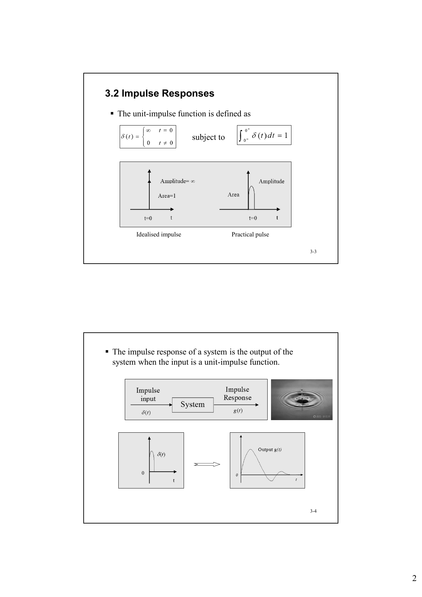

---

## 3.3 Transfer Functions

### 定义

线性时不变系统的传递函数定义为脉冲响应 $g(t)$ 的 Laplace 变换，且所有初始条件取零：

$$
G(s)=\mathcal{L}[g(t)]
$$

如果已知输入 $u(t)$ 和输出 $y(t)$ 的 Laplace 变换 $U(s)$、$Y(s)$，并且初始条件为零，则传递函数也可以写成：

$$
G(s)=\frac{Y(s)}{U(s)}
$$

例：若系统脉冲响应为 $g(t)=\sin(2t)$，则

$$
G(s)=\mathcal{L}[\sin(2t)]=\frac{2}{s^2+4}
$$

例：若 $Y(s)=1/(s^2+2s)$，$U(s)=1/s$，则

$$
G(s)=\frac{Y(s)}{U(s)}
=\frac{\frac{1}{s^2+2s}}{\frac{1}{s}}
=\frac{1}{s+2}
$$

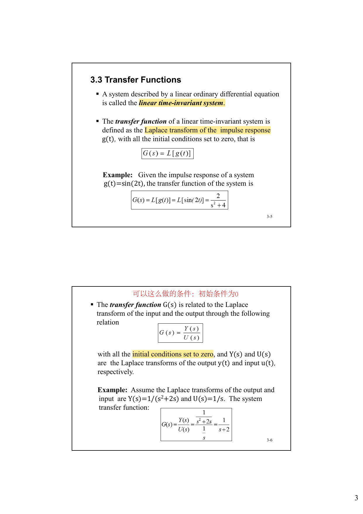

### 从微分方程到传递函数

考虑 $n$ 阶系统：

$$
\frac{d^n y(t)}{dt^n}
+a_{n-1}\frac{d^{n-1}y(t)}{dt^{n-1}}
+\cdots
+a_1\frac{dy(t)}{dt}
+a_0y(t)
=
b_m\frac{d^m u(t)}{dt^m}
+b_{m-1}\frac{d^{m-1}u(t)}{dt^{m-1}}
+\cdots
+b_1\frac{du(t)}{dt}
+b_0u(t)
$$

其中 $a_i$ 与 $b_j$ 为实常数。若初始条件为零，对两边作 Laplace 变换：

$$
(s^n+a_{n-1}s^{n-1}+\cdots+a_1s+a_0)Y(s)
=
(b_ms^m+b_{m-1}s^{m-1}+\cdots+b_1s+b_0)U(s)
$$

因此输入 $u(t)$ 到输出 $y(t)$ 的传递函数为：

$$
G(s)=\frac{Y(s)}{U(s)}
=
\frac{b_ms^m+b_{m-1}s^{m-1}+\cdots+b_1s+b_0}
{s^n+a_{n-1}s^{n-1}+\cdots+a_1s+a_0}
$$

### Proper、Strictly Proper 与 Improper

设分母阶数为 $n$，分子阶数为 $m$：

| 类型              |    条件 | 含义                        |
| --------------- | ----: | ------------------------- |
| Strictly proper | $n>m$ | 分母阶数高于分子阶数，常见物理系统多属于此类    |
| Proper          | $n=m$ | 分母与分子阶数相同                 |
| Improper        | $n<m$ | 分子阶数高于分母阶数，通常不对应普通可实现动态系统 |

例：

$$
\frac{s+1}{s^2+s+2}\quad \text{strictly proper}
$$

$$
\frac{s^2}{s^2+1}\quad \text{proper}
$$

$$
\frac{s^2+1}{s+1}\quad \text{improper}
$$

### 特征方程、极点和零点

特征方程由传递函数分母多项式置零得到：

$$
s^n+a_{n-1}s^{n-1}+\cdots+a_1s+a_0=0
$$

- 极点（poles）：特征方程的根，即分母为零的 $s$ 值。
- 零点（zeros）：分子多项式为零的根。

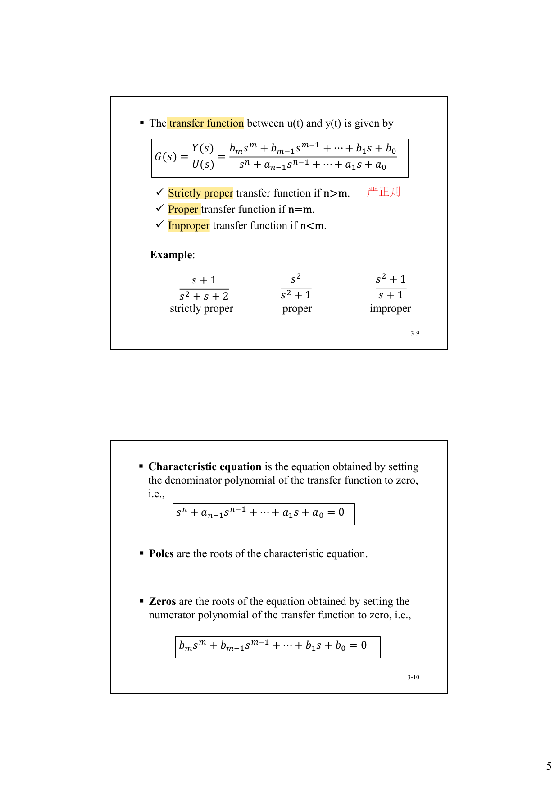

例：

$$
G(s)=\frac{2s^2+8s}{s^2+3s+2}
$$

特征方程为：

$$
s^2+3s+2=0=(s+1)(s+2)
$$

所以极点为 $s=-1,-2$。

零点由分子置零得到：

$$
2s^2+8s=0=2s(s+4)
$$

所以零点为 $s=0,-4$。

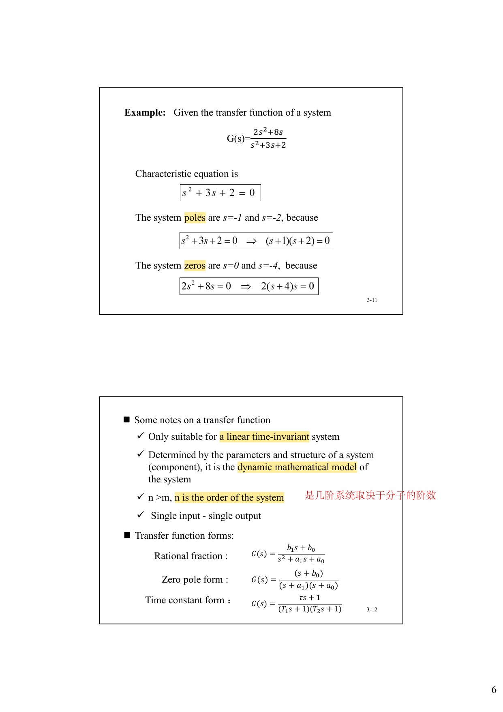

### 传递函数的性质

传递函数有几个重要限制和性质：

- 只适用于线性时不变系统。
- 定义为输入变量与输出变量之间的关系，通常针对单输入单输出系统。
- 初始条件必须设为零。
- 由系统参数和结构决定，与具体输入信号无关。
- 连续系统的传递函数只含复变量 $s$。
- 若 $n>m$，则系统阶次由分母阶数 $n$ 决定；若 $n<m$，传递函数为 improper，数学上的动态阶次仍看分母阶数 $n$，但这类形式通常不能直接对应普通物理可实现的因果系统。

常见传递函数形式：

1. 有理分式形式：

   $$
   G(s)=\frac{b_1s+b_0}{s^2+a_1s+a_0}
   $$

2. 零极点形式：

   $$
   G(s)=\frac{s+b_0}{(s+a_1)(s+a_0)}
   $$

3. 时间常数形式：

   $$
   G(s)=\frac{\tau s+1}{(T_1s+1)(T_2s+1)}
   $$

### 典型传递函数

#### 1. 比例环节

$$
y(t)=kx(t)
$$

$$
G(s)=\frac{Y(s)}{X(s)}=k
$$

其中 $k$ 为常数。

#### 2. 积分环节

$$
y(t)=k\int x(t)\,dt
$$

$$
G(s)=\frac{Y(s)}{X(s)}=\frac{k}{s}=\frac{1}{Ts}
$$

其中 $T=1/k$。

#### 3. 一阶系统

一阶系统的微分方程为：

$$
T\frac{dy(t)}{dt}+y(t)=x(t)
$$

传递函数：

$$
G(s)=\frac{Y(s)}{X(s)}=\frac{1}{Ts+1}
$$

$T$ 为时间常数。单位阶跃输入 $x(t)=1(t)$ 时：

$$
Y(s)=\frac{1}{Ts+1}\cdot\frac{1}{s}
=\frac{1}{s}-\frac{1}{s+\frac{1}{T}}
$$

时域响应为：

$$
y(t)=1-e^{-t/T}
$$

一阶系统的阶跃响应在 $t=T$ 处的切线斜率与时间常数相关，$T$ 越大响应越慢。

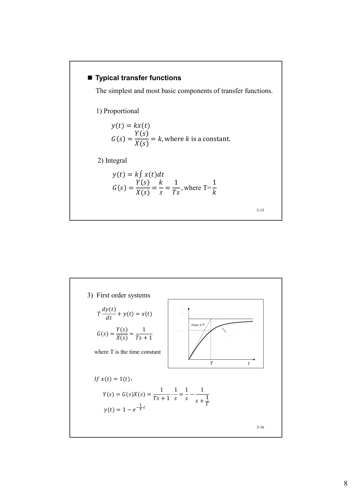

#### 4. 二阶系统

二阶系统常写为：

$$
T^2\frac{d^2y(t)}{dt^2}
+2T\zeta\frac{dy(t)}{dt}
+y(t)=x(t),\quad t\ge 0
$$

传递函数为：

$$
G(s)=\frac{1}{T^2s^2+2\zeta Ts+1}
$$

令 $\omega_n=1/T$，则：

$$
G(s)=\frac{\omega_n^2}{s^2+2\zeta\omega_n s+\omega_n^2}
$$

其中 $\zeta$ 是阻尼比，$\omega_n$ 是无阻尼自然频率。极点位置由 $\zeta$ 决定：

- $\zeta>1$：两个不同实极点，过阻尼。
- $\zeta=1$：两个相同实极点，临界阻尼。
- $0<\zeta<1$：一对共轭复极点，欠阻尼：

  $$
  s_{1,2}=-\zeta\omega_n\pm j\omega_n\sqrt{1-\zeta^2}
  $$

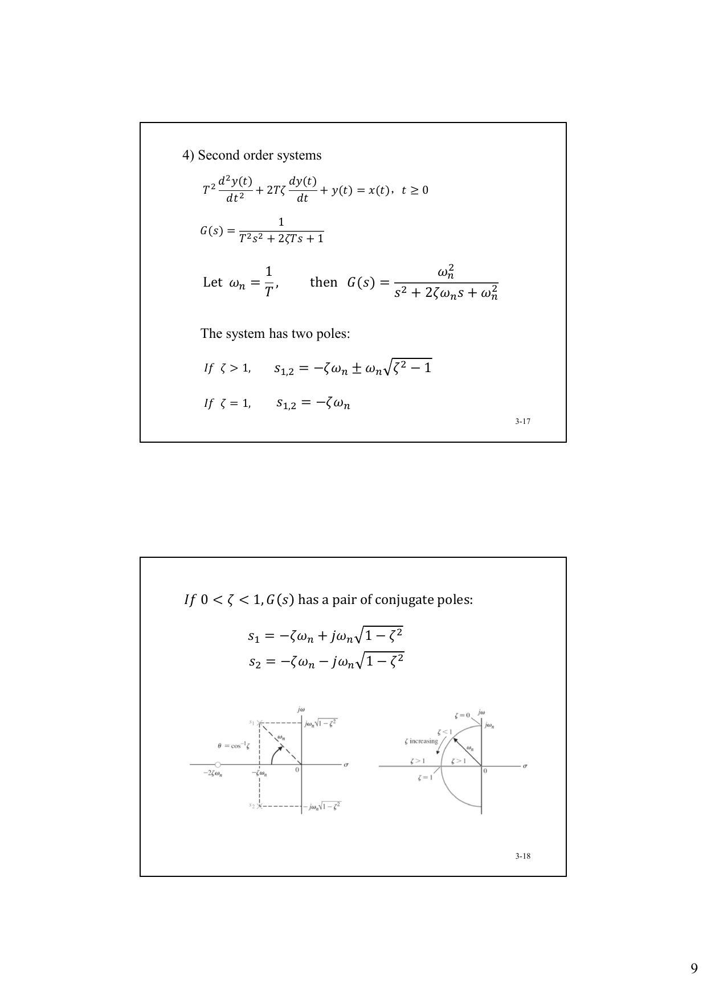

#### 5. 微分环节

常见微分环节包括：

| 环节 | 传递函数 |
|---|---|
| 纯微分 | $G(s)=Ks$ |
| 一阶微分 | $G(s)=K(\tau s+1)$ |
| 二阶微分 | $G(s)=K(\tau^2s^2+2\zeta\tau s+1)$ |
| 实际微分 | $G(s)=\dfrac{Ks}{Ts+1}$，当 $T\ll 1$ 时近似 $Ks$ |

纯微分会放大高频噪声，工程上更常用带有一阶惯性环节的实际微分。

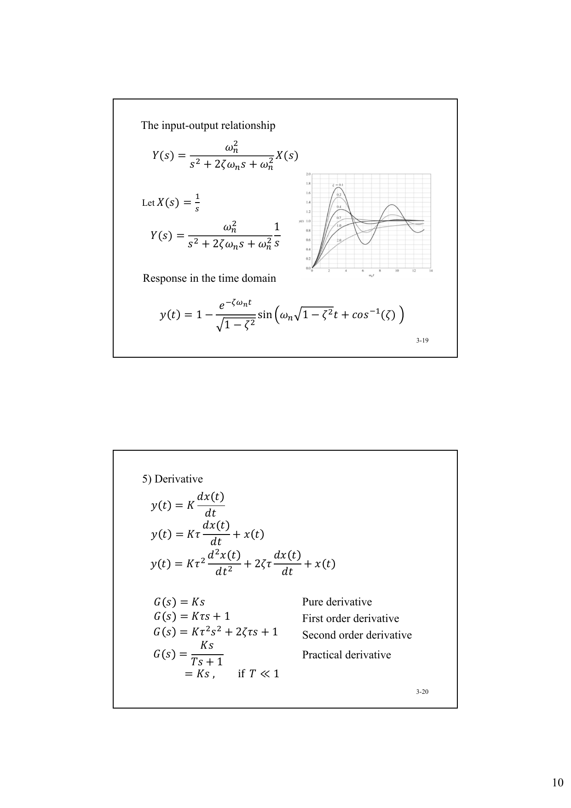

#### 6. 纯滞后环节

若输出是输入延迟 $\tau$ 后的结果：

$$
y(t)=x(t-\tau)
$$

则：

$$
G(s)=\frac{Y(s)}{X(s)}=e^{-\tau s}
$$

因此若系统为：

$$
T\frac{dy(t)}{dt}+y(t)=x(t-\tau)
$$

则传递函数为：

$$
G(s)=\frac{e^{-\tau s}}{Ts+1}
=\frac{1}{(Ts+1)e^{\tau s}}
$$

---

## 3.4 Block Diagrams

方块图用于描述系统各环节的组成、连接关系和因果关系。在线性系统中，每个方块通常对应一个传递函数，信号线表示变量或信号，求和点表示信号相加或相减，引出点表示同一信号被分支送往多个位置。

方块图可以表示控制回路的逻辑和数学模型，也可以与实际仪表和设备布置对应。

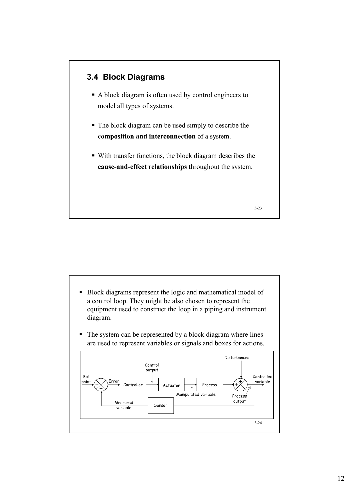

### 基本元素

方块图中的常用元素：

- Block：表示一个环节或传递函数。
- Summing junction：求和点，带正负号。
- Takeoff point：引出点，把同一个信号分配到多个支路。

课件用直流电机控制系统展示了从物理系统到传递函数方块图的抽象过程。

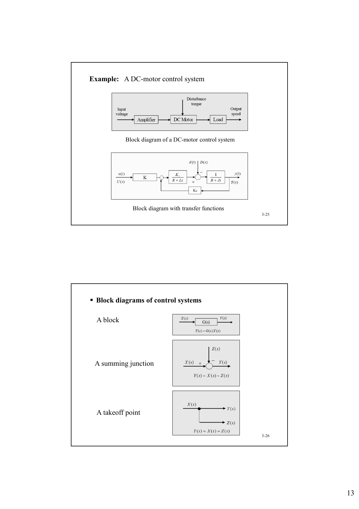

### 并联系统

两个环节并联时，输入相同，输出相加或相减。若两个并联环节分别为 $G_1(s)$、$G_2(s)$，输出为正向相加，则总传递函数为：

$$
M(s)=\frac{Y(s)}{R(s)}=G_1(s)+G_2(s)
$$

若求和点中有负号，则相应改为 $G_1(s)-G_2(s)$。

### 串联系统

两个环节串联时，前一环节输出作为后一环节输入，总传递函数为各环节传递函数的乘积：

$$
M(s)=\frac{Y(s)}{R(s)}=G_2(s)G_1(s)
$$

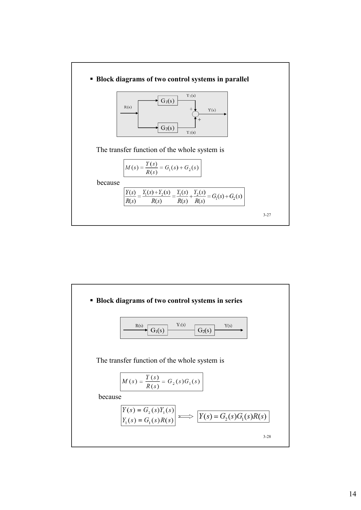

### 反馈系统

基本负反馈系统由前向通道 $G(s)$ 和反馈通道 $H(s)$ 构成。若参考输入为 $R(s)$，输出为 $C(s)$，负反馈下通常有：

$$
E(s)=R(s)-B(s)
$$

$$
B(s)=H(s)C(s)
$$

$$
C(s)=G(s)E(s)
$$

联立得到闭环传递函数：

$$
\frac{C(s)}{R(s)}=\frac{G(s)}{1+G(s)H(s)}
$$

若为正反馈，分母相应变为 $1-G(s)H(s)$。

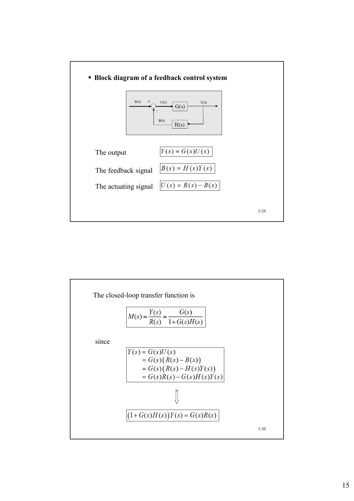

标准反馈系统常把控制器和被控对象分别写成不同方块。若前向通道由 $G_1(s)$、$G_2(s)$ 串联组成，反馈通道为 $H(s)$，则：

$$
\frac{Y(s)}{R(s)}=
\frac{G_1(s)G_2(s)}{1+G_1(s)G_2(s)H(s)}
$$

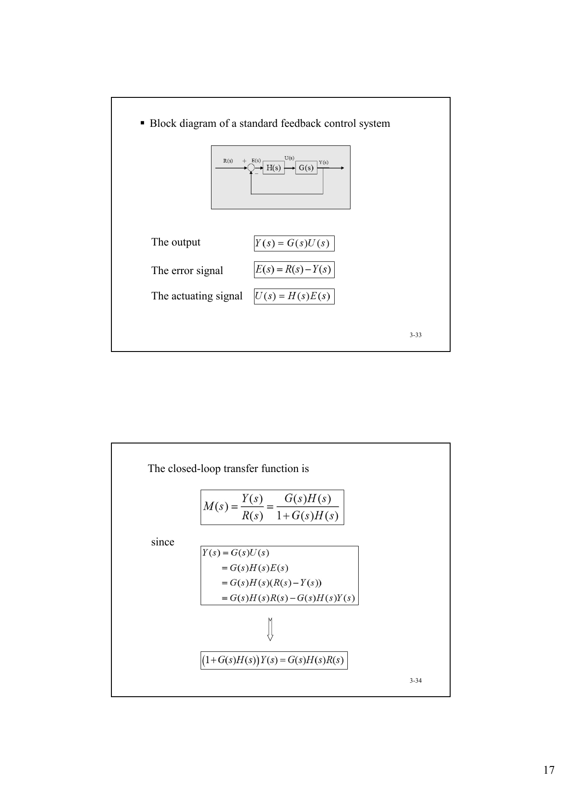

### 方块图等效变换

方块图化简的目标是在保持原输入输出关系不变的前提下移动求和点、引出点或方块，最终化成更简单的串并联和反馈结构。

常用规则包括：

- 串联方块合并：$V_1V_2$。
- 并联方块合并：$V_1\pm V_2$。
- 反馈环节合并：通常得到 $\dfrac{V_1}{1\mp V_1V_2}$，符号由反馈正负决定。
- 移动求和点或引出点时，需要补入相应的 $V$ 或 $1/V$，以保持经过移动后的信号数值不变。

这些规则容易在符号上出错，尤其是跨过方块移动求和点或引出点时。复习时优先检查“移动前后每条路径的信号是否一致”。

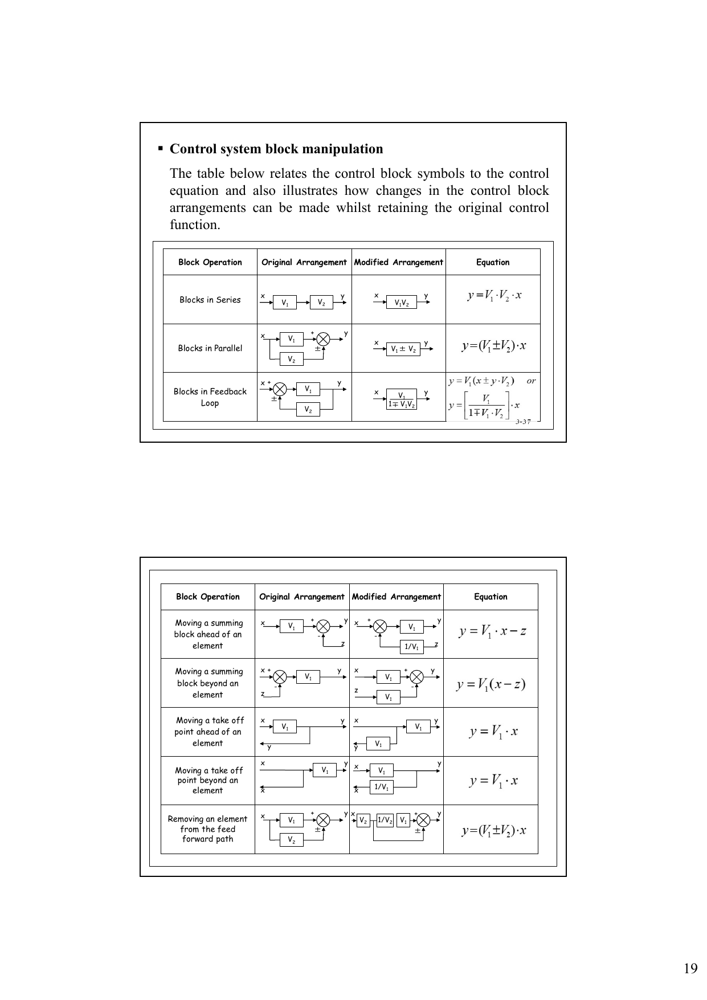

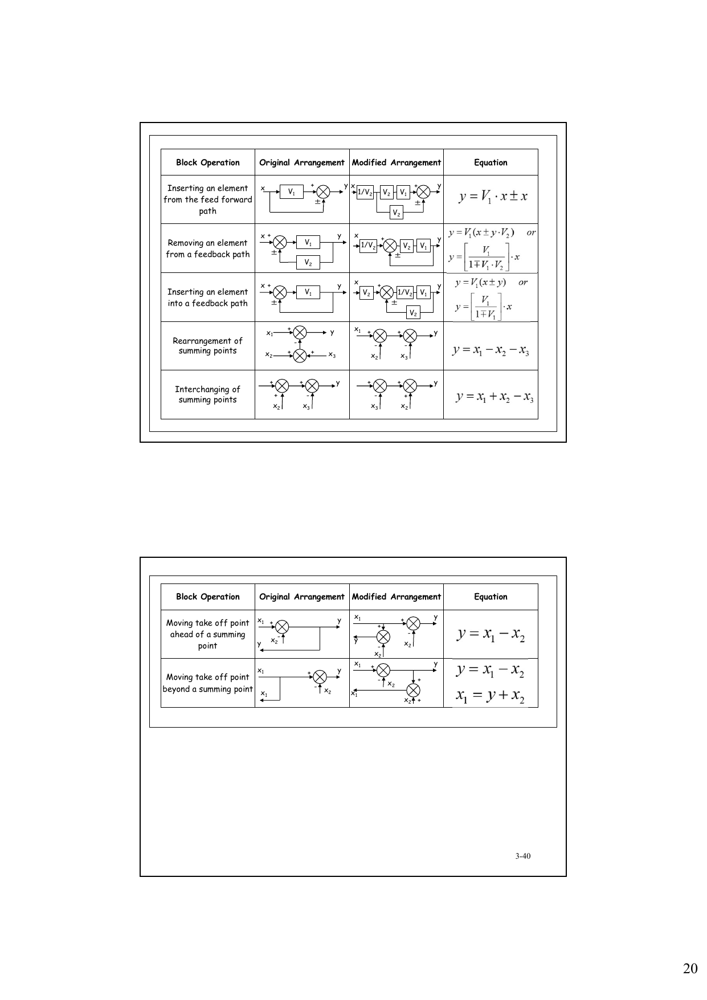

课件给出一个复杂结构图的等效化简例子：通过移动求和点、反馈支路和串并联方块，逐步把复杂方块图化成更容易求闭环传递函数的形式。

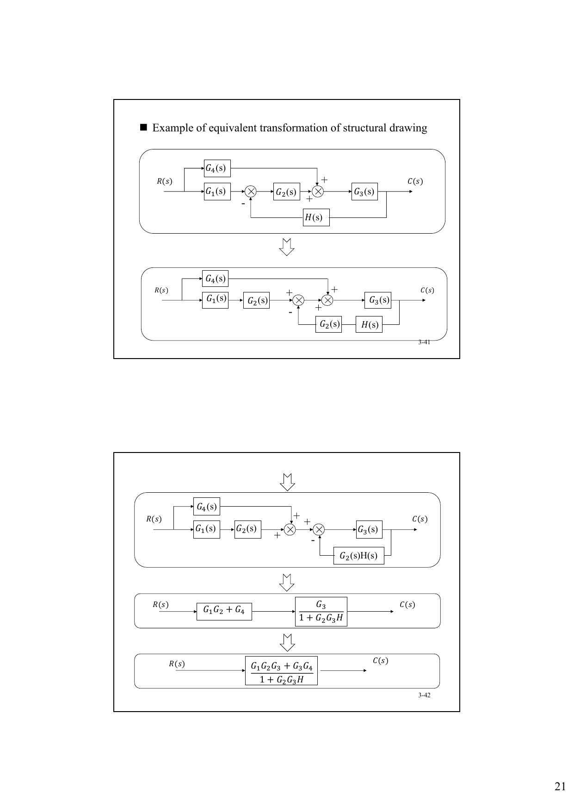

### 同时存在参考输入和扰动输入

控制系统中常同时存在参考输入 $R(s)$ 和扰动或噪声 $N(s)$。线性系统可以使用叠加原理：分别计算 $R(s)$ 单独作用和 $N(s)$ 单独作用时的输出，再相加。

对课件中的结构，开环传递函数为：

$$
\frac{B(s)}{R(s)}=G_1(s)G_2(s)H(s)
$$

若 $N(s)=0$，闭环参考输入到输出为：

$$
\frac{Y(s)}{R(s)}
=
\frac{G_1(s)G_2(s)}
{1+G_1(s)G_2(s)H(s)}
$$

若 $R(s)=0$，扰动输入到输出为：

$$
\frac{Y(s)}{N(s)}
=
\frac{G_2(s)}
{1+G_1(s)G_2(s)H(s)}
$$

因此同时存在 $R(s)$ 与 $N(s)$ 时：

$$
Y(s)=
\frac{G_1(s)G_2(s)R(s)}
{1+G_1(s)G_2(s)H(s)}
+
\frac{G_2(s)N(s)}
{1+G_1(s)G_2(s)H(s)}
$$

若扰动在求和点以负号进入，则对应扰动项改为负号。

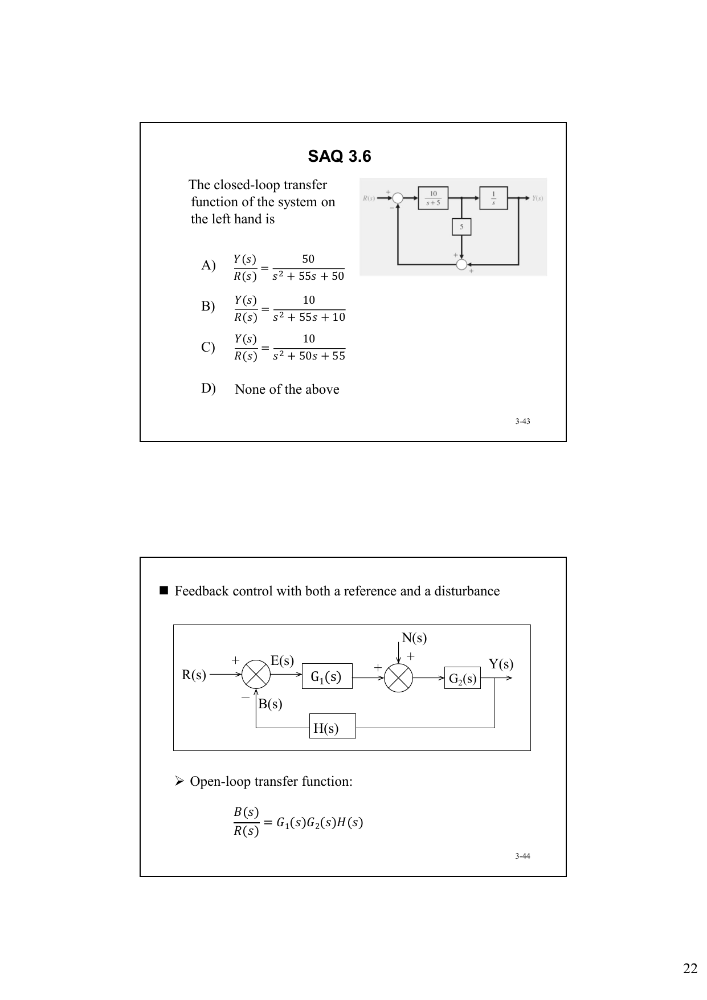

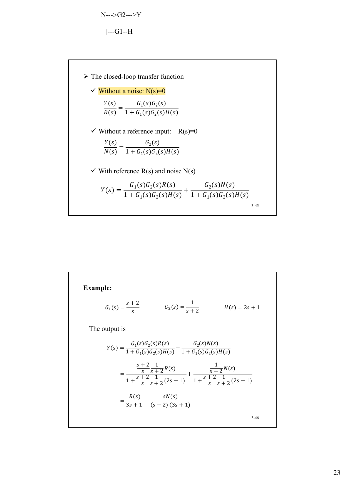

---

## 3.5 Signal-Flow Graphs

信号流图是描述系统变量之间关系的另一种方法。相比方块图，它更强调节点和有向支路组成的代数关系，适合用 Mason 公式直接求输入输出传递函数。

### 基本术语

- Node：节点，表示系统中的一个变量或信号。
- Branch：支路，带方向的线段，连接两个节点。
- Transmission / branch gain：支路增益。
- Source node：源节点，只有输出支路，没有输入支路，通常对应输入。
- Sink / well node：汇节点，只有输入支路，没有输出支路，通常对应输出。
- Hybrid node：混合节点，同时有输入和输出支路。
- Path：沿支路箭头方向依次经过的路径。
- Forward path：从输入节点到输出节点的路径，且同一节点不重复经过。
- Loop：起点与终点相同的闭合路径，且其他节点不重复。
- Nontouching loops：互不接触回路，即没有公共节点的回路。

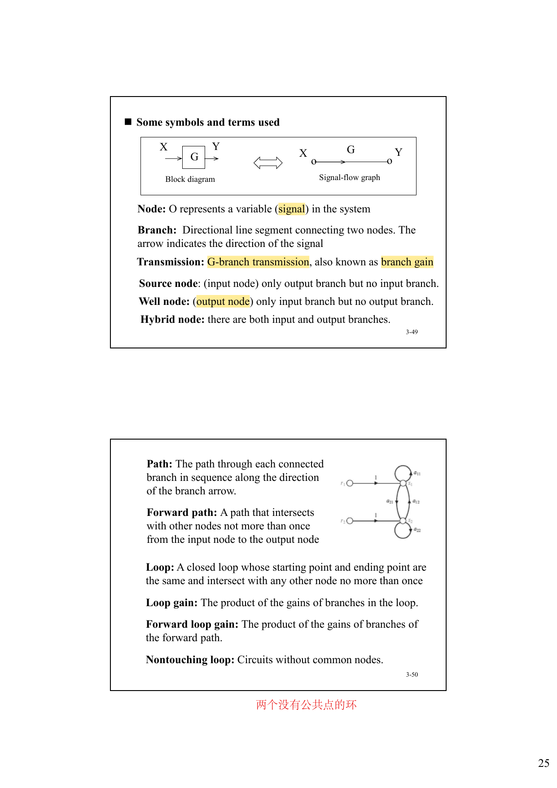

课件例子中，$R$、$N$ 是输入节点，$C$ 是输出节点，$E$、$P$、$Q$ 是混合节点。路径 REPQC、NPQC 是前向路径，EPQHE 是回路。

### Mason 信号流图增益公式

Mason 公式用于求输入到输出的总增益：

$$
G(s)=\frac{1}{\Delta}\sum_{k=1}^{n}P_k\Delta_k
$$

其中：

- $n$：前向路径数量。
- $P_k$：第 $k$ 条前向路径的增益。
- $\Delta$：图的特征式。
- $\Delta_k$：去掉所有与第 $k$ 条前向路径相接触的回路后得到的特征式。

特征式：

$$
\Delta
=1-\sum L_a
+\sum L_bL_c
-\sum L_dL_eL_f+\cdots
$$

其中 $\sum L_a$ 表示所有单独回路增益之和，$\sum L_bL_c$ 表示所有两两互不接触回路的增益乘积之和，后续项依次处理三组、四组互不接触回路，并交替变号。

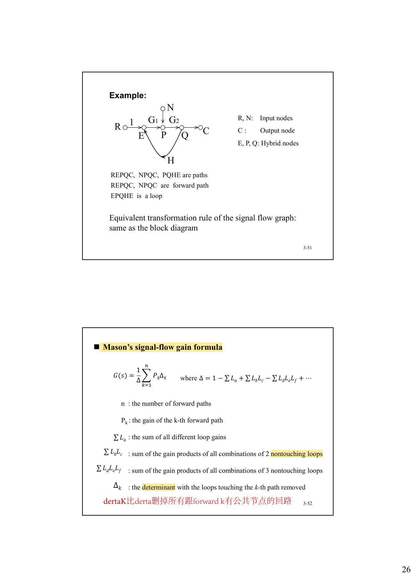

### Mason 公式例题

课件例题中有两条前向路径：

$$
P_1=G_1G_2G_3
$$

$$
P_2=G_4G_3
$$

一个回路：

$$
L_1=-G_2G_3H
$$

因此：

$$
\Delta=1-L_1=1+G_2G_3H
$$

且该回路与两条前向路径均接触，所以：

$$
\Delta_1=\Delta_2=1
$$

代入 Mason 公式：

$$
\frac{C(s)}{R(s)}
=
\frac{G_1G_2G_3+G_3G_4}
{1+G_2G_3H}
$$

---

## 易错点与复习提示

- 传递函数必须在零初始条件下定义，不能把非零初始条件直接塞进 $Y(s)/U(s)$。
- 传递函数描述的是系统结构和参数，不是某个特定输入。
- 极点来自分母，零点来自分子；不要把 SAQ 中的分子因式误认为极点。
- 系统阶次通常看分母阶数，课件中特别强调 $n>m$ 时 $n$ 是系统阶次。
- 负反馈闭环分母是 $1+GH$；正反馈或扰动负号进入时，符号要单独检查。
- 移动求和点、引出点时，必须补偿 $G$ 或 $1/G$，本质是保持移动前后的信号值不变。
- Mason 公式中 $\Delta_k$ 要删除所有与第 $k$ 条前向路径接触的回路；只保留不接触该路径的回路。

## 小结

本章把控制系统建模从时域微分方程转到 Laplace 域的代数表达。传递函数让串联、并联和反馈组合可以用代数方式处理；方块图提供了控制系统结构的直观表示；信号流图和 Mason 公式进一步提供了处理复杂互联系统的系统方法。后续分析系统稳定性、动态响应和控制器设计时，极点、零点、闭环传递函数和等效化简都会反复使用。

---

## 练习题与解答

本节集中放置课件中的全部 SAQ 与课后题，便于复习时连续练习。

### SAQ 3.1

原题：Applying the input $u(t)=\cos(2t)$ to a system with zero initial conditions gives the output response $y(t)=\sin(2t)$. The transfer function of the system is:

A. $G(s)=\dfrac{2}{s^2+4}$

B. $G(s)=\dfrac{s}{s^2+4}$

C. $G(s)=\dfrac{2}{s}$

D. $G(s)=\dfrac{s}{2}$

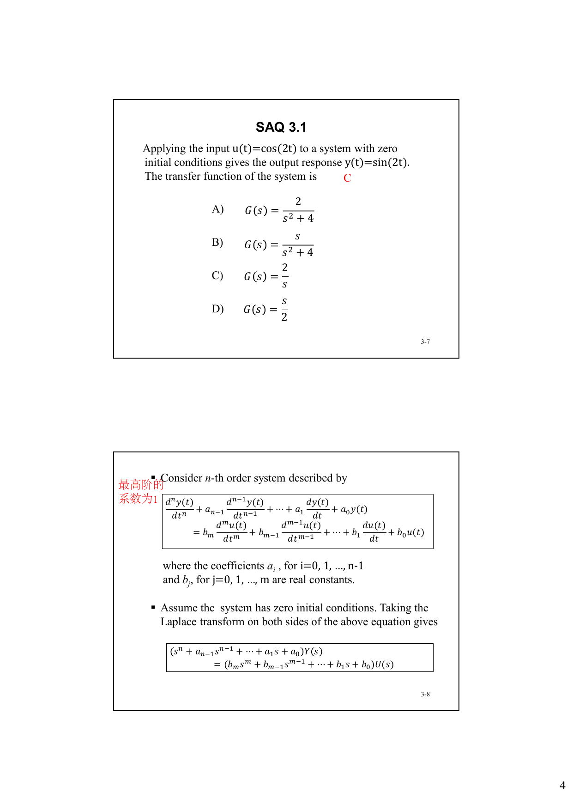

解答：选 C。

零初始条件下：

$$
U(s)=\mathcal{L}[\cos(2t)]=\frac{s}{s^2+4}
$$

$$
Y(s)=\mathcal{L}[\sin(2t)]=\frac{2}{s^2+4}
$$

因此：

$$
G(s)=\frac{Y(s)}{U(s)}
=
\frac{\frac{2}{s^2+4}}{\frac{s}{s^2+4}}
=\frac{2}{s}
$$

### SAQ 3.2

原题：The poles of the following transfer function are:

$$
G(s)=\frac{(s+2)(s+4)}{s^2+4s+3}
$$

A. $s=-2$ and $s=-4$

B. $s=1$ and $s=3$

C. $s=-3$ and $s=-4$

D. $s=-1$ and $s=-3$

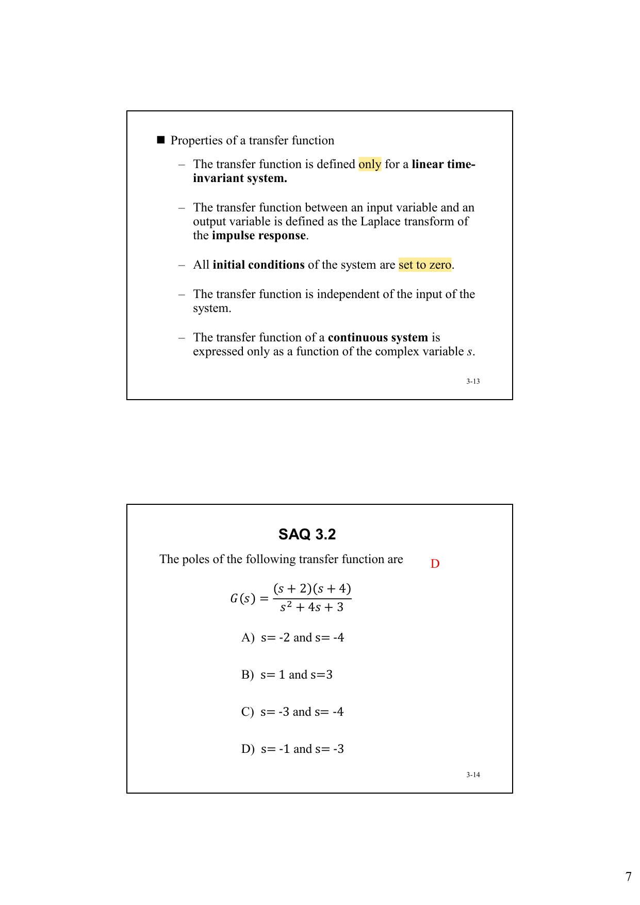

解答：选 D。

极点由分母决定：

$$
s^2+4s+3=(s+1)(s+3)
$$

所以极点为：

$$
s=-1,\quad s=-3
$$

### SAQ 3.3

原题：What is the transfer function of the following system?

$$
T\frac{dy(t)}{dt}+y(t)=x(t-\tau)
$$

A. $G(s)=\dfrac{1-\tau s}{Ts+1}$

B. $G(s)=\dfrac{1+e^{-\tau s}}{Ts+1}$

C. $G(s)=\dfrac{1}{Ts+1-e^{-\tau s}}$

D. $G(s)=\dfrac{1}{(Ts+1)e^{\tau s}}$

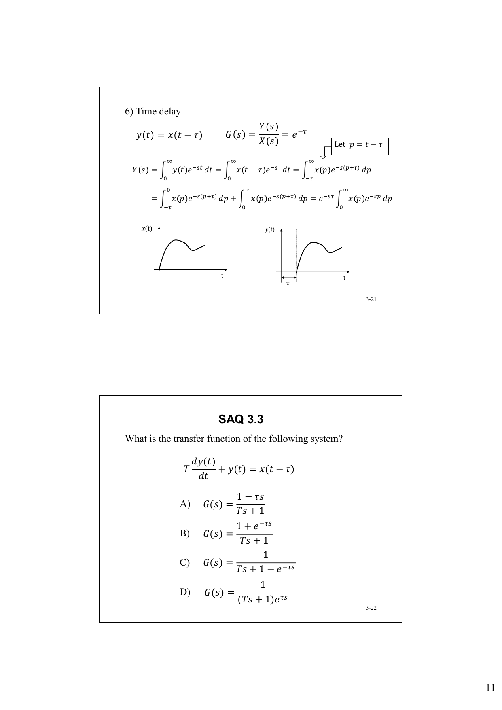

解答：选 D。

零初始条件下作 Laplace 变换：

$$
(Ts+1)Y(s)=e^{-\tau s}X(s)
$$

所以：

$$
G(s)=\frac{Y(s)}{X(s)}
=\frac{e^{-\tau s}}{Ts+1}
=\frac{1}{(Ts+1)e^{\tau s}}
$$

### SAQ 3.4

原题：The closed-loop transfer function of the unit feedback system below is:

A. $M(s)=\dfrac{1}{G(s)}$

B. $M(s)=\dfrac{G(s)}{1+G(s)}$

C. $M(s)=\dfrac{G(s)}{1-G(s)}$

D. $M(s)=\dfrac{1}{1-G(s)}$

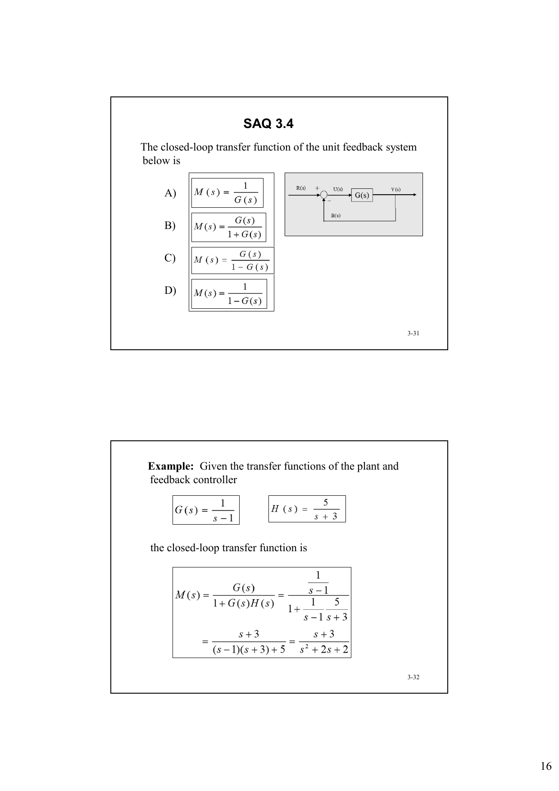

解答：选 B。

单位负反馈时：

$$
E(s)=R(s)-Y(s)
$$

$$
Y(s)=G(s)E(s)=G(s)[R(s)-Y(s)]
$$

整理：

$$
Y(s)[1+G(s)]=G(s)R(s)
$$

所以：

$$
M(s)=\frac{Y(s)}{R(s)}=\frac{G(s)}{1+G(s)}
$$

### SAQ 3.5

原题：What is the closed-loop transfer function of the system below, where $G(s)=s+10$?

A. $\dfrac{s+10}{s+11}$

B. $\dfrac{1}{s+11}$

C. $\dfrac{s+11}{s+10}$

D. $\dfrac{1}{s+10}$

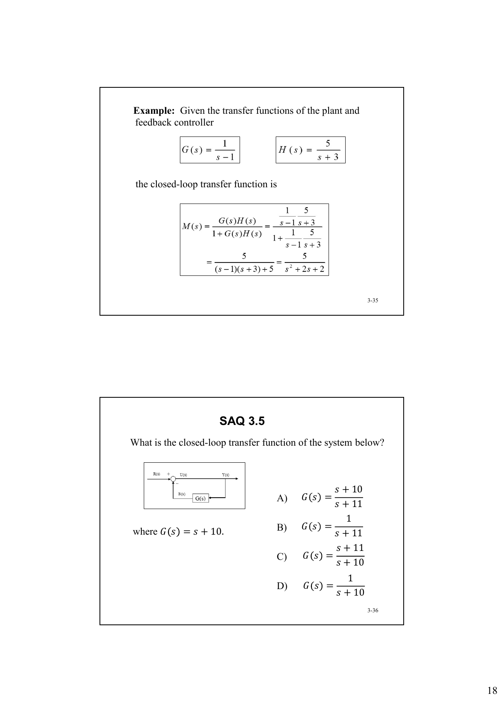

解答：选 B。

该图的前向通道是 1，反馈通道是 $G(s)$。因此：

$$
\frac{Y(s)}{R(s)}
=
\frac{1}{1+G(s)}
$$

代入 $G(s)=s+10$：

$$
\frac{Y(s)}{R(s)}
=
\frac{1}{1+s+10}
=
\frac{1}{s+11}
$$

### SAQ 3.6

原题：The closed-loop transfer function of the system on the left hand is:

A. $\dfrac{Y(s)}{R(s)}=\dfrac{50}{s^2+55s+50}$

B. $\dfrac{Y(s)}{R(s)}=\dfrac{10}{s^2+55s+10}$

C. $\dfrac{Y(s)}{R(s)}=\dfrac{10}{s^2+50s+55}$

D. None of the above

解答：选 B。

设第一块输出为 $X(s)$，最终输出为 $Y(s)$。由右侧积分环节：

$$
Y(s)=\frac{1}{s}X(s)
$$

所以：

$$
X(s)=sY(s)
$$

反馈信号为下方求和点输出：

$$
B(s)=Y(s)+5X(s)=Y(s)+5sY(s)=(1+5s)Y(s)
$$

前向通道从误差信号到输出为：

$$
G_f(s)=\frac{10}{s+5}\cdot\frac{1}{s}
=\frac{10}{s(s+5)}
$$

闭环传递函数：

$$
\frac{Y(s)}{R(s)}
=
\frac{G_f(s)}{1+G_f(s)(1+5s)}
$$

代入并化简：

$$
\frac{Y(s)}{R(s)}
=
\frac{\frac{10}{s(s+5)}}{1+\frac{10(1+5s)}{s(s+5)}}
=
\frac{10}{s(s+5)+10(1+5s)}
=
\frac{10}{s^2+55s+10}
$$

### SAQ 3.7

原题：Determine the output of the system below.

A. $Y(s)=\dfrac{G_1(s)G_2(s)R(s)}{1+G_2(s)G_1(s)H(s)}-\dfrac{G_2(s)N(s)}{1+G_1(s)G_2(s)H(s)}$

B. $Y(s)=\dfrac{G_1(s)G_2(s)R(s)}{1+G_2(s)G_1(s)H(s)}-\dfrac{N(s)}{1+G_2(s)G_1(s)H(s)}$

C. $Y(s)=\dfrac{G_1(s)G_2(s)R(s)}{1+G_1(s)G_2(s)H(s)}+\dfrac{N(s)}{1+G_1(s)G_2(s)H(s)}$

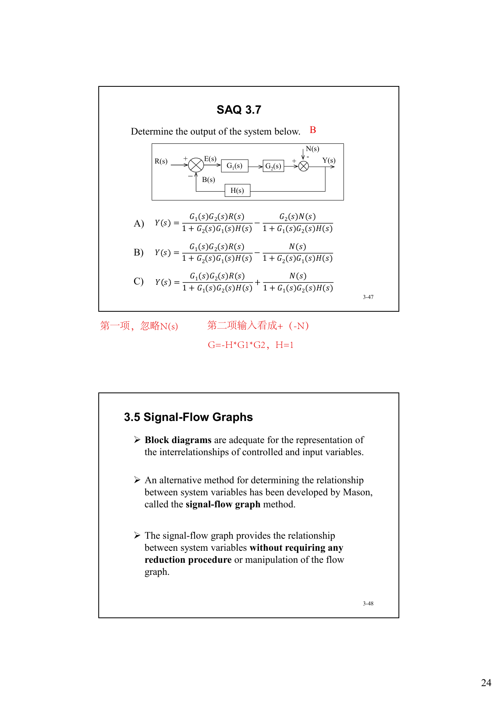

解答：选 B。

对参考输入 $R(s)$ 与扰动输入 $N(s)$ 分别使用叠加原理。扰动从输出端求和点以负号进入，因此扰动项前是负号。

参考输入单独作用时：

$$
Y_R(s)=
\frac{G_1(s)G_2(s)}{1+G_1(s)G_2(s)H(s)}R(s)
$$

扰动输入单独作用时：

$$
Y_N(s)=
-
\frac{1}{1+G_1(s)G_2(s)H(s)}N(s)
$$

因此：

$$
Y(s)=
\frac{G_1(s)G_2(s)R(s)}
{1+G_1(s)G_2(s)H(s)}
-
\frac{N(s)}
{1+G_1(s)G_2(s)H(s)}
$$

### SAQ 3.8

原题：Determine the closed-loop transfer function of the system below.

A. $\dfrac{\omega(s)}{\omega_d(s)}=\dfrac{G_1G_2}{1-0.1G_1G_2-G_1G_2G_3}$

B. $\dfrac{\omega(s)}{\omega_d(s)}=\dfrac{G_1G_3}{1-0.1G_1G_2-G_1G_2G_3}$

C. $\dfrac{\omega(s)}{\omega_d(s)}=\dfrac{G_1G_2G_3}{1+0.1G_1G_2+G_1G_2G_3}$

D. None of the above

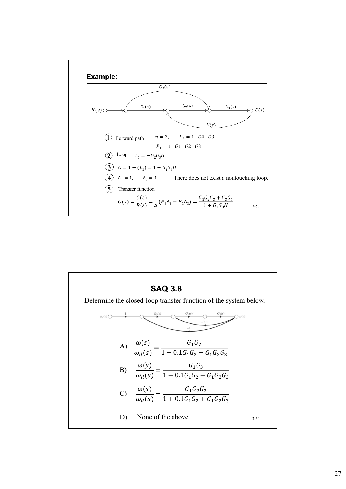

解答：选 C。

用 Mason 公式。前向路径只有一条：

$$
P_1=G_3G_1G_2
$$

两个回路为：

$$
L_1=-0.1G_1G_2
$$

$$
L_2=-G_3G_1G_2
$$

它们互相接触，没有互不接触回路组合。因此：

$$
\Delta=1-(L_1+L_2)
=1+0.1G_1G_2+G_1G_2G_3
$$

前向路径与所有回路接触，所以：

$$
\Delta_1=1
$$

于是：

$$
\frac{\omega(s)}{\omega_d(s)}
=
\frac{P_1\Delta_1}{\Delta}
=
\frac{G_1G_2G_3}{1+0.1G_1G_2+G_1G_2G_3}
$$

### Exercise 3.1

原题：

1. What is the closed-loop transfer function of the following feedback control system?
2. Calculate the closed-loop transfer function of the above system if

$$
G(s)=\frac{2}{3s+1},\quad
H(s)=\frac{s+4}{s+3},\quad
K(s)=\frac{5s+6}{s}
$$

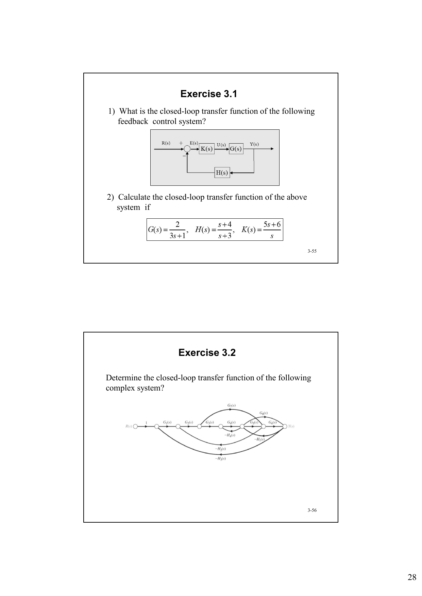

解答：

图中前向通道为 $K(s)G(s)$，反馈通道为 $H(s)$，负反馈闭环传递函数为：

$$
\frac{Y(s)}{R(s)}
=
\frac{K(s)G(s)}{1+K(s)G(s)H(s)}
$$

代入：

$$
K(s)G(s)
=
\frac{5s+6}{s}\cdot\frac{2}{3s+1}
=
\frac{2(5s+6)}{s(3s+1)}
$$

所以：

$$
\frac{Y(s)}{R(s)}
=
\frac{\frac{2(5s+6)}{s(3s+1)}}
{1+\frac{2(5s+6)}{s(3s+1)}\cdot\frac{s+4}{s+3}}
$$

统一分母后：

$$
\frac{Y(s)}{R(s)}
=
\frac{2(5s+6)(s+3)}
{s(3s+1)(s+3)+2(5s+6)(s+4)}
$$

展开：

$$
\frac{Y(s)}{R(s)}
=
\frac{10s^2+42s+36}
{3s^3+20s^2+55s+48}
$$

### Exercise 3.2

原题：Determine the closed-loop transfer function of the following complex system.

解答：

该题适合直接用 Mason 公式。闭环传递函数写成：

$$
\frac{Y(s)}{R(s)}
=
\frac{1}{\Delta}\sum_{k=1}^{n}P_k\Delta_k
$$

其中 $P_k$ 是从 $R(s)$ 到 $Y(s)$ 的各条前向路径增益，$\Delta$ 由所有回路和互不接触回路组合决定，$\Delta_k$ 为去掉与第 $k$ 条前向路径接触的回路后得到的特征式。

从图中可以直接读出三条前向路径：

$$
P_1=G_1G_2G_3G_4G_5G_6
$$

$$
P_2=G_1G_2G_3G_4G_8
$$

$$
P_3=G_1G_2G_7G_6
$$

对应的 $\Delta_k$ 为：

$$
\Delta_1=1,\quad \Delta_2=1,\quad \Delta_3=1+G_4H_4
$$

其中 $P_3$ 不经过 $G_3,G_4$ 之间的局部回路，所以 $\Delta_3$ 保留该不接触回路。

图中的主要回路可记为：

$$
L_1=-G_1G_2G_3G_4G_5G_6H_3
$$

$$
L_2=-G_1G_2G_3G_4G_8H_3
$$

$$
L_3=-G_1G_2G_7G_6H_3
$$

$$
L_4=-G_2G_3G_4H_2
$$

$$
L_5=G_2G_7G_6H_1H_2
$$

$$
L_6=-G_4H_4
$$

$$
L_7=-G_5G_6H_1
$$

$$
L_8=-G_8H_1
$$

其中只有 $L_3$ 与 $L_6$ 互不接触，因此：

$$
\Delta=1-\sum_{i=1}^{8}L_i+L_3L_6
$$

所以闭环传递函数为：

$$
\frac{Y(s)}{R(s)}
=
\frac{P_1\Delta_1+P_2\Delta_2+P_3\Delta_3}{\Delta}
$$

代入前向路径：

$$
\frac{Y(s)}{R(s)}
=
\frac{
G_1G_2G_3G_4G_5G_6\Delta_1
+G_1G_2G_3G_4G_8\Delta_2
+G_1G_2G_7G_6\Delta_3
}{\Delta}
$$

即：

$$
\frac{Y(s)}{R(s)}
=
\frac{
G_1G_2G_3G_4G_5G_6
+G_1G_2G_3G_4G_8
+G_1G_2G_7G_6(1+G_4H_4)
}
{1-\sum_{i=1}^{8}L_i+L_3L_6}
$$
