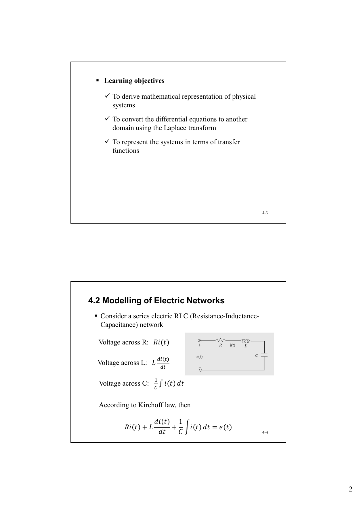
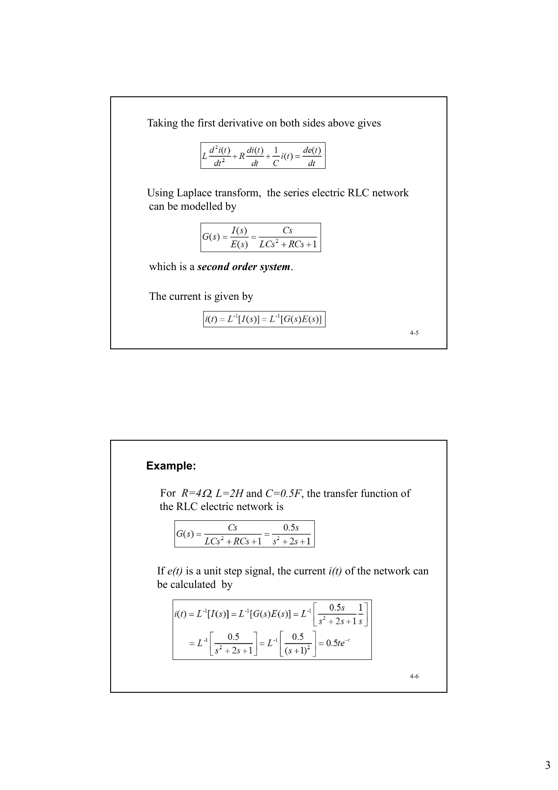
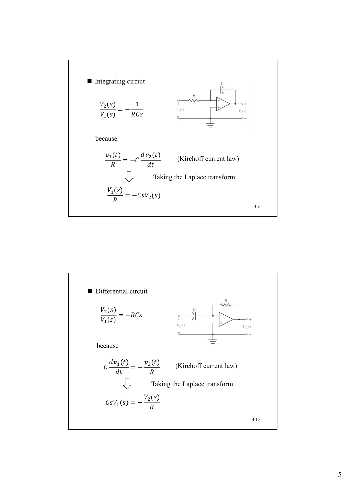
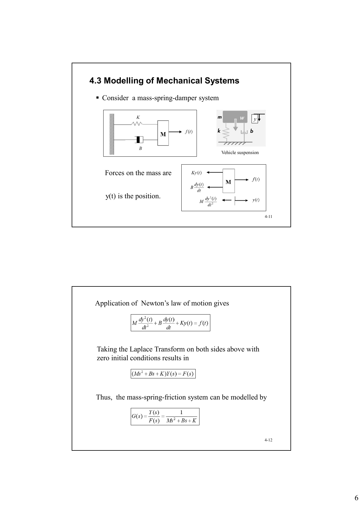
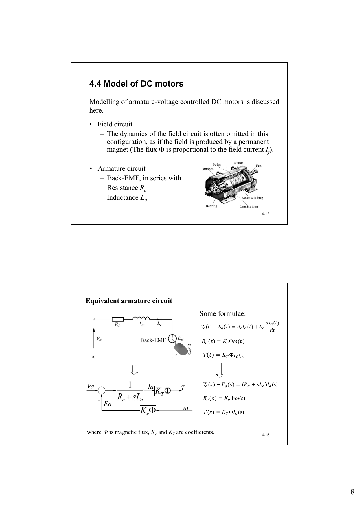
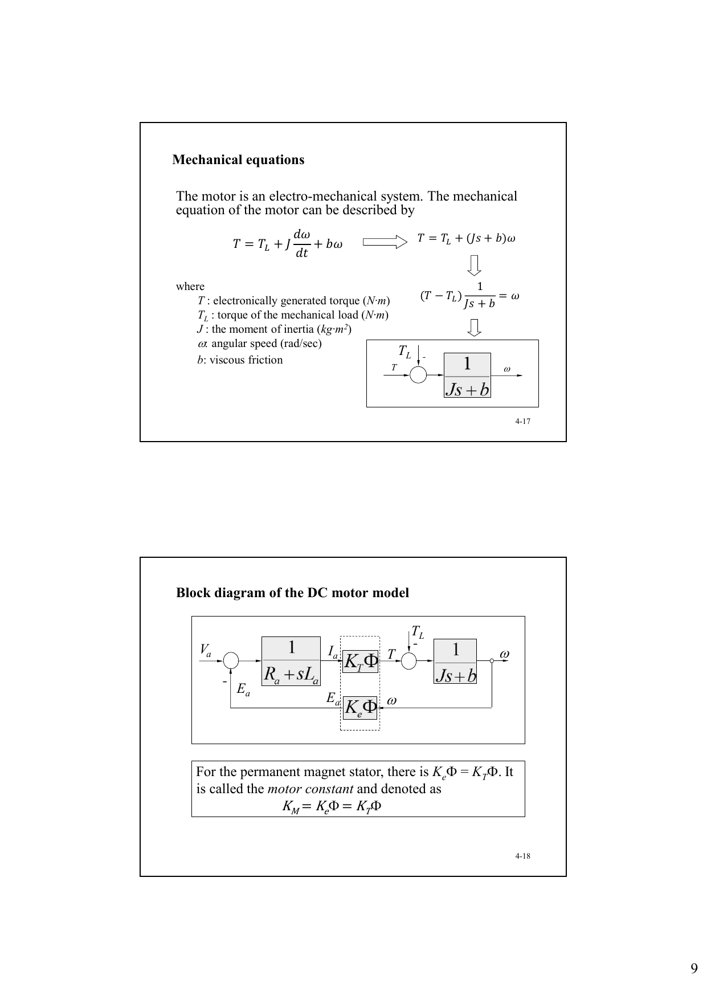
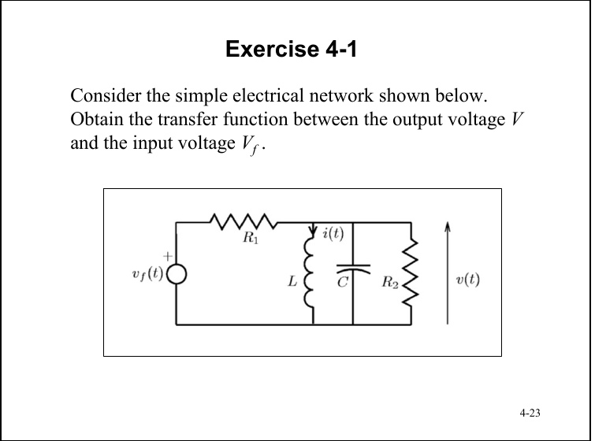
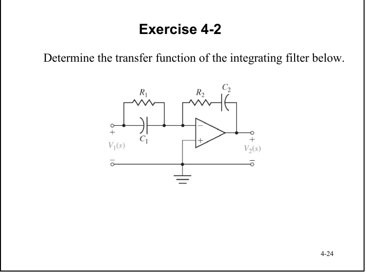

# 自动控制 class4 物理系统建模

> Source: `SDM263-ACT-Chapter4-Modelling-BW.pdf`

## 本讲内容

本章讨论物理系统的数学建模。目标是从基本物理定律出发，得到可用于控制系统分析与设计的数学模型，尤其是微分方程、拉普拉斯域表达式和传递函数。

学习目标：

- 推导物理系统的数学表示。
- 用拉普拉斯变换把微分方程转换到复频域。
- 用传递函数表示系统输入和输出之间的关系。

数学模型通常只能近似表示真实系统，因为真实系统过于复杂。控制工程中建模的重点不是追求绝对完美，而是得到足够准确、便于分析和设计的模型。

## 4.1 建模的基本思路

建模的一般步骤：

1. 明确输入、输出和需要关注的系统变量。
2. 根据物理定律写出时域方程。例如电路用 Kirchhoff 定律，机械系统用 Newton 定律。
3. 在零初始条件下进行拉普拉斯变换。
4. 整理出输入到输出的传递函数。

传递函数的标准形式是：

$$
G(s)=\frac{\text{Output}(s)}{\text{Input}(s)}
$$

它描述的是线性时不变系统在零初始条件下的输入输出关系。

## 4.2 电路系统建模

### 串联 RLC 电路

考虑串联 RLC 电路，输入为电源电压 $e(t)$，输出先取电流 $i(t)$。

各元件电压为：

$$
v_R(t)=Ri(t)
$$

$$
v_L(t)=L\frac{di(t)}{dt}
$$

$$
v_C(t)=\frac{1}{C}\int i(t)\,dt
$$

由 Kirchhoff 电压定律：

$$
Ri(t)+L\frac{di(t)}{dt}+\frac{1}{C}\int i(t)\,dt=e(t)
$$

两边求导：

$$
L\frac{d^2 i(t)}{dt^2}+R\frac{di(t)}{dt}+\frac{1}{C}i(t)=\frac{de(t)}{dt}
$$

在零初始条件下取拉普拉斯变换：

$$
\left(Ls^2+Rs+\frac{1}{C}\right)I(s)=sE(s)
$$

所以电流关于电源电压的传递函数为：

$$
G(s)=\frac{I(s)}{E(s)}
=\frac{Cs}{LCs^2+RCs+1}
$$

这是一个二阶系统。若已知输入 $E(s)$，则：

$$
i(t)=\mathcal{L}^{-1}[I(s)]
=\mathcal{L}^{-1}[G(s)E(s)]
$$

### RLC 数值例题

当 $R=4\Omega,\ L=2H,\ C=0.5F$ 时：

$$
G(s)=\frac{Cs}{LCs^2+RCs+1}
=\frac{0.5s}{s^2+2s+1}
$$

如果 $e(t)$ 是单位阶跃信号，则 $E(s)=1/s$：

$$
I(s)=G(s)E(s)
=\frac{0.5s}{s^2+2s+1}\cdot \frac{1}{s}
=\frac{0.5}{(s+1)^2}
$$

因此：

$$
i(t)=0.5te^{-t}
$$

### 输出为电容电压

如果输出不是电流，而是电容两端电压 $u_o(t)$，输入为 $u_i(t)$，则有：

$$
i(t)=C\frac{du_o(t)}{dt}
$$

代入 RLC 方程：

$$
LC\frac{d^2u_o(t)}{dt^2}
+RC\frac{du_o(t)}{dt}
+u_o(t)
=u_i(t)
$$

对应传递函数：

$$
\frac{U_o(s)}{U_i(s)}
=\frac{1}{LCs^2+RCs+1}
=\frac{1}{T_1s^2+T_2s+1}
$$

其中：

$$
T_1=LC,\qquad T_2=RC
$$

这里的 $T_1,T_2$ 是时间常数。

### 积分电路和微分电路

运算放大器积分电路：

$$
\frac{V_2(s)}{V_1(s)}=-\frac{1}{RCs}
$$

由 Kirchhoff 电流定律：

$$
\frac{v_1(t)}{R}=-C\frac{dv_2(t)}{dt}
$$

拉普拉斯变换：

$$
\frac{V_1(s)}{R}=-CsV_2(s)
$$

整理即得积分传递函数。

运算放大器微分电路：

$$
\frac{V_2(s)}{V_1(s)}=-RCs
$$

由 Kirchhoff 电流定律：

$$
C\frac{dv_1(t)}{dt}=-\frac{v_2(t)}{R}
$$

拉普拉斯变换：

$$
CsV_1(s)=-\frac{V_2(s)}{R}
$$

整理即得微分传递函数。

## 4.3 机械系统建模

### 质量-弹簧-阻尼系统

考虑质量-弹簧-阻尼系统，输入为外力 $f(t)$，输出为位移 $y(t)$。

质量块受力包括：

- 外力：$f(t)$
- 弹簧力：$Ky(t)$
- 阻尼力：$B\frac{dy(t)}{dt}$
- 惯性项：$M\frac{d^2y(t)}{dt^2}$

由 Newton 第二定律：

$$
M\frac{d^2y(t)}{dt^2}
+B\frac{dy(t)}{dt}
+Ky(t)
=f(t)
$$

零初始条件下取拉普拉斯变换：

$$
(Ms^2+Bs+K)Y(s)=F(s)
$$

因此系统传递函数为：

$$
G(s)=\frac{Y(s)}{F(s)}
=\frac{1}{Ms^2+Bs+K}
$$

这也是一个典型二阶系统。

### 机械系统数值例题

当 $M=1kg,\ B=2N/m,\ K=5N/m/s$ 时：

$$
G(s)=\frac{1}{Ms^2+Bs+K}
=\frac{1}{s^2+2s+5}
$$

极点由特征方程给出：

$$
s^2+2s+5=0
$$

所以：

$$
s_1=-1+2j,\qquad s_2=-1-2j
$$

极点实部为负，说明响应包含衰减振荡。

## 4.4 直流电机模型

本节讨论电枢电压控制的直流电机。直流电机是机电耦合系统，模型同时包括电气方程和机械方程。

### 电枢回路

建模时通常忽略励磁回路动态，相当于磁场由永磁体产生。电枢回路包括：

- 反电动势 $E_a$
- 电枢电阻 $R_a$
- 电枢电感 $L_a$

电枢电路方程：

$$
V_a(t)-E_a(t)=R_a I_a(t)+L_a\frac{dI_a(t)}{dt}
$$

反电动势与角速度成正比：

$$
E_a(t)=K_e\Phi\omega(t)
$$

电磁转矩与电枢电流成正比：

$$
T(t)=K_T\Phi I_a(t)
$$

拉普拉斯域表达式：

$$
V_a(s)-E_a(s)=(R_a+sL_a)I_a(s)
$$

$$
E_a(s)=K_e\Phi\omega(s)
$$

$$
T(s)=K_T\Phi I_a(s)
$$

其中 $\Phi$ 是磁通，$K_e$ 和 $K_T$ 分别为反电动势系数和转矩系数。

### 机械方程

电机机械端满足：

$$
T=T_L+J\frac{d\omega}{dt}+b\omega
$$

其中：

- $T$：电磁转矩，单位 $N\cdot m$
- $T_L$：负载转矩，单位 $N\cdot m$
- $J$：转动惯量，单位 $kg\cdot m^2$
- $\omega$：角速度，单位 $rad/s$
- $b$：粘性摩擦系数

拉普拉斯域中：

$$
T(s)=T_L(s)+(Js+b)\omega(s)
$$

所以：

$$
\omega(s)=\frac{T(s)-T_L(s)}{Js+b}
$$

对于永磁定子：

$$
K_e\Phi=K_T\Phi
$$

该常数称为电机常数：

$$
K_M=K_e\Phi=K_T\Phi
$$

### 直流电机角速度表达式

由电枢方程：

$$
I_a(s)=\frac{V_a(s)-K_M\omega(s)}{L_as+R_a}
$$

电磁转矩：

$$
T(s)=K_MI_a(s)
$$

机械方程：

$$
(Js+b)\omega(s)=T(s)-T_L(s)
$$

代入并整理：

$$
\omega(s)
=\frac{K_MV_a(s)-(L_as+R_a)T_L(s)}
{(Js+b)(L_as+R_a)+K_M^2}
$$

## 模型概念总结

为了系统地设计控制器，需要对被控对象建立一个形式化但可能简化的描述，这个描述称为模型。

模型是一组数学方程，用来捕捉某些系统变量之间的影响关系。

几个关键词：

- Certain system variables：通常既不可能也没必要建模所有变量之间的相互影响，因此只选择和控制目标相关的变量子集，例如输入对输出、扰动对输出、参考信号对控制信号的影响。
- Capture：模型永远不可能完全精确，因此总伴随建模误差。
- Intended：建模不一定一次达到目标精度，可能需要迭代修正。
- Set of mathematical equations：系统行为可用多种数学形式描述，例如线性或非线性微分方程、差分方程、状态空间方程等。

## 复习要点

- 电路系统建模通常从 Kirchhoff 定律出发，机械系统建模通常从 Newton 定律出发。
- 传递函数是在零初始条件下定义的输入输出关系。
- 串联 RLC、质量-弹簧-阻尼系统、直流电机都可以整理为二阶或含二阶环节的系统。
- 阻尼项决定机械系统是否耗散能量；无阻尼系统受到冲激后会持续振荡。
- 直流电机模型的关键反馈是反电动势：角速度越大，反电动势越大，从而影响电枢电流和输出转矩。

## 练习题与解答

### SAQ 4-1

原题：If the capacitor is removed from a RLC network, what is the transfer function between the current $i(t)$ and the power supply $e(t)$?

选项：

A.

$$
\frac{I(s)}{E(s)}=\frac{Cs}{LCs^2+RCs+1}
$$

B.

$$
\frac{I(s)}{E(s)}=0
$$

C.

$$
\frac{I(s)}{E(s)}=\frac{1}{Rs+L}
$$

D.

$$
\frac{I(s)}{E(s)}=\frac{1}{Ls+R}
$$

解答：电容移除后，电路只剩串联的电阻 $R$ 和电感 $L$。Kirchhoff 电压定律为：

$$
Ri(t)+L\frac{di(t)}{dt}=e(t)
$$

零初始条件下取拉普拉斯变换：

$$
(R+Ls)I(s)=E(s)
$$

因此：

$$
\frac{I(s)}{E(s)}=\frac{1}{Ls+R}
$$

答案：D。

### SAQ 4-2

原题：If the damper is removed from a mass-spring-damper system and $f(t)=\delta(t)$, what will happen?

选项：

a. The mass will not move.

b. The mass will oscillate forever.

c. The spring will be broken.

d. The mass will move at the beginning and then stop.

解答：移除阻尼器后，系统方程变为：

$$
M\frac{d^2y(t)}{dt^2}+Ky(t)=f(t)
$$

若 $f(t)=\delta(t)$，冲激输入会给系统一个初始动量。由于没有阻尼项 $B\frac{dy}{dt}$，系统没有能量耗散机制，因此理想情况下会持续振荡。

答案：b。

### SAQ 4-3

原题：The angular velocity of the DC motor is?

选项：

A.

$$
\omega(s)=
\frac{K_MV_a(s)-T_L(s)}
{(Js+b)(L_as+R_a)-K_M^2}
$$

B.

$$
\omega(s)=
\frac{K_MV_a(s)-(L_as+R_a)T_L(s)}
{(Js+b)(L_as+R_a)+K_M^2}
$$

C.

$$
\omega(s)=
\frac{V_a(s)-(L_as+R_a)T_L(s)}
{(Js+b)(L_as+R_a)+K_M^2}
$$

D. None of the above.

解答：电枢方程为：

$$
V_a(s)-E_a(s)=(L_as+R_a)I_a(s)
$$

永磁电机中：

$$
E_a(s)=K_M\omega(s),\qquad T(s)=K_MI_a(s)
$$

所以：

$$
I_a(s)=\frac{V_a(s)-K_M\omega(s)}{L_as+R_a}
$$

机械方程为：

$$
(Js+b)\omega(s)=T(s)-T_L(s)
$$

代入 $T(s)=K_MI_a(s)$：

$$
(Js+b)\omega(s)
=K_M\frac{V_a(s)-K_M\omega(s)}{L_as+R_a}-T_L(s)
$$

两边同乘 $(L_as+R_a)$ 并整理：

$$
\left[(Js+b)(L_as+R_a)+K_M^2\right]\omega(s)
=K_MV_a(s)-(L_as+R_a)T_L(s)
$$

因此：

$$
\omega(s)=
\frac{K_MV_a(s)-(L_as+R_a)T_L(s)}
{(Js+b)(L_as+R_a)+K_M^2}
$$

答案：B。

### Exercise 4-1

原题：Consider the simple electrical network shown below. Obtain the transfer function between the output voltage $V$ and the input voltage $V_f$.

解答：题图中 $R_1$ 与后级并联网络串联，后级并联网络由 $L$、$C$、$R_2$ 组成，输出 $V(s)$ 是并联网络两端电压。

并联网络导纳为：

$$
Y_p(s)=\frac{1}{sL}+sC+\frac{1}{R_2}
$$

所以等效阻抗：

$$
Z_p(s)=\frac{1}{Y_p(s)}
$$

由分压关系：

$$
\frac{V(s)}{V_f(s)}
=\frac{Z_p(s)}{R_1+Z_p(s)}
=\frac{1}{1+R_1Y_p(s)}
$$

代入 $Y_p(s)$：

$$
\frac{V(s)}{V_f(s)}
=
\frac{1}{1+R_1\left(\frac{1}{sL}+sC+\frac{1}{R_2}\right)}
$$

上下同乘 $sLR_2$：

$$
\frac{V(s)}{V_f(s)}
=
\frac{sLR_2}
{R_1R_2LCs^2+L(R_1+R_2)s+R_1R_2}
$$

### Exercise 4-2

原题：Determine the transfer function of the integrating filter below.

解答：该电路可按反相运放处理：

$$
\frac{V_2(s)}{V_1(s)}=-\frac{Z_f(s)}{Z_i(s)}
$$

输入阻抗是 $R_1$ 与 $C_1$ 并联：

$$
Z_i(s)=R_1\parallel \frac{1}{sC_1}
=\frac{R_1}{1+R_1C_1s}
$$

反馈阻抗是 $R_2$ 与 $C_2$ 串联：

$$
Z_f(s)=R_2+\frac{1}{sC_2}
=\frac{1+R_2C_2s}{sC_2}
$$

因此：

$$
\frac{V_2(s)}{V_1(s)}
=-
\frac{\frac{1+R_2C_2s}{sC_2}}
{\frac{R_1}{1+R_1C_1s}}
$$

整理得：

$$
\frac{V_2(s)}{V_1(s)}
=-
\frac{(1+R_1C_1s)(1+R_2C_2s)}
{R_1C_2s}
$$

当频率处在中间工作区间，使 $R_1C_1s\ll 1$ 且 $R_2C_2s\ll 1$ 时，近似为积分环节：

$$
\frac{V_2(s)}{V_1(s)}
\approx -\frac{1}{R_1C_2s}
$$
