# 自动控制 class5 稳定性分析

来源：`SDM263-ACT-Chapter5-Stability-BW.pdf`

## 本章内容

本章讨论控制系统稳定性：

- 为什么稳定性是控制系统设计的基本要求
- 稳定、临界稳定、不稳定与 BIBO 稳定的定义
- 如何由闭环传递函数和特征方程判断稳定性
- Routh-Hurwitz 判据及其特殊情形
- 参数 $K$ 的稳定范围求法

## 1. 稳定性的重要性

稳定性是控制系统的基本要求。系统不稳定时，微小扰动可能被反馈环节不断放大，导致输出发散、振荡加剧甚至造成事故。因此在控制系统设计和调试时，必须先判断闭环系统是否稳定。

反馈控制本身并不天然稳定。反馈信号的作用应当是减小误差；如果反馈作用方向或相位导致误差增大，系统就可能不稳定。稳定性可以通过计算分析，也可以通过实验测量判断。

## 2. 稳定性的基本定义

### 2.1 稳定系统

系统受到轻微扰动后，经过一段时间能够趋于某个常值，则称为稳定系统。

### 2.2 临界稳定系统

系统受到轻微扰动后，能够保持常值，或以恒定幅值振荡，则称为临界稳定，也称中性稳定或边界稳定。

### 2.3 不稳定系统

系统受到轻微扰动后，振荡幅值不断增大，或输出发散，则称为不稳定系统。

### 2.4 BIBO 稳定

在零初始条件下，如果任意有界输入 $u(t)$ 都只产生有界输出 $y(t)$，则系统称为 BIBO 稳定，即 bounded-input bounded-output stable。

常见判断误区：

- 反馈控制系统不一定稳定。
- 等幅振荡不是普通意义下的渐近稳定，而是临界稳定。
- BIBO 稳定讨论的是有界输入对应有界输出；不能用无界输入推出系统是否 BIBO 稳定。

## 3. 由特征方程判断稳定性

闭环系统的特征方程来自闭环传递函数的分母。对于负反馈系统，常见闭环形式为：

$$
M(s)=\frac{Y(s)}{R(s)}=\frac{G(s)}{1+G(s)H(s)}
$$

特征方程为：

$$
1+G(s)H(s)=0
$$

如果闭环传递函数写成：

$$
M(s)=\frac{N(s)}{F(s)}
$$

则 $F(s)=0$ 就是系统特征方程，$F(s)$ 的根就是闭环极点。

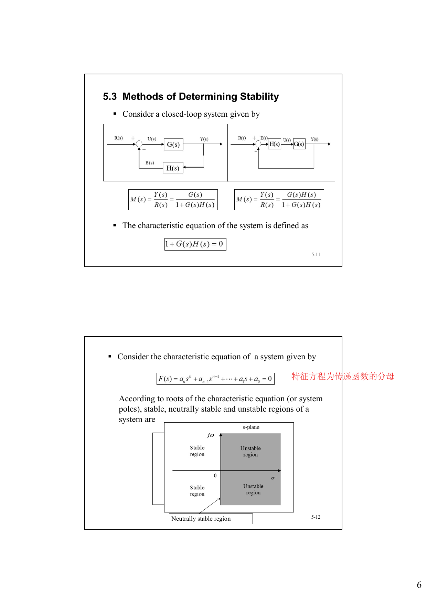

### 3.1 根平面判据

连续时间系统的稳定性可以直接由闭环极点在 $s$ 平面的位置判断：

- 稳定：所有特征根实部均小于 $0$，即全部在左半平面。
- 不稳定：至少一个特征根实部大于 $0$，即存在右半平面极点。
- 临界稳定：至少一个特征根实部为 $0$，其他根实部小于 $0$，且虚轴根不是导致响应发散的重复根。

讲义中的直观分区：

- 左半平面：稳定区域。
- 右半平面：不稳定区域。
- 虚轴：临界稳定区域。

### 3.2 最小相位与非最小相位

最小相位系统：所有零点和极点的实部都为负，或允许零点在原点。

非最小相位系统：至少一个零点或极点实部为正，或者系统含有纯滞后。

注意：稳定性主要看闭环极点；最小相位还要看零点。

## 4. 例子：质量弹簧系统

质量弹簧系统的传递函数为：

$$
\frac{Y(s)}{F(s)}=\frac{1}{Ms^2+K}
$$

其极点为：

$$
s_{1,2}=\pm j\sqrt{\frac{K}{M}}
$$

极点位于虚轴上，所以系统会等幅振荡，是临界稳定系统。

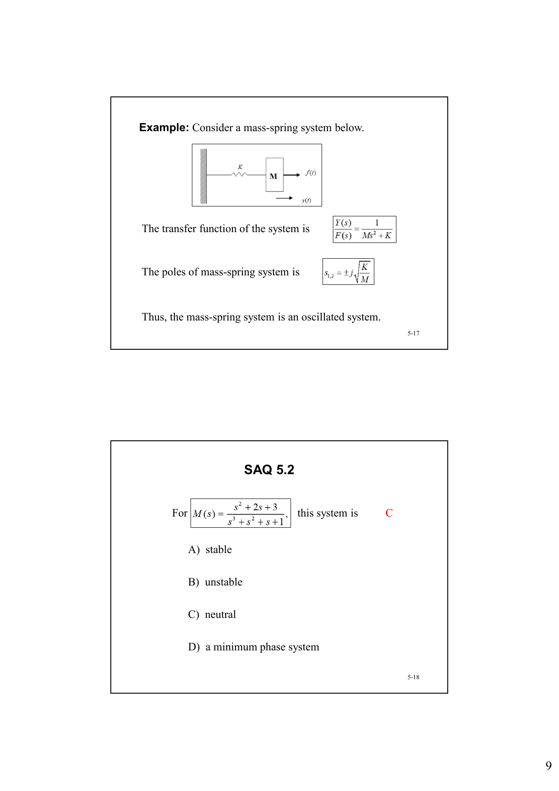

## 5. 系数的必要条件

若特征方程全部根都在左半平面，则必须满足：

1. 特征方程所有系数同号。
2. 没有系数为 $0$。

但这只是必要条件，不是充分条件。也就是说，系数全为正只能说明“有可能稳定”，不能保证稳定。

对于一阶和二阶系统，上述必要条件同时也是充分条件：

- 一阶：$a_1s+a_0=0$，稳定条件为 $a_1$ 与 $a_0$ 同号且非零。
- 二阶：$a_2s^2+a_1s+a_0=0$，稳定条件为所有系数同号且无缺项。

## 6. 极点位置与时域响应

极点位置决定暂态响应形式：

- 左半平面的实极点：指数衰减。
- 左半平面的共轭复极点：衰减振荡。
- 虚轴上的共轭复极点：等幅振荡。
- 右半平面的实极点：指数发散。
- 右半平面的共轭复极点：发散振荡。

讲义中的参数例子显示：随着 $K$ 变化，闭环极点在 $s$ 平面中移动；当极点从左半平面越过虚轴进入右半平面时，系统由稳定变为不稳定。

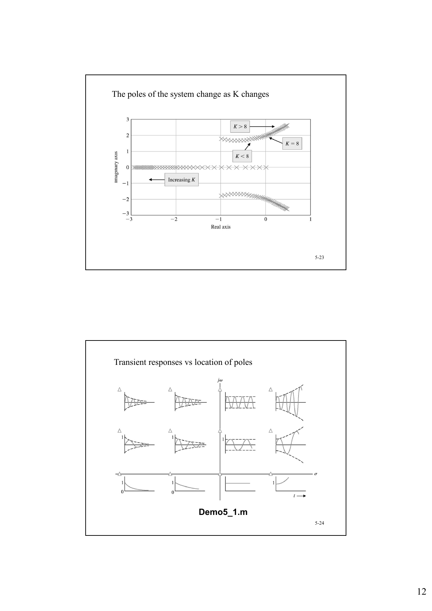

## 7. Routh-Hurwitz 判据

Routh-Hurwitz 判据用于不显式求根，而直接由特征方程判断系统稳定性。

设特征方程为：

$$
F(s)=a_ns^n+a_{n-1}s^{n-1}+\cdots+a_1s+a_0=0
$$

构造 Routh 表后：

- 第一列符号变化次数 = 右半平面根的个数。
- 稳定的充分必要条件：特征方程各项系数为正，且 Routh 表第一列元素全部为正。

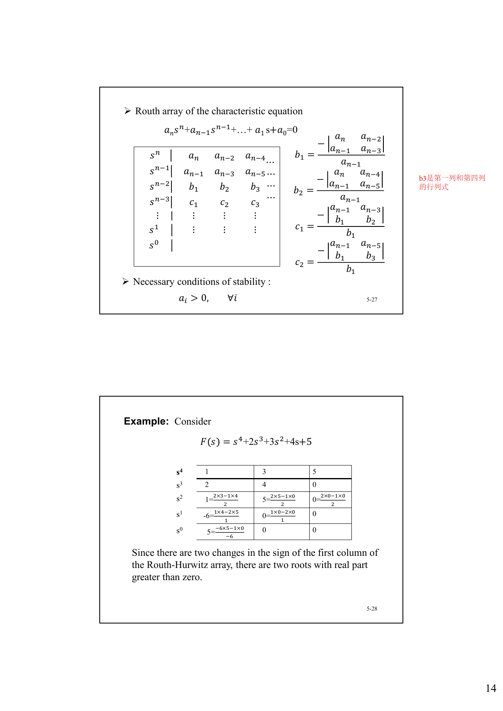

### 7.1 Routh 表构造要点

前两行由特征方程系数交错排列：

$$
\begin{array}{c|cccc}
s^n & a_n & a_{n-2} & a_{n-4} & \cdots \\
s^{n-1} & a_{n-1} & a_{n-3} & a_{n-5} & \cdots
\end{array}
$$

后续元素由前两行的行列式关系递推。讲义中特别强调：$b_1,b_2,c_1,c_2$ 等都由上方两行的对应列计算得到。

### 7.2 例题：四阶多项式

考虑：

$$
F(s)=s^4+2s^3+3s^2+4s+5
$$

Routh 表第一列的符号出现两次变化，因此该方程有两个右半平面根，系统不稳定。

## 8. 三阶系统的稳定条件

对三阶特征方程：

$$
a_3s^3+a_2s^2+a_1s+a_0=0
$$

Routh 表给出三阶系统稳定的充分必要条件：

$$
a_i>0,\quad \forall i
$$

并且：

$$
a_1a_2-a_3a_0>0
$$

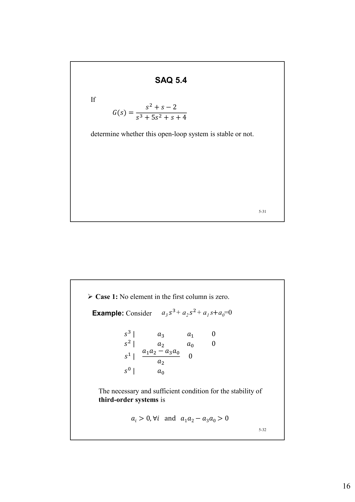

这个条件常用于参数范围题。先写闭环特征方程，再把各项系数代入三阶判据。

## 9. Routh 判据的特殊情形

### 9.1 情形 1：第一列无零元素

正常构造 Routh 表。若第一列没有符号变化，系统稳定；若有 $m$ 次符号变化，则有 $m$ 个右半平面根。

### 9.2 情形 2：第一列出现零，但该行其他元素不全为零

方法 1：用一个很小的正数 $\varepsilon$ 替代第一列中的 $0$，再继续构造 Routh 表。

例：

$$
s^3-3s+2=0
$$

用 $\varepsilon$ 替代 $0$ 后，第一列会出现两次符号变化，系统不稳定。实际根为 $-2,1,1$。

另一个例子：

$$
s^4+3s^3+3s^2+3s+2=0
$$

用正的 $\varepsilon$ 替代后可判断存在虚根，系统临界稳定。实际根为 $+j,-j,-1,-2$。

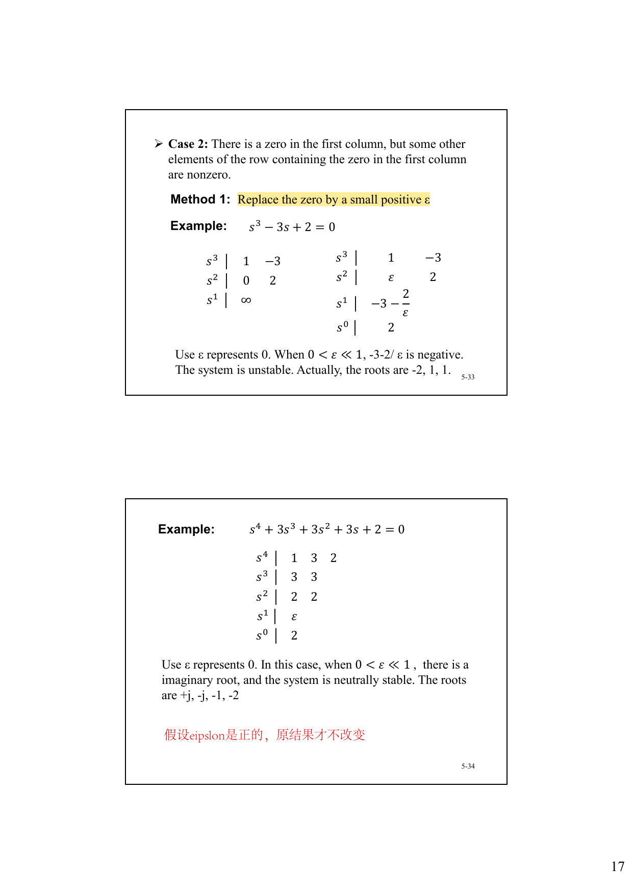

方法 2：把原方程乘以 $(s+a)$，其中 $a$ 为任意正数，再构造 Routh 表。这个方法不改变原方程右半平面根的个数。

例：

$$
(s^3-3s+2)(s+3)=0
$$

展开为：

$$
s^4+3s^3-3s^2-7s+6=0
$$

Routh 表第一列符号变化两次，因此原系统不稳定。

### 9.3 情形 3：第一列为零，且该行所有元素也为零

当 Routh 表出现整行零时，需要构造辅助方程 $Q(s)$。

步骤：

1. 用整零行上一行的系数构造辅助方程 $Q(s)$。
2. 对 $Q(s)$ 求导。
3. 用 $Q'(s)$ 的系数替换整零行。
4. 继续构造 Routh 表。

例：

$$
s^5+s^4+3s^3+3s^2+2s+2=0
$$

整零行上一行对应辅助方程：

$$
Q(s)=s^4+3s^2+2=0
$$

求导：

$$
Q'(s)=4s^3+6s
$$

继续 Routh 表后可得到虚轴根。辅助方程可分解为：

$$
s^4+3s^2+2=(s^2+1)(s^2+2)=0
$$

所以虚轴根为：

$$
\pm j,\quad \pm j\sqrt{2}
$$

实际所有根为：

$$
\pm j,\quad \pm j\sqrt{2},\quad -1
$$

系统临界稳定。

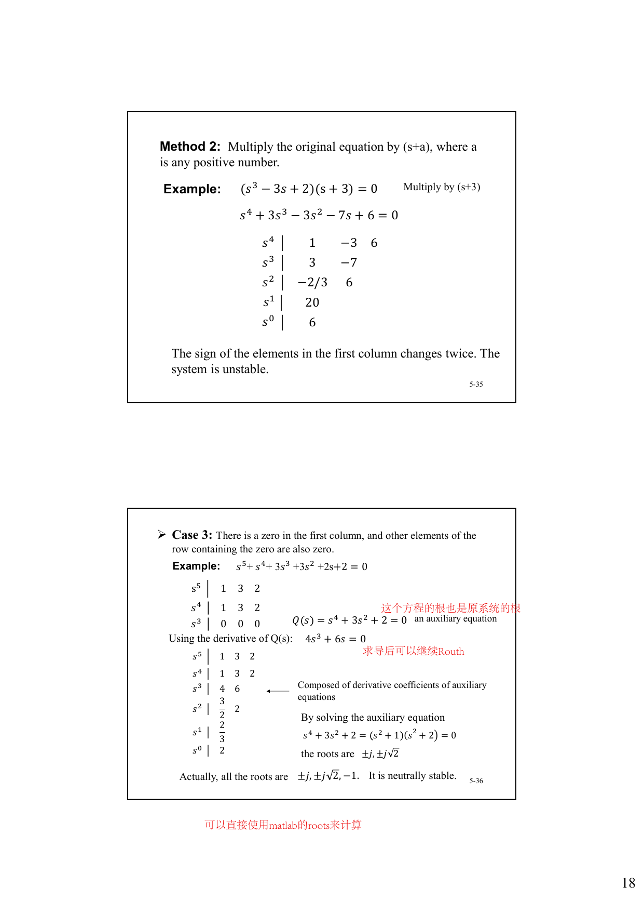

### 9.4 情形 4：虚轴重复根

如果特征方程在虚轴上存在重复根，系统响应会不稳定。讲义强调：Routh-Hurwitz 判据不一定能揭示这种形式的不稳定，因此必要时需要直接求根，例如使用 MATLAB 的 `roots`。

例：

$$
s^5+s^4+2s^3+2s^2+s+1=0
$$

根为：

$$
+j,\ -j,\ +j,\ -j,\ -1
$$

虚轴根重复，因此响应不稳定。

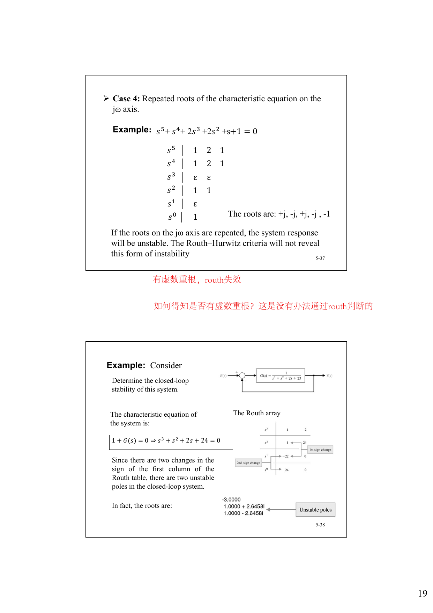

## 10. 参数稳定范围例题

### 10.1 单位负反馈中的参数 K

系统开环传递函数：

$$
G(s)=\frac{K}{s(0.1s+1)(0.25s+1)}
$$

闭环特征方程：

$$
s(0.1s+1)(0.25s+1)+K=0
$$

化简为：

$$
s^3+14s^2+40s+40K=0
$$

三阶稳定条件：

$$
K>0
$$

以及：

$$
14\times 40-1\times 40K>0
$$

所以：

$$
0<K<14
$$

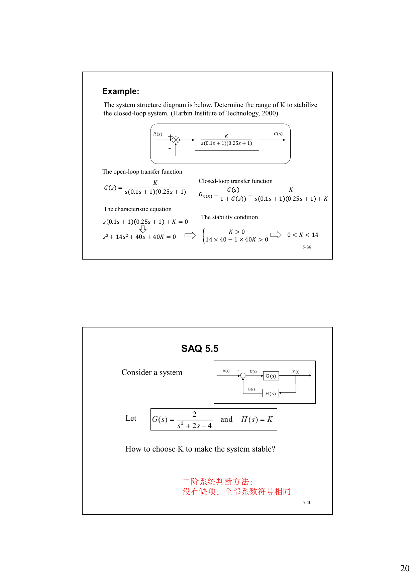

## 11. 复习要点

- 连续时间系统稳定性看闭环极点，所有极点在左半平面才稳定。
- 虚轴极点通常对应临界稳定；虚轴重复根会导致不稳定响应。
- BIBO 稳定强调有界输入对应有界输出。
- 特征方程是闭环传递函数分母为零，负反馈常写作 $1+G(s)H(s)=0$。
- 系数同号且无缺项只是一般高阶系统稳定的必要条件，不是充分条件。
- 一阶、二阶系统中，系数同号且无缺项就是稳定的充分必要条件。
- 三阶系统 $a_3s^3+a_2s^2+a_1s+a_0=0$ 的稳定条件是 $a_i>0$ 且 $a_1a_2-a_3a_0>0$。
- Routh 表第一列符号变化次数等于右半平面根的个数。
- Routh 表第一列出现零时，用 $\varepsilon$ 法或乘以 $(s+a)$ 法。
- Routh 表出现整行零时，用辅助方程求导替换该行。

## 12. SAQ 与课后题

### SAQ 5.1

原题：

Which is correct in the following:

- A) A feedback control system is always stable
- B) A system is unstable if it remains oscillating at constant amplitude when slightly disturbed
- C) A system is not BIBO stable if its output $y(t)$ is unbounded to an unbounded input $u(t)$
- D) Determination of stability is important in control system design

解答：

- A 错，反馈系统不一定稳定。
- B 错，等幅振荡对应临界稳定，不是不稳定。
- C 错，BIBO 稳定考察的是有界输入是否导致有界输出，不能拿无界输入判断。
- D 对。

答案：**D**

### SAQ 5.2

原题：

$$
M(s)=\frac{s^2+2s+3}{s^3+s^2+s+1}
$$

这个系统属于：

- A) stable
- B) unstable
- C) neutral
- D) a minimum phase system

原题截图：

解答：

看分母对应极点：

$$
s^3+s^2+s+1=(s+1)(s^2+1)
$$

所以极点为：

$$
s=-1,\quad s=\pm j
$$

存在一对虚轴单根，且另一个极点在左半平面，因此系统为临界稳定。

答案：**C) neutral**

### SAQ 5.3

原题：

For a unit feedback system, if

$$
G(s)=\frac{1}{s^2+2s+7}
$$

what does its closed-loop response look like?

原题截图：

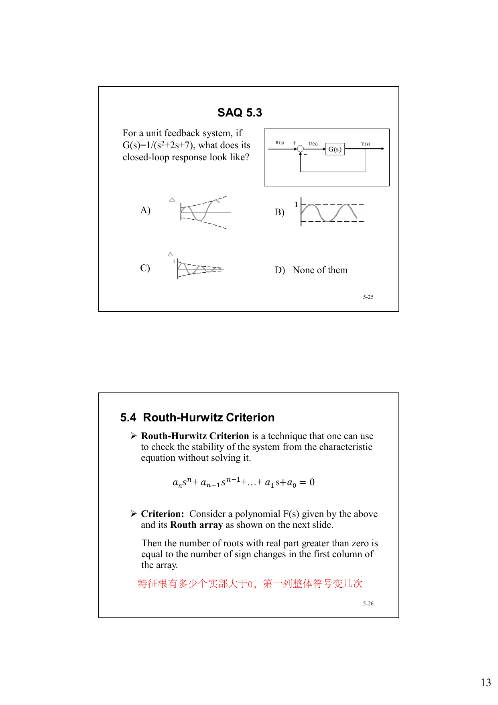

解答：

单位负反馈闭环传递函数：

$$
T(s)=\frac{G(s)}{1+G(s)}=\frac{1}{s^2+2s+8}
$$

特征方程为：

$$
s^2+2s+8=0
$$

极点：

$$
s=-1\pm j\sqrt{7}
$$

实部为负，所以响应是**衰减振荡**。对应选项 C 的图像。

答案：**C**

### SAQ 5.4

原题：

If

$$
G(s)=\frac{s^2+s-2}{s^3+5s^2+s+4}
$$

determine whether this open-loop system is stable or not.

原题截图：

解答：

开环系统是否稳定只看极点，也就是分母：

$$
s^3+5s^2+s+4=0
$$

这是三阶系统，检验：

$$
a_3=1,\ a_2=5,\ a_1=1,\ a_0=4
$$

各系数都为正，且

$$
a_2a_1-a_3a_0=5\cdot 1-1\cdot 4=1>0
$$

满足三阶稳定判据，因此开环稳定。

答案：**stable**

### SAQ 5.5

原题：

考虑系统

$$
G(s)=\frac{2}{s^2+2s-4},\qquad H(s)=K
$$

How to choose $K$ to make the system stable?

原题截图：

解答：

闭环特征方程由

$$
1+G(s)H(s)=0
$$

得到：

$$
s^2+2s-4+2K=0
$$

即

$$
s^2+2s+(2K-4)=0
$$

二阶系统稳定要求系数同号且无缺项，因此：

$$
2K-4>0
$$

所以：

$$
K>2
$$

答案：**$K>2$**

### Exercise 5.1

原题：

考虑系统

$$
G(s)=\frac{2}{s-1},\qquad H(s)=\frac{K+1}{s+3}
$$

求使系统 stable、neutral、unstable 的 $K$ 范围。

原题截图：

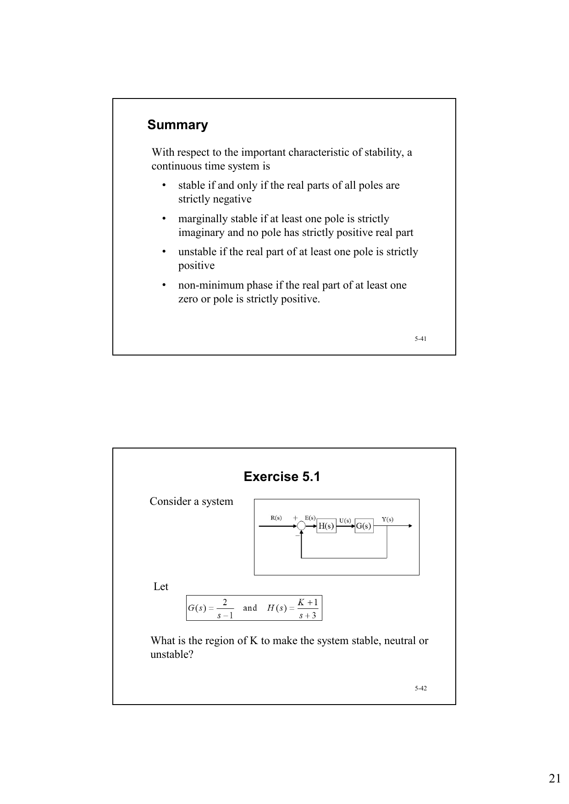

解答：

由框图可得特征方程：

$$
1+G(s)H(s)=0
$$

代入：

$$
1+\frac{2}{s-1}\cdot\frac{K+1}{s+3}=0
$$

化简得：

$$
(s-1)(s+3)+2(K+1)=0
$$

即

$$
s^2+2s+(2K-1)=0
$$

这是二阶系统。

1. 稳定要求：

$$
2K-1>0 \Rightarrow K>\frac{1}{2}
$$

2. 临界稳定要求存在虚轴单根，即常数项为零：

$$
2K-1=0 \Rightarrow K=\frac{1}{2}
$$

此时

$$
s^2+2s=s(s+2)=0
$$

根为 $0,-2$，因此为 neutral。

3. 不稳定：

$$
K<\frac{1}{2}
$$

答案：

- **stable**：$K>\dfrac{1}{2}$
- **neutral**：$K=\dfrac{1}{2}$
- **unstable**：$K<\dfrac{1}{2}$

### Exercise 5.2

原题：

A control system is shown in the figure below. Try to determine $K_1$ and $K_2$ to stabilize the closed-loop system.

原题截图：

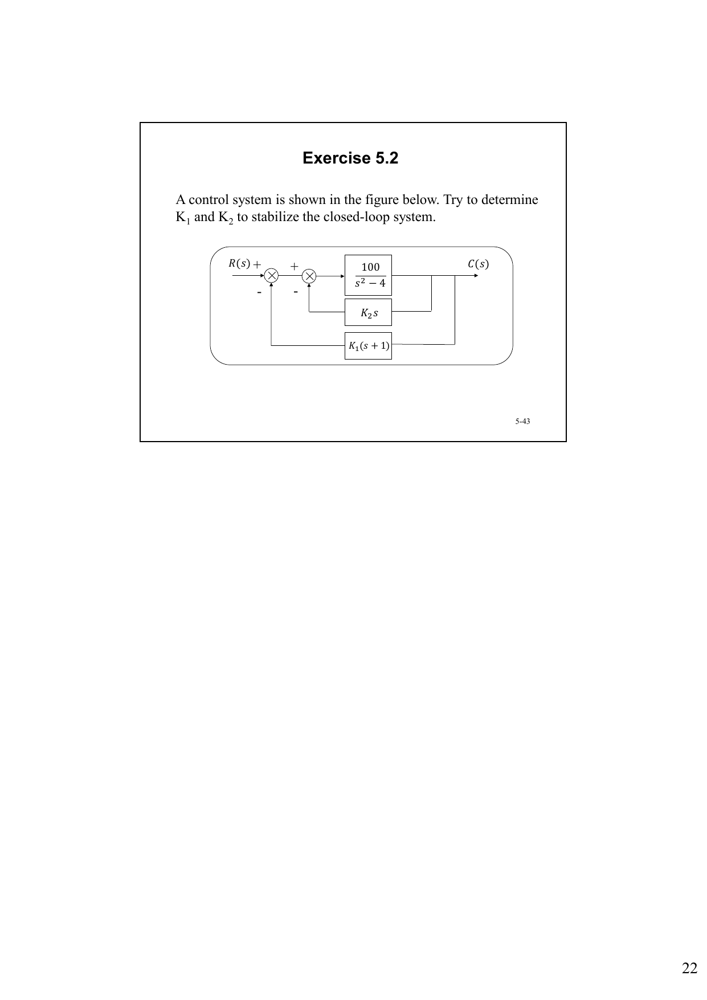

解答：

设被控对象为：

$$
P(s)=\frac{100}{s^2-4}
$$

由框图可得输入到被控对象前的信号为：

$$
U(s)=R(s)-K_1(s+1)C(s)-K_2s\,C(s)
$$

因此：

$$
C(s)=P(s)U(s)
$$

代入得特征方程：

$$
1+P(s)\bigl[K_1(s+1)+K_2s\bigr]=0
$$

即：

$$
1+\frac{100\,[K_1(s+1)+K_2s]}{s^2-4}=0
$$

化简：

$$
s^2-4+100K_1(s+1)+100K_2s=0
$$

整理为：

$$
s^2+100(K_1+K_2)s+(100K_1-4)=0
$$

二阶系统稳定要求一次项和常数项系数都大于 0，因此：

$$
100(K_1+K_2)>0
$$

和

$$
100K_1-4>0
$$

所以稳定条件是：

$$
K_1>\frac{1}{25}=0.04,\qquad K_1+K_2>0
$$

即：

$$
K_2>-K_1,\qquad K_1>0.04
$$

答案：闭环稳定当且仅当

$$
K_1>0.04,\qquad K_2>-K_1
$$
