# SDM263 自动控制理论 Chapter 6: Time-Domain Analysis

来源：`SDM263-ACT-Chapter6-TimeDomain-BW.pdf`

## 本讲内容

本章讨论控制系统的时域分析。核心问题是：给定典型输入后，系统输出随时间怎样变化，以及如何用稳态误差和暂态指标评价系统性能。

- 时域响应的组成：暂态响应与稳态响应
- 典型测试信号：阶跃、斜坡、抛物线
- 稳态误差与系统型别
- 时域性能指标：超调量、延迟时间、上升时间、峰值时间、调节时间
- 一阶系统与二阶系统的阶跃响应
- 增加极点、零点对暂态性能的影响
- 主导极点的概念

---

## 6.1 Time Responses of Systems

### 基本术语

控制系统的时域响应描述的是系统输出随时间变化的过程。

- Reference input：期望系统跟踪的输入信号，记为 `r(t)`。
- Actuating signal：施加到被控对象上的控制信号。
- Time response：系统输出 `y(t)` 关于时间的响应。

控制系统的输出通常拆成两部分：

$$
y(t)=y_t(t)+y_s(t)
$$

其中：

- `y_t(t)` 是 transient response，表示随时间衰减并最终趋于 0 的暂态部分。
- `y_s(t)` 是 steady-state response，表示暂态消失后剩下的稳态部分。

在时域中，系统通常由微分方程建模。研究时域响应，本质上就是求解系统变量随时间演化的过程。

---

## 6.2 Typical Test Signals for Time Responses

### Step Input

阶跃输入表示参考输入发生瞬时变化。幅值为 `R_0` 的阶跃输入可以写成：

$$
r(t)=R_0 u_s(t),\quad t\ge 0
$$

其拉普拉斯变换为：

$$
R(s)=\frac{R_0}{s}
$$

当 `R_0=1` 时，称为 unit-step input，记作 `u_s(t)`。

### Ramp Input

斜坡输入表示输入随时间线性变化：

$$
r(t)=R_0 t,\quad t\ge 0
$$

其拉普拉斯变换为：

$$
R(s)=\frac{R_0}{s^2}
$$

斜坡输入常用于测试系统对匀速变化参考信号的跟踪能力。

### Parabolic Input

单位抛物线输入，也可理解为加速度阶跃输入：

$$
r(t)=\frac{1}{2}t^2,\quad t\ge 0
$$

对应拉普拉斯变换：

$$
R(s)=\frac{1}{s^3}
$$

三个标准测试输入可以概括为：

| 输入类型 | 时域表达 | 拉普拉斯变换 | 用途 |
|---|---:|---:|---|
| 阶跃输入 | `R_0` | `R_0 / s` | 测试系统对突变参考的响应 |
| 斜坡输入 | `R_0 t` | `R_0 / s^2` | 测试匀速跟踪能力 |
| 抛物线输入 | `(1/2)t^2` | `1 / s^3` | 测试加速度型输入跟踪能力 |

---

## 6.3 Steady-State Error

### 误差与稳态误差

系统误差定义为参考输入和实际输出之差：

$$
e(t)=r(t)-y(t)
$$

稳态误差是系统进入稳态后，输出与参考输入之间仍然存在的误差：

$$
e_{ss}=\lim_{t\to\infty} e(t)
$$

稳态误差可能来自非线性环节，例如摩擦、死区等。设计控制系统时，通常要求稳态误差尽可能小，或者低于可接受阈值。

### 系统型别 Type

系统型别由开环传递函数 `G(s)` 在 `s=0` 处的极点阶数决定。

- Type 0：`G(s)` 在 `s=0` 无极点。
- Type 1：`G(s)` 在 `s=0` 有一个点。
- Type 2：`G(s)` 在 `s=0` 有两个极点。
- Type n：`G(s)` 在 `s=0` 有 `n` 个极点。

直观理解：系统里有多少个积分器，就是几型系统。

例如：

| 传递函数形式                       | 型别     |
| ---------------------------- | ------ |
| $G(s)=s/(s^2+3s+2)$          | Type 0 |
| $G(s)=(s+1)/[(s+1)s]$        | Type 1 |
| $G(s)=(s-1)/[(s+1)s^2]$      | Type 2 |
| $G(s)=(s^2+4s+4)/[(s+3)s^5]$ | Type 5 |

### 单位负反馈系统的稳态误差

对单位负反馈系统：

$$
\frac{E(s)}{R(s)}=\frac{1}{1+G(s)}
$$

由终值定理：

$$
e_{ss}=\lim_{t\to\infty}e(t)=\lim_{s\to 0}sE(s)
$$

因此：

$$
e_{ss}=\lim_{s\to 0} \frac{sR(s)}{1+G(s)}
$$

若前向通道中还有控制器 `K(s)`，则：

$$
\frac{E(s)}{R(s)}=\frac{1}{1+G(s)K(s)}
$$

稳态误差按 `G(s)K(s)` 计算。

### 阶跃输入下的稳态误差

对单位阶跃输入：

$$
R(s)=\frac{1}{s}
$$

定义位置误差常数：

$$
K_p=\lim_{s\to 0}G(s)
$$

则：

$$
e_{ss}=\frac{1}{1+K_p}
$$

如果阶跃幅值为 `R_0`，则：

$$
e_{ss}=\frac{R_0}{1+K_p}
$$

不同系统型别对阶跃输入的结果：

| 系统型别 | `K_p` | 阶跃稳态误差 |
|---|---:|---:|
| Type 0 | 有限值 | `R_0/(1+K_p)` |
| Type 1 或更高 | `∞` | `0` |

结论：只要系统中至少有一个积分器，单位负反馈系统对阶跃输入的稳态误差为 0。

### 斜坡输入下的稳态误差

对单位斜坡输入：

$$
R(s)=\frac{1}{s^2}
$$

定义速度误差常数：

$$
K_v=\lim_{s\to 0}sG(s)
$$

则：

$$
e_{ss}=\frac{1}{K_v}
$$

不同系统型别对斜坡输入的结果：

| 系统型别 | `K_v` | 斜坡稳态误差 |
|---|---:|---:|
| Type 0 | `0` | `∞` |
| Type 1 | 有限值 | `1/K_v` |
| Type 2 或更高 | `∞` | `0` |

### 抛物线输入下的稳态误差

对单位抛物线输入：

$$
R(s)=\frac{1}{s^3}
$$

定义加速度误差常数：

$$
K_a=\lim_{s\to 0}s^2G(s)
$$

则：

$$
e_{ss}=\frac{1}{K_a}
$$

不同系统型别对抛物线输入的结果：

| 系统型别 | `K_a` | 抛物线稳态误差 |
|---|---:|---:|
| Type 0 | `0` | `∞` |
| Type 1 | `0` | `∞` |
| Type 2 | 有限值 | `1/K_a` |
| Type 3 或更高 | `∞` | `0` |

稳态误差的图形理解如下。阶跃误差是最终输出与最终参考值之间的垂直差；斜坡误差是稳态时输出和参考直线之间的固定偏差；抛物线误差对应加速度型参考下的长期偏差。

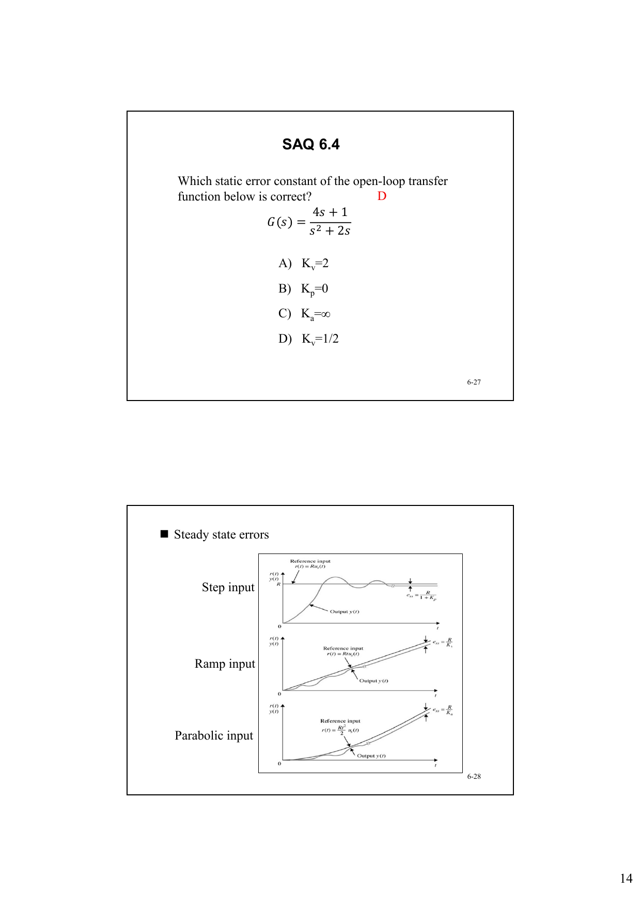

### 静态误差常数汇总

| 常数 | 定义 | 名称 | 对应输入 |
|---|---|---|---|
| `K_p` | `lim_{s->0} G(s)` | Position error constant | 阶跃 |
| `K_v` | `lim_{s->0} sG(s)` | Velocity error constant | 斜坡 |
| `K_a` | `lim_{s->0} s^2G(s)` | Acceleration error constant | 抛物线 |

### 例：计算 `K_p, K_v, K_a`

给定单位负反馈开环系统：

$$
G(s)=\frac{24}{s(s+2)(s+3)}
$$

计算：

$$
K_p=\lim_{s\to0}G(s)=\infty
$$

$$
K_v=\lim_{s\to0}sG(s)
=\lim_{s\to0}\frac{24}{(s+2)(s+3)}=4
$$

$$
K_a=\lim_{s\to0}s^2G(s)
=\lim_{s\to0}\frac{24s}{(s+2)(s+3)}=0
$$

所以它是 Type 1 系统：对阶跃输入无稳态误差，对单位斜坡输入稳态误差为 `1/4`，对抛物线输入稳态误差无穷大。

### 例：复合输入的稳态误差

如果参考输入为：

$$
r(t)=\left(r_0+v_0t+\frac{a_0}{2}t^2\right)u_s(t)
$$

则稳态误差可以按线性叠加写成：

$$
e_{ss}=\frac{r_0}{1+K_p}+\frac{v_0}{K_v}+\frac{a_0}{K_a}
$$

课件中的例子是 Type 2 系统，因此：

$$
K_p=\infty,\quad K_v=\infty,\quad K_a=K_1K_m
$$

所以：

$$
e_{ss}=0+0+\frac{a_0}{K_1K_m}
$$

### 扰动作用下的稳态误差

当 `R(s)=0` 且系统受到扰动 `N(s)` 时，误差不再由参考输入产生，而由扰动通道传递到输出。

课件给出的结构中：

$$
C(s)=\frac{G_2(s)N(s)}{1+G_1(s)G_2(s)H(s)}
$$

因为 `R(s)=0`，有：

$$
E(s)=R(s)-C(s)=-C(s)
$$

所以：

$$
e_{ss}
=\lim_{s\to0}sE(s)
=\lim_{s\to0}\frac{-sG_2(s)N(s)}
{1+G_1(s)G_2(s)H(s)}
$$

### 暂态性能与稳态性能的权衡

增加积分器可以改善稳态性能，因为积分环节会提高系统型别，降低阶跃、斜坡或抛物线输入下的稳态误差。但积分器在原点引入极点，会降低系统稳定裕度。

因此，不能只追求稳态误差小，还必须同时考虑稳定性和暂态响应。

---

## 6.4 Time-Domain Specifications

单位阶跃响应是输入为单位阶跃信号时的系统输出。时域指标主要从这条响应曲线上读取。

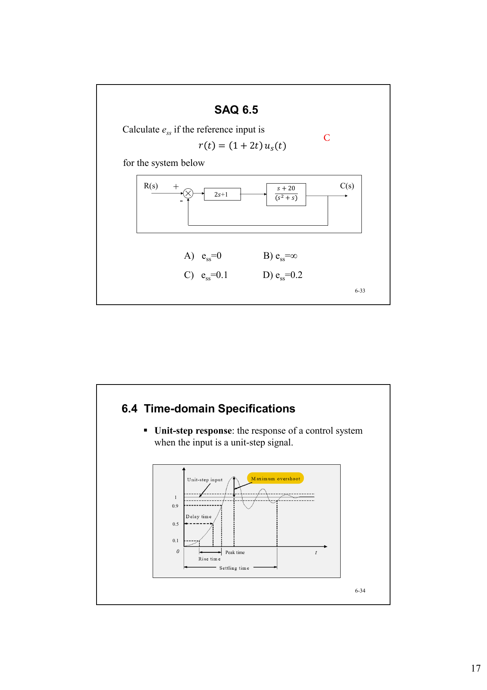

常用时域指标：

| 指标 | 英文 | 含义 |
|---|---|---|
| 最大超调量 | Maximum overshoot | 输出最大值与稳态值之间的差，常用百分比表示 |
| 延迟时间 | Delay time | 响应第一次达到最终值 50% 所需时间 |
| 上升时间 | Rise time | 响应从最终值 10% 上升到 90% 所需时间 |
| 调节时间 | Settling time | 响应进入并保持在指定误差带内所需时间 |
| 峰值时间 | Peak time | 响应达到最大值所需时间 |

---

## 6.5 Transient Response of a First-Order System

一阶系统的一般形式为：

$$
G(s)=\frac{Y(s)}{U(s)}=\frac{K}{\tau s+1}
$$

其中 `K` 为系统增益，`\tau` 为时间常数。

对单位阶跃输入 `U(s)=1/s`，有：

$$
Y(s)=\frac{K}{s(\tau s+1)}
$$

反拉普拉斯变换得到：

$$
y(t)=K(1-e^{-t/\tau})
$$

一阶系统的阶跃响应是单调上升曲线，无超调。时间常数 `\tau` 决定响应快慢。

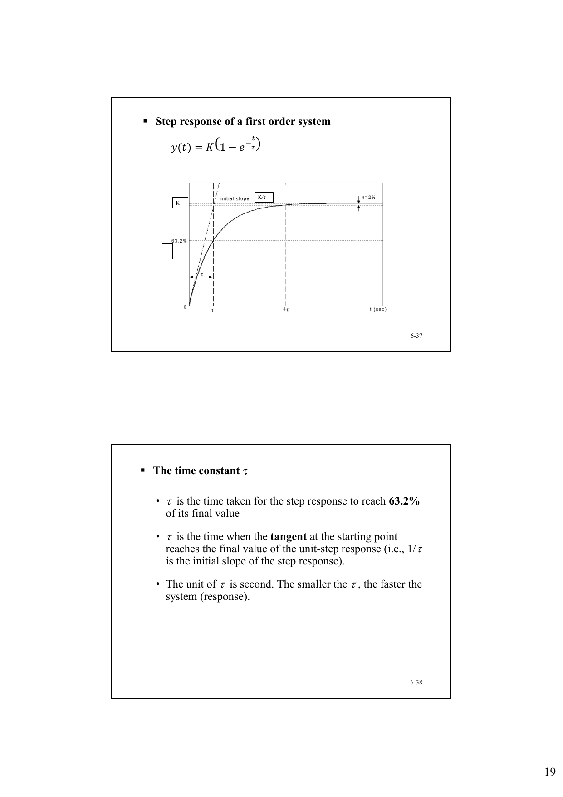

### 时间常数 `\tau`

`\tau` 的意义：

- `t=\tau` 时，响应达到最终值的 `63.2%`。
- 初始点切线到达最终值所需时间为 `\tau`。
- `1/\tau` 是单位阶跃响应在起点处的初始斜率。
- `\tau` 越小，响应越快。

一阶系统常用指标：

| 指标 | 公式 |
|---|---:|
| 最终值 | `y(∞)=K u(∞)` |
| 上升时间 | `t_r=2.2τ` |
| 超调量 | `σ%=0%` |
| 5% 调节时间 | `t_s=3τ` |
| 2% 调节时间 | `t_s=4τ` |

例如 `y(t)=1-e^{-t/\tau}` 达到 95% 最终值时：

$$
1-e^{-t/\tau}=0.95
$$

$$
t\approx 3\tau
$$

---

## 6.6 Transient Response of a Second-Order System

标准二阶闭环系统通常写成：

$$
M(s)=\frac{C(s)}{R(s)}
=\frac{\omega_n^2}{s^2+2\zeta\omega_n s+\omega_n^2}
$$

其中：

- `\omega_n`：undamped natural frequency，无阻尼自然频率。
- `\zeta`：damping ratio，阻尼比。
- `\zeta\omega_n`：damping factor / damping constant，决定响应包络的衰减速度。
- `\omega_d=\omega_n\sqrt{1-\zeta^2}`：damped frequency，阻尼振荡频率。

闭环特征方程：

$$
s^2+2\zeta\omega_n s+\omega_n^2=0
$$

闭环极点：

$$
s_{1,2}=-\zeta\omega_n\pm \omega_n\sqrt{\zeta^2-1}
$$

欠阻尼情况下 `0<\zeta<1`，极点为共轭复数：

$$
s_{1,2}=-\zeta\omega_n\pm j\omega_n\sqrt{1-\zeta^2}
$$

### 阻尼比与动态分类

阻尼比决定二阶系统响应形态：

| 阻尼比范围 | 类型 | 响应特点 |
|---|---|---|
| `\zeta>1` | Overdamped | 无振荡，响应慢 |
| `\zeta=1` | Critically damped | 无振荡，临界阻尼，较快到达稳态 |
| `0<\zeta<1` | Underdamped | 有衰减振荡和超调 |
| `\zeta=0` | Undamped | 等幅振荡，不衰减 |
| `\zeta<0` | Negatively damped | 发散，不稳定 |

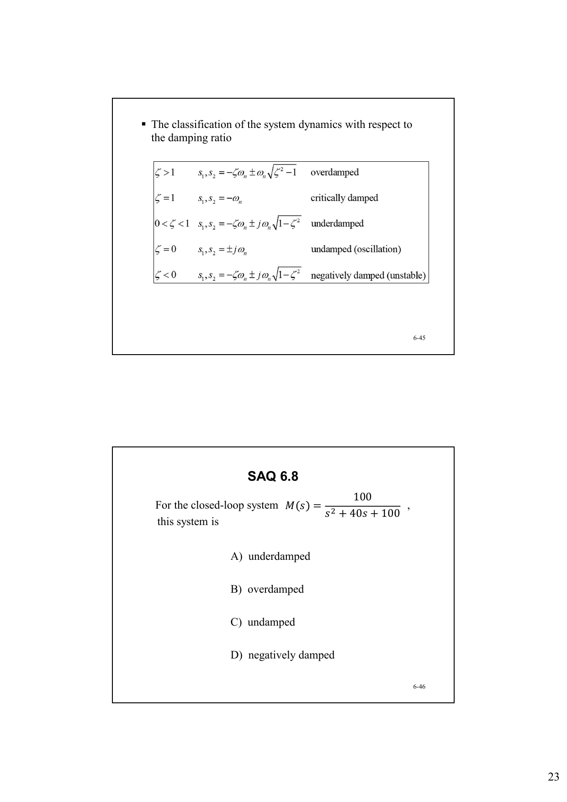

不同阻尼比对应的阶跃响应和极点位置如下。离虚轴越近，响应衰减越慢；右半平面极点对应不稳定响应。

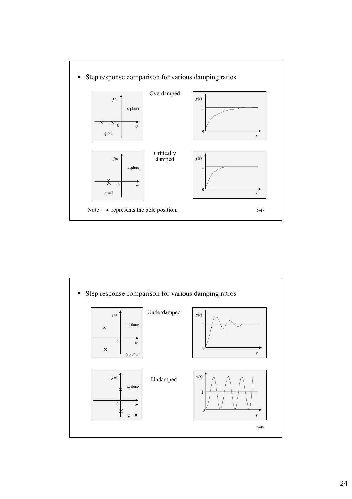

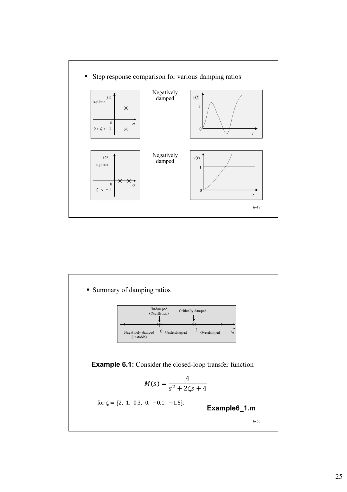

### 二阶系统性能指标

对标准欠阻尼二阶系统，最大超调量：

$$
M_p=y_{\max}-1
=e^{-\frac{\pi\zeta}{\sqrt{1-\zeta^2}}}
$$

百分超调量：

$$
\sigma\%=e^{-\frac{\pi\zeta}{\sqrt{1-\zeta^2}}}\times 100\%
$$

峰值时间：

$$
T_p=\frac{\pi}{\omega_n\sqrt{1-\zeta^2}}
$$

上升时间近似为：

$$
t_r=\frac{2.16\zeta+0.60}{\omega_n},
\quad 0.3\le\zeta\le0.8
$$

调节时间近似为：

$$
t_s=
\begin{cases}
\dfrac{3.5}{\zeta\omega_n}, & \Delta=0.05\\[6pt]
\dfrac{4.4}{\zeta\omega_n}, & \Delta=0.02
\end{cases}
$$

延迟时间也与 `\zeta` 成正比、与 `\omega_n` 成反比；课件强调其定性关系。

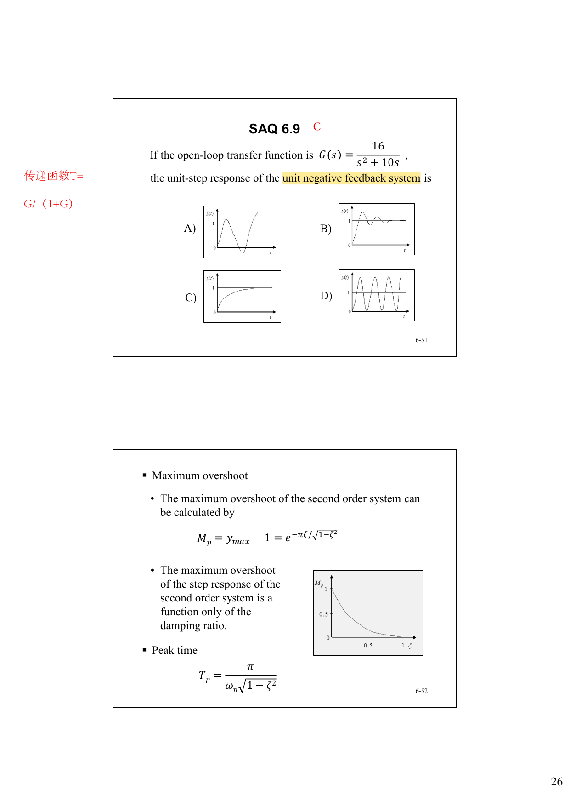

### 例：由开环系统求二阶时域指标

给定单位负反馈系统：

$$
G(s)=\frac{0.64}{s(s+0.8)}
$$

闭环传递函数：

$$
\frac{C(s)}{R(s)}
=\frac{0.64}{s^2+0.8s+0.64}
$$

与标准形式比较：

$$
\omega_n^2=0.64,\quad 2\zeta\omega_n=0.8
$$

所以：

$$
\omega_n=0.8,\quad \zeta=0.5
$$

这是欠阻尼系统。超调量：

$$
\sigma\%
=e^{-\frac{\pi(0.5)}{\sqrt{1-0.5^2}}}\times100\%
=16.3\%
$$

其他指标：

$$
t_r=\frac{2.16\times0.5+0.60}{0.8}=2.1s
$$

$$
T_p=\frac{\pi}{0.8\sqrt{1-0.5^2}}=4.55s
$$

$$
t_s=\frac{3.5}{0.5\times0.8}=8.75s,\quad \Delta=0.05
$$

$$
t_s=\frac{4.4}{0.5\times0.8}=11s,\quad \Delta=0.02
$$

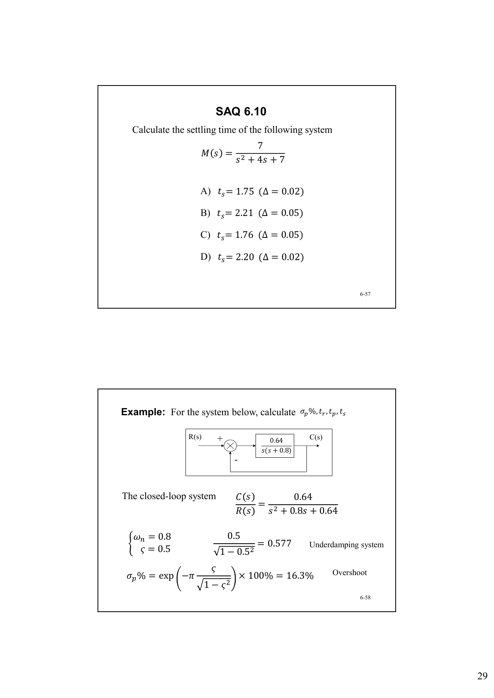

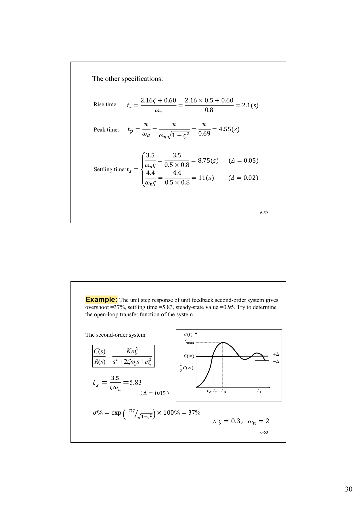

### 例：由响应指标反推开环传递函数

题目给出单位负反馈二阶系统的阶跃响应：

- 超调量 `37%`
- 调节时间 `t_s=5.83`
- 稳态值 `c(∞)=0.95`

由超调量可求：

$$
\zeta=0.3
$$

由 5% 调节时间：

$$
t_s=\frac{3.5}{\zeta\omega_n}=5.83
$$

得到：

$$
\omega_n=2
$$

闭环传递函数写成：

$$
\Phi(s)=\frac{4K}{s^2+1.2s+4}
$$

由终值定理：

$$
\lim_{t\to\infty}c(t)=K=0.95
$$

所以：

$$
\Phi(s)=\frac{3.8}{s^2+1.2s+4}
$$

单位负反馈下：

$$
G(s)=\frac{\Phi(s)}{1-\Phi(s)}
=\frac{19}{5s^2+6s+1}
$$

---

## 6.7 Effects of Adding Poles and Zeros

闭环极点会显著影响线性控制系统的暂态响应，尤其是稳定性。传递函数的零点也会影响暂态响应。为了达到满意的时域性能，常常需要增加极点、零点，或者抵消不希望出现的极点、零点。

### 在前向通道增加极点

课件考虑单位反馈系统，开环传递函数为：

$$
G(s)=\frac{\omega_n^2}
{s(s+2\zeta\omega_n)(1+T_p s)}
$$

闭环传递函数为：

$$
M(s)=\frac{G(s)}{1+G(s)}
$$

当 `\omega_n=1`、`\zeta=1`、`T_p=0,2,5` 时，随着 `T_p` 增大，新增极点 `-1/T_p` 向原点靠近。结果是：

- 最大超调量增加
- 上升时间增加
- 响应变慢，振荡倾向增强

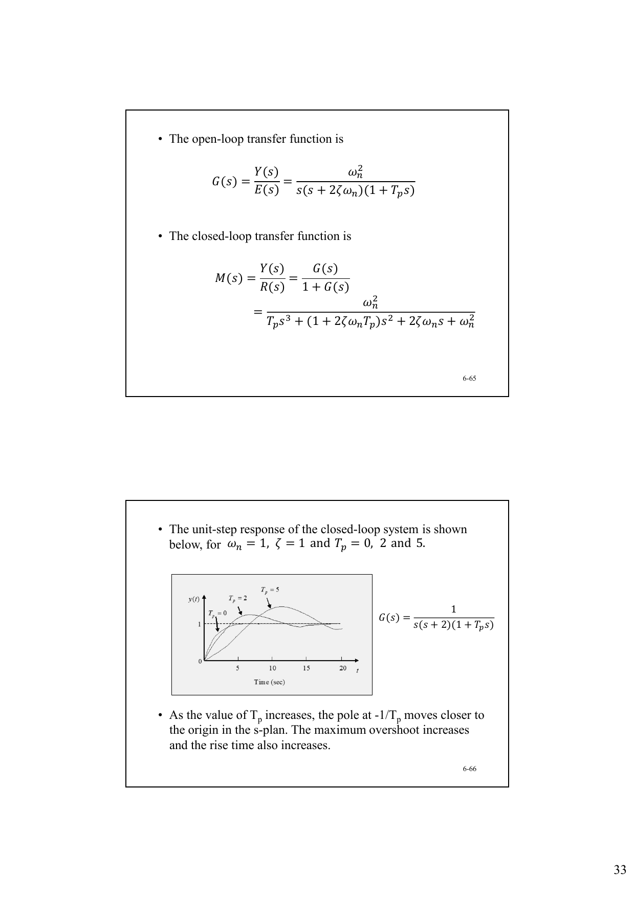

### 在闭环传递函数增加极点

考虑闭环传递函数：

$$
M(s)=\frac{\omega_n^2}
{(s^2+2\zeta\omega_n s+\omega_n^2)(1+T_p s)}
$$

当 `\omega_n=1`、`\zeta=0.5`、`T_p=0,2,4` 时，随着 `T_p` 增大，新增极点靠近原点。结果是：

- 上升时间增加
- 最大超调量减少
- 响应更慢，但峰值更不明显

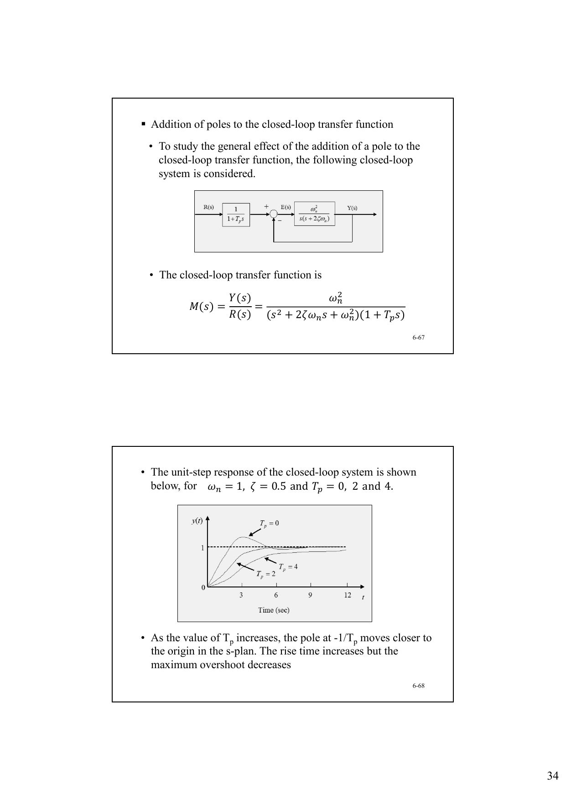

### 在闭环传递函数增加零点

考虑闭环传递函数：

$$
M(s)=\frac{\omega_n^2(1+T_zs)}
{s^2+2\zeta\omega_n s+\omega_n^2}
$$

当 `\omega_n=1`、`\zeta=1`、`T_z=0,1,3` 时，随着 `T_z` 增大：

- 上升时间减少
- 最大超调量增加

也就是说，零点通常会让响应更快，但可能带来更明显的超调。

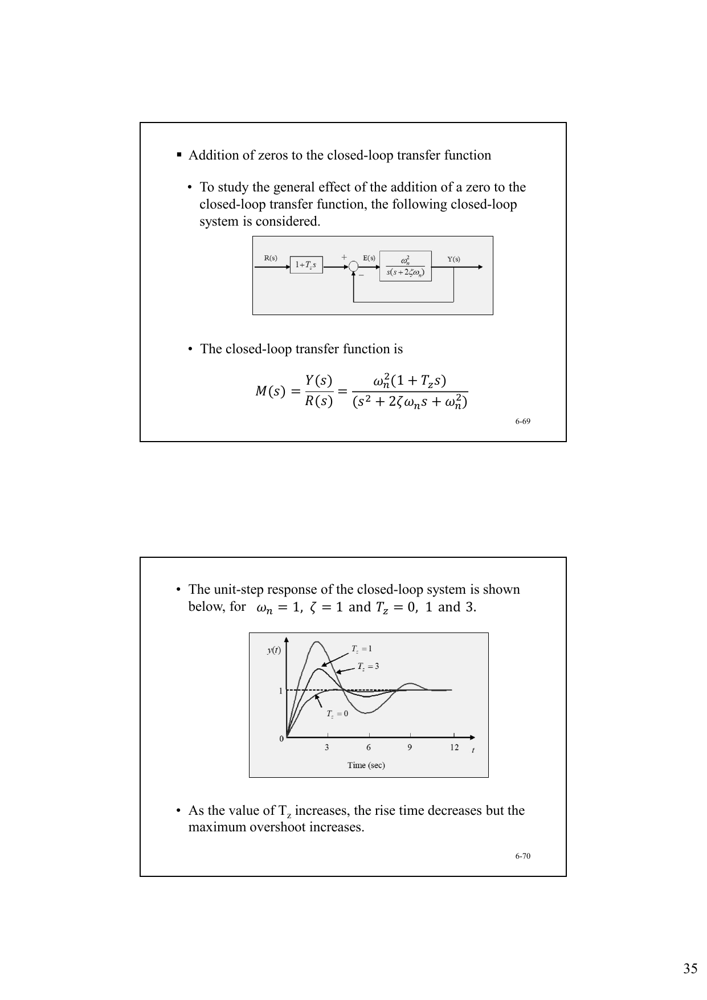

---

## 6.8 Dominant Poles of Transfer Functions

闭环极点在 `s` 平面的位置强烈影响系统暂态响应，但并非所有极点的影响都一样。

- Dominant poles：对暂态响应起主要作用的极点。
- Insignificant poles：影响较小、对应快速衰减分量的极点。

判断原则：

- 左半平面中靠近虚轴的极点，产生衰减较慢的暂态响应，因此影响更大。
- 远离虚轴的极点，对应快速衰减项，影响较小。

课件中的中文标注可以直接记为：离虚轴近的，是影响大的极点。

### 例：主导极点判断

给定闭环传递函数：

$$
M(s)=\frac{20}{(s+10)(s^2+2s+2)}
$$

极点为：

$$
s=-10,\quad s=-1+j,\quad s=-1-j
$$

其中 `s=-10` 的实部距离虚轴更远，衰减更快；`-1±j` 的实部更靠近虚轴，衰减较慢。因此：

- 主导极点：`s=-1+j` 与 `s=-1-j`
- 非重要极点：`s=-10`

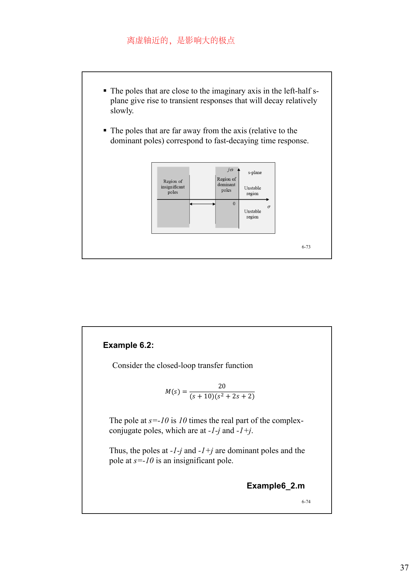

---

## 练习题与解答

说明：原讲义中出现的 SAQ 编号为 6.1、6.2、6.3、6.4、6.5、6.6、6.8、6.9、6.10、6.11、6.12、6.13；未看到 SAQ 6.7。

### SAQ 6.1

**原题：** Draw the signal `r(t)` which is described by

$$
R(s)=\frac{1-e^{-2s}}{s}
$$

**解答：**

利用时移性质：

$$
\frac{1}{s}\leftrightarrow u(t),\quad
\frac{e^{-2s}}{s}\leftrightarrow u(t-2)
$$

所以：

$$
r(t)=u(t)-u(t-2)
$$

即高度为 1、持续时间为 `0≤t<2` 的矩形脉冲。

### SAQ 6.2

**原题：** For

$$
G(s)=\frac{s-1}{(s^2+2)s}
$$

this system is:

A) type 0  
B) type 1  
C) type 2  
D) type 3

**解答：** `G(s)` 的分母中含有一个 `s`，即在 `s=0` 处有一个一阶极点，所以是 Type 1 系统。

答案：**B**。

### SAQ 6.3

**原题：** For

$$
G(s)=\frac{4}{s+2}
$$

the steady-state error of the unity feedback system with an input `r(t)=2u_s(t)` is:

A) `e_ss=1/3`  
B) `e_ss=1`  
C) `e_ss=2/3`  
D) `e_ss=1/2`

**解答：**

对阶跃输入，单位负反馈系统：

$$
e_{ss}=\frac{R_0}{1+K_p}
$$

其中：

$$
K_p=\lim_{s\to0}G(s)=\frac{4}{2}=2
$$

输入幅值 `R_0=2`，所以：

$$
e_{ss}=\frac{2}{1+2}=\frac{2}{3}
$$

答案：**C**。

### SAQ 6.4

**原题：** Which static error constant of the open-loop transfer function below is correct?

$$
G(s)=\frac{4s+1}{s^2+2s}
$$

A) `K_v=2`  
B) `K_p=0`  
C) `K_a=∞`  
D) `K_v=1/2`

**解答：**

$$
G(s)=\frac{4s+1}{s(s+2)}
$$

速度误差常数：

$$
K_v=\lim_{s\to0}sG(s)
=\lim_{s\to0}\frac{4s+1}{s+2}
=\frac{1}{2}
$$

答案：**D**。

### SAQ 6.5

**原题：** Calculate `e_ss` if the reference input is

$$
r(t)=(1+2t)u_s(t)
$$

for the unity feedback system whose forward path is

$$
G(s)=(2s+1)\frac{s+20}{s^2+s}
$$

A) `e_ss=0`  
B) `e_ss=∞`  
C) `e_ss=0.1`  
D) `e_ss=0.2`

**解答：**

因为：

$$
G(s)=\frac{(2s+1)(s+20)}{s(s+1)}
$$

系统为 Type 1。输入包含阶跃项和斜坡项：

$$
r(t)=1+2t
$$

阶跃项误差为 0。斜坡项的速度误差常数为：

$$
K_v=\lim_{s\to0}sG(s)
=\lim_{s\to0}\frac{(2s+1)(s+20)}{s+1}
=20
$$

斜坡斜率为 `v_0=2`，所以：

$$
e_{ss}=\frac{v_0}{K_v}=\frac{2}{20}=0.1
$$

答案：**C**。

### SAQ 6.6

**原题：** For a first order system

$$
G(s)=\frac{6}{s+2}
$$

which is correct below if the input is a unit step signal?

A) The final value of the output is 6.  
B) The final value of the output is 3.  
C) The time constant is 2.  
D) The time constant is 0.5.

**解答：**

化为一阶标准形式：

$$
G(s)=\frac{6}{s+2}
=\frac{3}{0.5s+1}
$$

所以系统增益 `K=3`，时间常数 `τ=0.5`。单位阶跃输入下最终值为 3。

答案：**B、D**。

### SAQ 6.8

**原题：** For the closed-loop system

$$
M(s)=\frac{100}{s^2+40s+100}
$$

this system is:

A) underdamped  
B) overdamped  
C) undamped  
D) negatively damped

**解答：**

与标准二阶形式比较：

$$
s^2+2\zeta\omega_n s+\omega_n^2=s^2+40s+100
$$

得到：

$$
\omega_n=10,\quad 2\zeta\omega_n=40
$$

所以：

$$
\zeta=2>1
$$

系统为过阻尼系统。

答案：**B**。

### SAQ 6.9

**原题：** If the open-loop transfer function is

$$
G(s)=\frac{16}{s^2+10s}
$$

the unit-step response of the unit negative feedback system is which curve?

**解答：**

单位负反馈闭环传递函数：

$$
T(s)=\frac{G(s)}{1+G(s)}
=\frac{16}{s^2+10s+16}
$$

特征方程：

$$
s^2+10s+16=0
$$

极点为：

$$
s=-2,\quad s=-8
$$

两个极点均为负实数，是过阻尼响应，无超调且单调趋于稳态。对应讲义中的曲线 C。

答案：**C**。

### SAQ 6.10

**原题：** Calculate the settling time of the following system:

$$
M(s)=\frac{7}{s^2+4s+7}
$$

A) `t_s=1.75 (Δ=0.02)`  
B) `t_s=2.21 (Δ=0.05)`  
C) `t_s=1.76 (Δ=0.05)`  
D) `t_s=2.20 (Δ=0.02)`

**解答：**

与标准形式比较：

$$
\omega_n^2=7,\quad 2\zeta\omega_n=4
$$

因此：

$$
\zeta\omega_n=2
$$

调节时间近似为：

$$
t_s=\frac{3.5}{\zeta\omega_n}
=\frac{3.5}{2}=1.75,\quad \Delta=0.05
$$

$$
t_s=\frac{4.4}{\zeta\omega_n}
=\frac{4.4}{2}=2.20,\quad \Delta=0.02
$$

选项 C 将 5% 调节时间写成 `1.76`，是由四舍五入造成的近似；选项 D 正确。

答案：**C、D**。

### SAQ 6.11

**原题：** For the system below, calculate `σ%`. The forward path is

$$
G(s)=\frac{0.25}{s(s+1.2)}
$$

A) `σ%=5%`  
B) `σ%=15%`  
C) `σ%=18%`  
D) None of the above

**解答：**

单位负反馈闭环传递函数：

$$
T(s)=\frac{0.25}{s^2+1.2s+0.25}
$$

与标准二阶形式比较：

$$
\omega_n^2=0.25,\quad 2\zeta\omega_n=1.2
$$

得到：

$$
\omega_n=0.5,\quad \zeta=\frac{1.2}{2\times0.5}=1.2
$$

因为 `ζ>1`，系统为过阻尼，无超调：

$$
\sigma\%=0
$$

不在 A、B、C 中。

答案：**D**。

### SAQ 6.12

**原题：** Adding poles and zeros to a system:

A) does not affect the system transient response  
B) changes the system stability  
C) is not necessary for a satisfactory performance  
D) makes the system performance worse sometimes

**解答：**

增加极点或零点会改变系统极点、零点分布，从而影响暂态响应和稳定性。某些极点或零点可能用于改善性能，但也可能使超调增大、响应变慢或稳定性变差。

答案：**B、D**。

### SAQ 6.13

**原题：** For

$$
M(s)=\frac{s+20}{(10s+1)(s^2+100s+2)}
$$

the dominant pole is:

A) `s=-20`  
B) `s=-1`  
C) `s=-0.1`  
D) `s=-5`

**解答：**

主导极点通常是距离虚轴最近、衰减最慢的极点。分母中的 `(10s+1)` 给出极点：

$$
s=-0.1
$$

在给定选项中，`s=-0.1` 最靠近虚轴，因此是主导极点。

答案：**C**。

注：课件页面标出的答案为 C。若严格按题面中的 `s^2+100s+2` 逐项求根，该二次项还会给出一个约为 `s=-0.020` 的极点，它比 `-0.1` 更靠近虚轴，但不在选项中；考试/作业按课件选项应选 C。

### Exercise 6.1

**原题：** For a feedback control system, let

$$
G(s)=\frac{1}{s+2},\quad H(s)=\frac{K}{s+1}
$$

What `K` can make the steady state error be `0.01` if the input `r(t)` is a unit step signal?

**解答：**

该结构可视为单位负反馈，前向通道为：

$$
H(s)G(s)=\frac{K}{(s+1)(s+2)}
$$

对单位阶跃输入：

$$
e_{ss}=\frac{1}{1+K_p}
$$

其中：

$$
K_p=\lim_{s\to0}H(s)G(s)=\frac{K}{2}
$$

令 `e_ss=0.01`：

$$
0.01=\frac{1}{1+K/2}
$$

所以：

$$
1+\frac{K}{2}=100
$$

$$
K=198
$$

### Exercise 6.2

**原题：** For a feedback control system, let

$$
G(s)=\frac{2}{s^2+2s+1},\quad H(s)=Ks
$$

What is the range of `K` if the closed-loop system is underdamped?

**解答：**

对负反馈系统，闭环特征方程由

$$
1+G(s)H(s)=0
$$

给出：

$$
1+\frac{2Ks}{s^2+2s+1}=0
$$

即：

$$
s^2+(2+2K)s+1=0
$$

与标准二阶形式比较：

$$
s^2+2\zeta\omega_n s+\omega_n^2
$$

可得：

$$
\omega_n=1,\quad \zeta=1+K
$$

欠阻尼且稳定要求：

$$
0<\zeta<1
$$

所以：

$$
0<1+K<1
$$

因此：

$$
-1<K<0
$$

### Exercise 6.3

**原题：** The open-loop transfer function of a unity negative feedback system is

$$
G(s)=\frac{K}{s^2+2s}
$$

A system response to a step input is specified as follows:

- peak time `t_p=1.1s`
- overshoot `σ=5%`

(a) Determine whether both specifications can be met simultaneously.  
(b) If the specifications cannot be met simultaneously, determine a compromise value for `K` so that the peak time and percent overshoot specifications are relaxed by the same percentage.

**解答：**

单位负反馈闭环传递函数：

$$
T(s)=\frac{K}{s^2+2s+K}
$$

与标准二阶形式比较：

$$
\omega_n^2=K,\quad 2\zeta\omega_n=2
$$

所以：

$$
\omega_n=\sqrt{K},\quad \zeta=\frac{1}{\sqrt{K}}
$$

峰值时间：

$$
t_p=\frac{\pi}{\omega_n\sqrt{1-\zeta^2}}
=\frac{\pi}{\sqrt{K-1}}
$$

若严格满足 `t_p=1.1s`：

$$
1.1=\frac{\pi}{\sqrt{K-1}}
$$

$$
K=1+\left(\frac{\pi}{1.1}\right)^2\approx 9.16
$$

超调量为 5% 时：

$$
0.05=e^{-\frac{\pi\zeta}{\sqrt{1-\zeta^2}}}
$$

可得：

$$
\zeta\approx0.690
$$

因此：

$$
K=\frac{1}{\zeta^2}\approx2.10
$$

两个指标分别要求 `K≈9.16` 和 `K≈2.10`，所以不能同时满足。

若令峰值时间和超调量相对原指标按相同百分比放宽，设放宽比例为 `p`，则：

$$
\frac{t_p(K)}{1.1}=\frac{M_p(K)}{0.05}=1+p
$$

其中：

$$
t_p(K)=\frac{\pi}{\sqrt{K-1}}
$$

$$
M_p(K)=e^{-\frac{\pi/\sqrt{K}}{\sqrt{1-1/K}}}
$$

数值求解得到：

$$
K\approx2.91
$$

此时：

$$
t_p\approx2.27s,\quad M_p\approx10.3\%
$$

两者都约为原指标的 `2.06` 倍，即放宽约 `106%`。

---

## 小结

本章的主线是用时域响应评价控制系统性能。

- 稳态误差由系统型别和输入类型共同决定。
- 积分器能改善稳态精度，但会牺牲稳定裕度。
- 一阶系统由时间常数 `\tau` 控制响应快慢，阶跃响应无超调。
- 二阶系统由 `\zeta` 和 `\omega_n` 控制响应形态与指标。
- 增加极点通常会使响应变慢；增加零点可能加快响应但增加超调。
- 靠近虚轴的闭环极点通常是主导极点，对暂态响应影响最大。
