# 自动控制 class7 根轨迹法

来源：`SDM263-ACT-Chapter7-RootLocus-BW.pdf`

## 本章内容

本章讨论 Root Locus Method，即根轨迹法。根轨迹法用于分析闭环特征根随某个参数变化时在 $s$ 平面上的运动轨迹，尤其适合研究增益 $K$ 对稳定性、暂态响应和控制器设计的影响。

- 根轨迹的定义
- 根轨迹作图步骤
- 根轨迹的主要性质
- 由根轨迹预测时域响应
- 用根轨迹法设计 PI、PD 等串联控制器

---

## 7.1 What Is Root Locus?

对于负反馈闭环系统，闭环特征方程通常写成：

$$
1+K G(s)=0
$$

当参数 $K$ 从 $0$ 变化到 $\infty$ 时，特征方程的根会在 $s$ 平面上移动。根轨迹就是这些闭环特征根随 $K$ 变化形成的轨迹。

根轨迹关注的是闭环极点的位置，因为闭环极点决定系统的稳定性和主要动态性能。开环传递函数 $G(s)$ 的极点、零点则用于确定根轨迹的起点、终点、实轴段、渐近线和离开角等。

### 简单例子：摄像机控制系统

讲义用一个摄像机控制系统说明：随着增益 $K$ 改变，闭环特征方程

$$
s^2+10s+K=0
$$

的根会发生移动。把不同 $K$ 下的根画在 $s$ 平面上，就得到根轨迹。

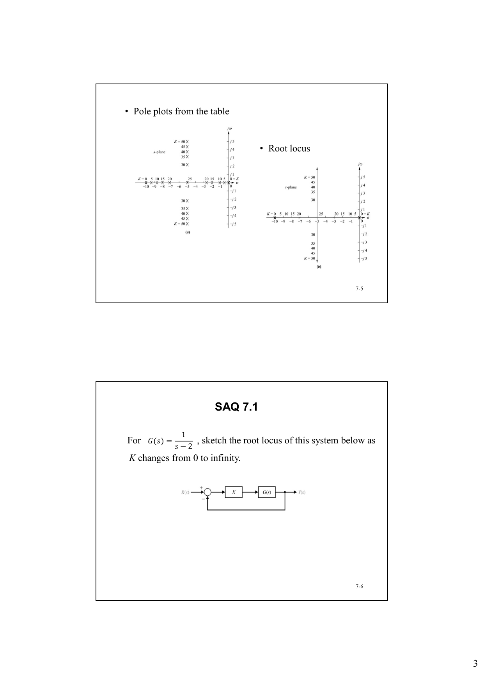

---

## 7.2 Root Locus Procedure

### 根轨迹的两个基本判据

设开环传递函数为

$$
G(s)=\frac{\prod_{j=1}^{m}(s+z_j)}{\prod_{i=1}^{n}(s+p_i)}
$$

闭环特征方程为：

$$
1+K G(s)=0
$$

等价于：

$$
K G(s)=-1
$$

因此根轨迹上的点必须同时满足：

1. 幅值条件

$$
|K G(s)|=1
$$

也就是：

$$
K\frac{\prod_{j=1}^{m}|s+z_j|}{\prod_{i=1}^{n}|s+p_i|}=1
$$

2. 相角条件

$$
\angle G(s)=(2k+1)180^\circ,\quad k=0,\pm1,\pm2,\dots
$$

也就是：

$$
\sum_{j=1}^{m}\angle(s+z_j)-\sum_{i=1}^{n}\angle(s+p_i)
=(2k+1)180^\circ
$$

相角条件用于判断某个点是否在根轨迹上，幅值条件用于求该点对应的 $K$。

### Step 1：准备根轨迹草图

第一步是把特征方程写成参数 $K$ 作为乘子出现的形式：
、
$$
1+K G(s)=0
$$

然后把 $G(s)$ 分解成零点和极点：

$$
1+K\frac{\prod_{j=1}^{m}(s+z_j)}
{\prod_{i=1}^{n}(s+p_i)}=0
$$

也可以写为：

$$
\frac{\prod_{j=1}^{m}(s+z_j)}
{\prod_{i=1}^{n}(s+p_i)}
=-\frac{1}{K}
$$

在 $s$ 平面上标出开环极点和零点，通常用 `X` 表示极点，用 `O` 表示零点。

根据幅值条件：

$$
\frac{\prod_{j=1}^{m}|s+z_j|}
{\prod_{i=1}^{n}|s+p_i|}
=\frac{1}{K}
$$

当 $K\to 0$ 时，右侧趋于 $\infty$，根轨迹从开环极点出发：

$$
s=-p_i,\quad i=1,2,\dots,n
$$

当 $K\to \infty$ 时，右侧趋于 $0$，根轨迹终止于开环零点：

$$
s=-z_j,\quad j=1,2,\dots,m
$$

若开环极点数 $n$ 大于零点数 $m$，则有 $n-m$ 条分支终止于无穷远处。

关键结论：

- 根轨迹从 $G(s)$ 的开环极点出发。
- 根轨迹终止于 $G(s)$ 的开环零点或无穷远处。
- 分支数等于开环极点数 $n$。
- 根轨迹关于实轴对称，因为复根必须成共轭对出现。

### Step 2：确定实轴上的根轨迹段

实轴上的某一点属于根轨迹，当且仅当该点右侧的开环极点和开环零点总数为奇数。

这个规则来自相角条件。实轴上的极点、零点对测试点贡献的相角只能是 $0^\circ$ 或 $180^\circ$，因此只有右侧极点和零点总数为奇数时，净相角才满足 $(2k+1)180^\circ$。

具体解释如下。取实轴上的一个测试点 $s_0$，对任意一个开环零点 $-z_j$ 或开环极点 $-p_i$，相角都是从该零点或极点指向测试点 $s_0$ 的向量角度：

$$
\angle(s_0+z_j),\quad \angle(s_0+p_i)
$$

因为测试点、实轴零点和实轴极点都在实轴上，所以这些向量只能沿实轴向右或向左：

- 如果某个极点或零点在测试点左侧，那么从该点指向 $s_0$ 的向量向右，角度为 $0^\circ$。
- 如果某个极点或零点在测试点右侧，那么从该点指向 $s_0$ 的向量向左，角度为 $180^\circ$。

相角条件为：

$$
\sum \angle(s_0+z_j)-\sum \angle(s_0+p_i)
=(2k+1)180^\circ
$$

左侧的极点和零点只贡献 $0^\circ$，不影响奇偶性。右侧的每一个实轴极点或零点都会贡献一个 $180^\circ$；虽然零点在相角条件中是加号、极点是减号，但 $+180^\circ$ 和 $-180^\circ$ 在模 $360^\circ$ 意义下都等价于一个“奇数倍 $180^\circ$”的贡献。因此只需要数测试点右侧共有多少个开环极点和零点：

- 右侧总数为偶数：净相角为 $0^\circ$ 或 $360^\circ$ 的整数倍，不在根轨迹上。
- 右侧总数为奇数：净相角为 $(2k+1)180^\circ$，在根轨迹上。

所以实轴根轨迹段的判定可以简化为：测试点右侧的开环极点和零点总数为奇数。

### Step 3：确定无穷远渐近线

若 $n>m$，有 $n-m$ 条根轨迹分支趋向无穷远。渐近线的交点在实轴上，其坐标为：

$$
\sigma_a=
\frac{\sum_{i=1}^{n}(-p_i)-\sum_{j=1}^{m}(-z_j)}
{n-m}
$$

==注意：如果存在重极点或重零点，求 $\sigma_a$ 时必须按重数分别计入求和。例如二重极点 $s=-2$ 要在极点和里加两次 $-2$，二重零点 $s=-1$ 要在零点和里加两次 $-1$。这里的 $n$ 和 $m$ 也都按重数统计。==

渐近线角度为：

$$
\theta_a=\frac{(2k+1)\pi}{n-m},
\quad k=0,1,2,\dots,n-m-1
$$

（多少条渐近线取决于n、m）
若使用角度制：

$$
\theta_a=\frac{(2k+1)180^\circ}{n-m}
$$

#### 渐近线公式的推导

渐近线描述的是根轨迹在 $|s|\to\infty$ 时的走向。也就是说，当某些闭环极点沿根轨迹跑到很远的位置时，它们会越来越接近几条直线；这些直线就是根轨迹的渐近线。

从特征方程出发：

$$
1+K\frac{\prod_{j=1}^{m}(s+z_j)}
{\prod_{i=1}^{n}(s+p_i)}=0
$$

移项可得：

$$
\frac{\prod_{i=1}^{n}(s+p_i)}
{\prod_{j=1}^{m}(s+z_j)}=-K
$$

这里 $G(s)$ 有 $n$ 个开环极点、$m$ 个开环零点，并且讨论的是 $n>m$ 的情况。因此左边分子次数比分母次数高 $n-m$。当 $s\to\infty$ 时，只需要保留最高阶和次高阶项：

$$
\frac{\prod_{i=1}^{n}(s+p_i)}
{\prod_{j=1}^{m}(s+z_j)}
\approx
s^{n-m}+
\left(\sum_{i=1}^{n}p_i-\sum_{j=1}^{m}z_j\right)s^{n-m-1}
+\cdots
$$

为了把它写成一条“平移后的幂函数”，设：

$$
r=n-m
$$

并令：

$$
A=\frac{\sum_{i=1}^{n}p_i-\sum_{j=1}^{m}z_j}{n-m}
$$

则：

$$
(s+A)^{n-m}
=s^{n-m}
+(n-m)A s^{n-m-1}
+\cdots
$$

代入 $A$ 后，次高阶项正好一致：

$$
(n-m)A
=\sum_{i=1}^{n}p_i-\sum_{j=1}^{m}z_j
$$

所以在无穷远附近可以近似为：

$$
(s+A)^{n-m}\approx -K
$$

由于开环极点的实际坐标是 $-p_i$，开环零点的实际坐标是 $-z_j$，渐近线交点写成实际 $s$ 平面坐标就是：

$$
\sigma_a
=-A
=\frac{\sum_{i=1}^{n}(-p_i)-\sum_{j=1}^{m}(-z_j)}
{n-m}
$$

也就是：

$$
s+A=s-\sigma_a
$$

因此远离原点时：

$$
(s-\sigma_a)^{n-m}=-K
$$

对两边开 $(n-m)$ 次方：

$$
s-\sigma_a=(-K)^{\frac{1}{n-m}}
$$

在 $s$ 平面中，$K>0$，所以 $-K$ 是负实数，可以写成：

$$
-K=K e^{j(2k+1)\pi}
$$

于是：

$$
(-K)^{\frac{1}{n-m}}
=K^{\frac{1}{n-m}}
e^{j\frac{(2k+1)\pi}{n-m}}
$$

这说明渐近线都从同一个点 $\sigma_a$ 出发，方向角为：

$$
\theta_a=\frac{(2k+1)\pi}{n-m}
$$

或角度制：

$$
\theta_a=\frac{(2k+1)180^\circ}{n-m}
$$

其中：

$$
k=0,1,2,\dots,n-m-1
$$

直观理解：

- $n-m$ 表示有多少条分支没有有限零点可去，因此必须趋向无穷远。
- $\sigma_a$ 是这些无穷远分支的“中心点”或 centroid。
- $\theta_a$ 是从该中心点发出的 $n-m$ 条方向线。
- $K$ 的大小只决定沿渐近线走多远；方向由 $-K$ 的复平面角度决定。

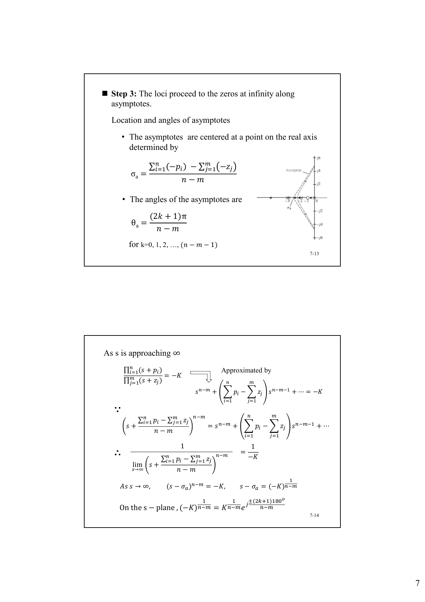

例：设

$$
G(s)=\frac{s+1}{s(s+4)(s^2+2s+2)}
$$

则 $n=4,m=1$，极点为 $0,-1\pm j,-4$，零点为 $-1$。渐近线交点为：

$$
\sigma_a=
\frac{0+(-1-j)+(-1+j)+(-4)-(-1)}{4-1}
=-\frac{5}{3}
$$

渐近线角度为：

$$
\theta_a=60^\circ,\ 180^\circ,\ -60^\circ
$$

### Step 4：求与虚轴的交点

这一步的目的是找出系统从稳定变为不稳定，或从不稳定变为稳定的临界位置。连续系统的稳定性由闭环极点是否全部在左半平面决定；虚轴是左半平面和右半平面的边界。因此根轨迹穿过虚轴时，对应的 $K$ 就是临界增益，对应的 $s=\pm j\omega$ 给出临界振荡频率。

求出虚轴交点后，可以判断：

- 哪些 $K$ 区间内闭环极点全部在左半平面，系统稳定。
- 哪个 $K$ 使系统处于临界稳定状态。
- 当 $K$ 继续增大或减小时，根轨迹是否进入右半平面，系统是否变为不稳定。

若根轨迹穿越虚轴，可以用 Routh-Hurwitz 判据求交点和对应增益。也可以令 $s=j\omega$，把特征方程分成实部和虚部求解。

例：

$$
G(s)=\frac{1}{s(s+1)(s+2)}
$$

闭环特征方程为：

$$
s(s+1)(s+2)+K=0
$$

即：

$$
s^3+3s^2+2s+K=0
$$

令 $s=j\omega$：

$$
(j\omega)^3+3(j\omega)^2+2(j\omega)+K=0
$$

分离实部和虚部：

$$
K-3\omega^2=0
$$

$$
2\omega-\omega^3=0
$$

得到：

$$
\omega=\pm\sqrt{2},\quad K=6
$$

同一结论也可以由 Routh 表得到：令第一列中的临界项为 $0$，求得 $K=6$，再由辅助方程求 $s=\pm j\sqrt{2}$。

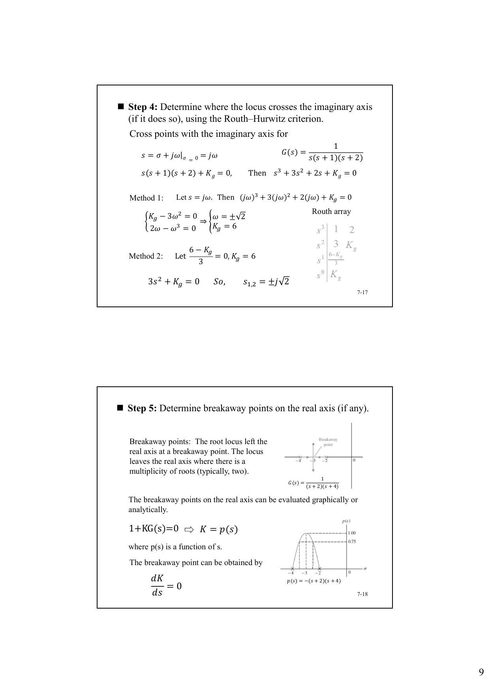

### Step 5：求实轴分离点

分离点是根轨迹离开实轴的位置。更具体地说，若两条或多条根轨迹分支先在实轴上相向运动，然后在某一点汇合并离开实轴进入复平面，这个汇合并离开的点称为 breakaway point。若根轨迹从复平面回到实轴，也可能出现 break-in point，求法类似。

根轨迹在分离点处通常出现重根，也可以说一般在重根处进行分离。原因是：在分离点，同一个 $K$ 值对应两个或多个闭环极点位于同一个 $s$ 位置。也就是说，闭环特征方程在该点不只是有一个根，而是有重根。

由特征方程：

$$
1+K G(s)=0
$$

可以把 $K$ 写成 $s$ 的函数：

$$
K=p(s)
$$

分离点满足：

$$
\frac{dK}{ds}=0
$$

为什么用 $\frac{dK}{ds}=0$？可以这样理解：根轨迹表示 $s$ 随 $K$ 变化的路径。若两条实轴分支在某点汇合，对应的 $K(s)$ 在该点达到局部极大或局部极小；此时曲线在 $K$-$s$ 关系中出现转折，因此满足 $\frac{dK}{ds}=0$。

从特征方程角度看也一样。设闭环特征方程写成：

$$
F(s,K)=D(s)+K N(s)=0
$$

如果 $s=s_b$ 是某个 $K=K_b$ 下的重根，那么不仅有：

$$
F(s_b,K_b)=0
$$

还必须满足：

$$
\frac{\partial F}{\partial s}(s_b,K_b)=0
$$

把 $F(s,K)=0$ 解成 $K=K(s)$ 后，这个重根条件就对应到：

$$
\frac{dK}{ds}=0
$$

不过，$\frac{dK}{ds}=0$ 求出来的只是候选分离点，不一定都是真正的分离点。判断时要继续检查：

1. 该点是否在实轴根轨迹段上。
2. 该点对应的 $K$ 是否为正实数，且符合题目给定的 $K$ 变化范围。
3. 附近是否确实有分支在该点汇合后离开实轴，或从复平面进入实轴。

如果候选点不在根轨迹实轴段上，即使满足 $\frac{dK}{ds}=0$，也不是实际分离点。

例：

$$
K G(s)=\frac{K}{s(s+1)(s+2)}
$$

特征方程为：

$$
s(s+1)(s+2)+K=0
$$

所以：

$$
K=-s(s+1)(s+2)
$$

求导：

$$
\frac{dK}{ds}=-(3s^2+6s+2)=0
$$

得到两个候选点：

$$
s=-0.423,\quad s=-1.577
$$

但只有落在根轨迹实轴段上的点才是真正的分离点。讲义中实际分离点为：

$$
s=-0.423
$$

### Step 6：求出射角与入射角

当根轨迹从复极点出发时，需要确定出射角；当根轨迹到达复零点时，需要确定入射角。二者都来自相角条件。

相角条件是：

$$
\sum \angle(s+z_j)-\sum \angle(s+p_i)
=(2k+1)180^\circ
$$

它的意思是：若某一点 $s$ 在根轨迹上，那么从所有开环零点指向 $s$ 的相角总和，减去从所有开环极点指向 $s$ 的相角总和，必须等于奇数倍 $180^\circ$。

#### 出射角为什么来自相角条件

设根轨迹从某个复极点 $-p_\ell$ 出发。取一个非常靠近该极点的根轨迹点：

$$
s=-p_\ell+\varepsilon e^{j\theta_d},\quad \varepsilon\to 0^+
$$

其中 $\theta_d$ 就是要找的出射角。把这个点代入相角条件：

$$
\sum \angle(s+z_j)
-\left[
\angle(s+p_\ell)+\sum_{i\ne \ell}\angle(s+p_i)
\right]
=(2k+1)180^\circ
$$

当 $s$ 非常靠近 $-p_\ell$ 时，当前极点到 $s$ 的向量就是：

$$
s+p_\ell=\varepsilon e^{j\theta_d}
$$

所以：

$$
\angle(s+p_\ell)=\theta_d
$$

其他零点和极点离这个点仍有有限距离，因此它们贡献的是从各自位置指向该复极点附近的固定角度。于是：

$$
\sum \phi_z-\left(\theta_d+\sum \theta_p\right)
=(2k+1)180^\circ
$$

其中 $\sum \theta_p$ 不包括当前出发的极点。移项得到：

$$
\theta_d
=\sum \phi_z-\sum \theta_p-(2k+1)180^\circ
$$

也就是说，出射角就是“为了让总相角满足奇数倍 $180^\circ$，当前极点这一项还需要补上的角度”。

根轨迹从某个极点出发时，出射角等于满足相角条件所需的剩余角度：

$$
\theta_{\text{departure}}
=\mp 180^\circ(2k+1)
+\sum \phi_z-\sum \theta_p
$$

其中求和时不包括当前出发的极点。

#### 入射角为什么来自相角条件

设根轨迹到达某个复零点 $-z_\ell$。取一个非常靠近该零点的根轨迹点：

$$
s=-z_\ell+\varepsilon e^{j\phi_a},\quad \varepsilon\to 0^+
$$

其中 $\phi_a$ 是入射角。代入相角条件：

$$
\left[
\angle(s+z_\ell)+\sum_{j\ne \ell}\angle(s+z_j)
\right]
-\sum \angle(s+p_i)
=(2k+1)180^\circ
$$

由于：

$$
s+z_\ell=\varepsilon e^{j\phi_a}
$$

所以：

$$
\angle(s+z_\ell)=\phi_a
$$

于是：

$$
\phi_a+\sum \phi_z-\sum \theta_p
=(2k+1)180^\circ
$$

其中 $\sum \phi_z$ 不包括当前到达的零点。移项得到：

$$
\phi_a
=(2k+1)180^\circ+\sum \theta_p-\sum \phi_z
$$

也就是说，入射角也是由相角条件中“当前零点这一项还需要补上的角度”决定的。

根轨迹到达某个零点时，入射角为：

$$
\phi_{\text{arrival}}
=\pm 180^\circ(2k+1)
+\sum \theta_p-\sum \phi_z
$$

其中求和时不包括当前到达的零点。

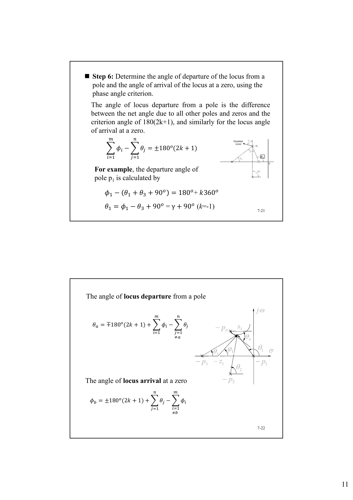

讲义例题中，对复极点的出射角计算得到：

$$
\theta=-26.6^\circ
$$

### Step 7：补全根轨迹草图并求指定点的增益

完成前六步后，需要用相角条件检查剩余曲线走向。若要判断某个点 $s_x$ 是否在根轨迹上，检查：

$$
\angle G(s_x)=180^\circ+k360^\circ
$$

若点 $s_x$ 在根轨迹上，其对应增益由幅值条件给出：

$$
K_x=
\frac{\prod_{i=1}^{n}|s_x+p_i|}
{\prod_{j=1}^{m}|s_x+z_j|}
$$

---

## 例题：典型三极点系统

考虑：

$$
G(s)H(s)=\frac{K}{s(s+1)(s+2)}
$$

开环极点为：

$$
0,\ -1,\ -2
$$

无有限零点。分支数为 $3$。实轴上的根轨迹段为：

$$
(-\infty,-2],\quad [-1,0]
$$

渐近线条数为：

$$
n-m=3
$$

渐近线交点：

$$
\sigma_a=\frac{-2-1-0}{3}=-1
$$

渐近线角度：

$$
\theta_a=60^\circ,\ 180^\circ,\ -60^\circ
$$

分离点：

$$
s=-0.42
$$

虚轴交点：

$$
\omega=\pm\sqrt{2},\quad K=6
$$

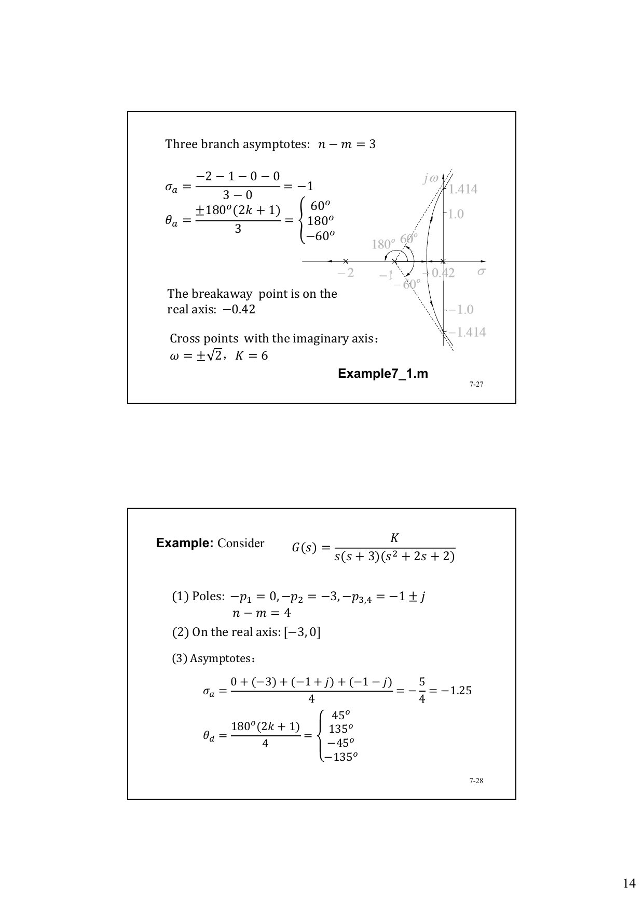

---

## 例题：含共轭复极点的四阶系统

考虑：

$$
G(s)=\frac{K}{s(s+3)(s^2+2s+2)}
$$

开环极点为：

$$
0,\ -3,\ -1\pm j
$$

无有限零点，因此 $n-m=4$。

实轴根轨迹段为：

$$
[-3,0]
$$

渐近线交点：

$$
\sigma_a=
\frac{0+(-3)+(-1+j)+(-1-j)}{4}
=-\frac{5}{4}=-1.25
$$

渐近线角度：

$$
45^\circ,\ 135^\circ,\ -45^\circ,\ -135^\circ
$$

讲义给出的进一步结果：

- 分离点：$s=-2.28$
- 虚轴交点：$s=\pm j1.1,\ K=8.6$
- 出射角：$\theta=-71.6^\circ$

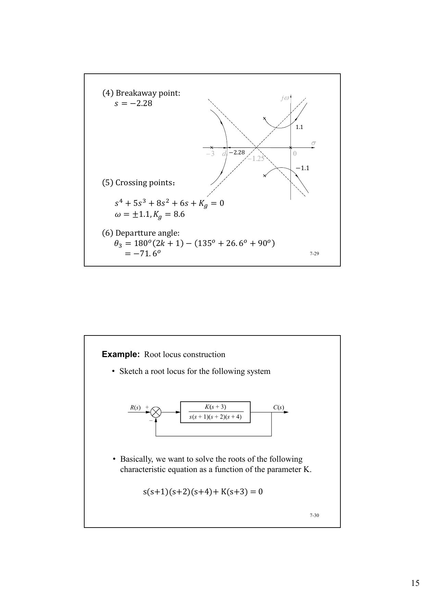

---

## 例题：Root Locus Construction

讲义给出系统，其特征方程可以写为：

$$
s(s+1)(s+2)(s+4)+K(s+3)=0
$$

等价开环形式可理解为：

$$
G(s)=\frac{s+3}{s(s+1)(s+2)(s+4)}
$$

根轨迹从 $0,-1,-2,-4$ 四个开环极点出发，并终止于零点 $-3$ 或无穷远处。因为 $n=4,m=1$，有 $3$ 条渐近线。

讲义图中还标出了一个典型增益：

$$
K=9.666
$$

---

## Arc Root Locus

对于特殊形式：

$$
G(s)=\frac{K(s+z)}{(s+p_1)(s+p_2)},\quad z>p_2>p_1
$$

相角条件为：

$$
\angle(s+z)-\angle(s+p_1)-\angle(s+p_2)=\pi
$$

令：

$$
s=\sigma+j\omega
$$

整理后可以得到圆弧根轨迹方程：

$$
(\sigma+z)^2+\omega^2=(p_1-z)(p_2-z)
$$

因此根轨迹是圆的一部分，圆心和半径为：

$$
\text{center}=(-z,0)
$$

$$
\text{radius}=\sqrt{(p_1-z)(p_2-z)}
$$

例：

$$
G(s)=\frac{K(s+4)}{s(s+2)}
$$

圆心为：

$$
(-4,0)
$$

半径为：

$$
\sqrt{4\times 2}=2.83
$$

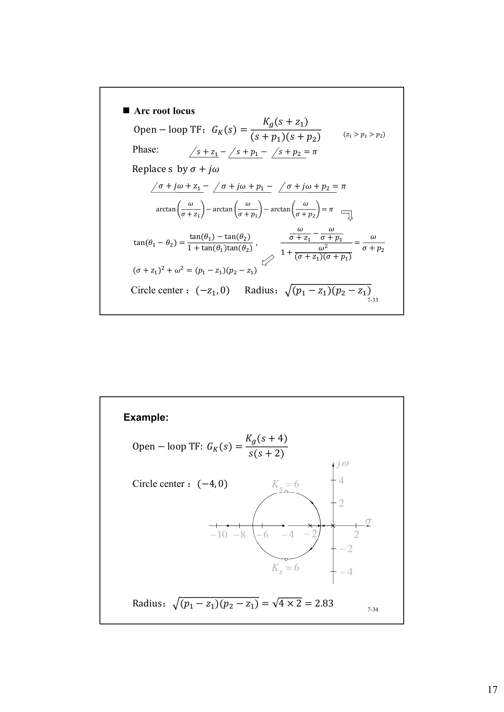

---

## Parametric Root Locus

根轨迹不仅可以研究开环增益 $K$，也可以研究其他参数变化的影响。若变化参数不是简单的开环增益，需要先把特征方程改写成：

$$
1+\text{parameter}\cdot G_{\text{eq}}(s)=0
$$

然后对等效开环传递函数 $G_{\text{eq}}(s)$ 作根轨迹。

讲义例题要求画系统随 $\tau$ 从 $0$ 到 $\infty$ 变化的根轨迹。原系统特征方程为：

$$
s(5s+1)+5\tau s+5=0
$$

整理为：

$$
(5s^2+s+5)+5\tau s=0
$$

两边除以 $5$：

$$
s^2+0.2s+1+\tau s=0
$$

写成根轨迹形式：

$$
1+\tau\frac{s}{s^2+0.2s+1}=0
$$

等效开环传递函数为：

$$
G_{\text{eq}}(s)=\tau\frac{s}{s^2+0.2s+1}
$$

极点与零点为：

$$
-p_{1,2}=-0.1\pm j0.995
$$

$$
-z=0
$$

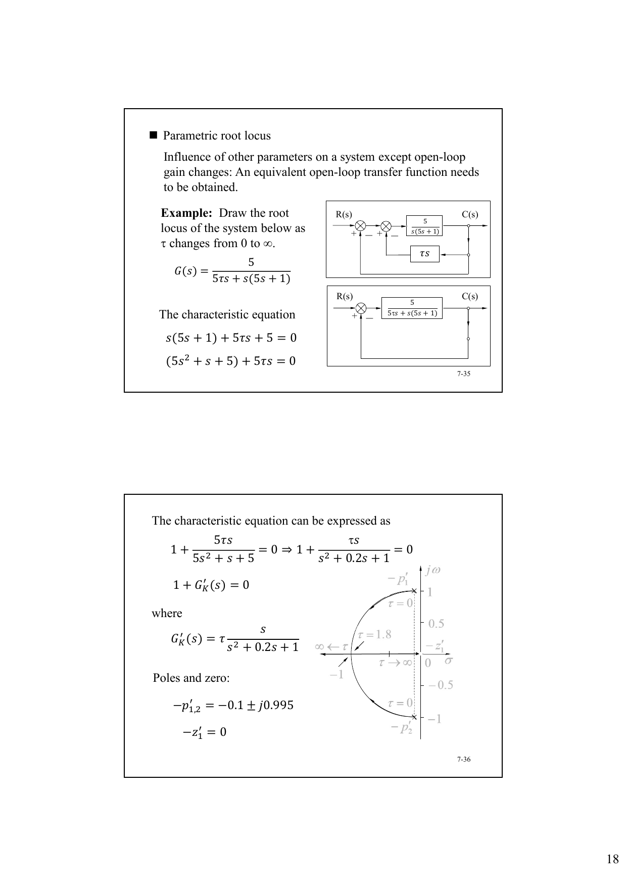

---

## 7.3 Properties of Root Locus

根轨迹的主要性质：

- 根轨迹总是从开环极点出发。
- 根轨迹总是终止于开环零点或无穷远处。
- 根轨迹分支数等于系统阶数，即开环极点数。
- 根轨迹关于实轴对称。
- 趋向无穷远的分支沿渐近线前进。
- 实轴上的某一区间属于根轨迹，当且仅当该区间右侧开环极点和零点总数为奇数。

### 闭环零点和闭环极点的关系

对单位负反馈系统，若

$$
G(s)=\frac{K N(s)}{D(s)}
$$

则闭环传递函数为：

$$
M(s)=\frac{G(s)}{1+G(s)}
=\frac{K N(s)}{D(s)+K N(s)}
$$

因此单位负反馈系统的闭环零点与开环零点相同，闭环极点由：

$$
D(s)+K N(s)=0
$$

决定。

当 $n-m\ge 2$ 时，闭环极点之和等于开环极点之和：

$$
\sum s_i=\sum p_i
$$

这个性质可用于在已知一对主导闭环极点时估算剩余闭环极点。

### 例题：由阻尼比确定闭环主导极点

给定：

$$
G(s)=\frac{1}{s(s+1)(0.5s+1)}
$$

可化为：

$$
G(s)=\frac{2K}{s(s+1)(s+2)}
=\frac{K'}{s(s+1)(s+2)}
$$

给定阻尼比：

$$
\zeta=0.5
$$

对应阻尼角：

$$
\beta=\cos^{-1}\zeta=\cos^{-1}0.5=60^\circ
$$

由根轨迹与等阻尼线交点得到主导极点：

$$
s_{1,2}=-0.33\pm j0.58
$$

由于开环极点之和为：

$$
0-1-2=-3
$$

剩余闭环极点为：

$$
s_3=-3-\left[(-0.33+j0.58)+(-0.33-j0.58)\right]
=-2.34
$$

幅值条件给出：

$$
K'=|s-p_1||s-p_2||s-p_3|
=0.667\times0.886\times1.77
=1.05
$$

由于 $K'=2K$，所以：

$$
K=0.525
$$

并且：

$$
\frac{2.34}{0.33}\approx 7
$$

剩余极点离虚轴显著更远，因此 $s_1,s_2$ 可作为主导极点。自然频率：

$$
\omega_n=\sqrt{0.33^2+0.58^2}=0.667
$$

超调量：

$$
\sigma\% = e^{-\frac{\zeta\pi}{\sqrt{1-\zeta^2}}}\times 100\%
=16.3\%
$$

按 $5\%$ 误差带估算调节时间：

$$
t_s=\frac{3.5}{\zeta\omega_n}
=\frac{3.5}{0.5\times0.667}
=10.5s
$$

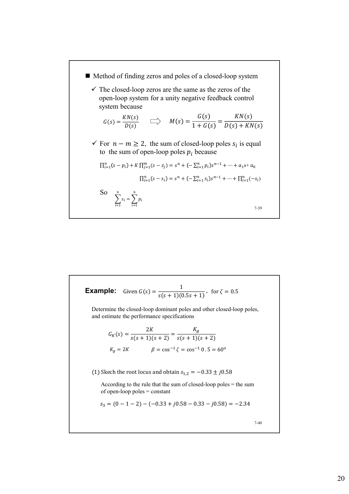

### 闭环零极点分布与阶跃响应的定性关系

根轨迹可用于从闭环极点位置直接判断时域响应：

- 所有闭环极点必须在左半平面，系统才稳定。
- 闭环极点离虚轴越远，响应越快。
- 共轭复根若对应 $\beta=\pm45^\circ$，则 $\zeta=0.707$，通常稳定性和暂态性能较均衡。
- 主导极点对闭环性能影响最大。
- 闭环零点会削弱或抵消附近闭环极点的影响。

### 增加开环零点的影响

增加开环零点会改变实轴根轨迹段，也会改变渐近线数量、角度和截距。一般来说，开环零点会把根轨迹向左拉，有利于改善动态性能。

如果开环零点靠近某个开环极点，会形成 open-loop dipole，使二者的影响相互抵消。新增零点越靠近虚轴，对根轨迹影响越大。

例：给

$$
G(s)=\frac{1}{s(s+1)}
$$

增加零点 $z=-2$ 后：

$$
G(s)=\frac{s+2}{s(s+1)}
$$

根轨迹明显发生左移。

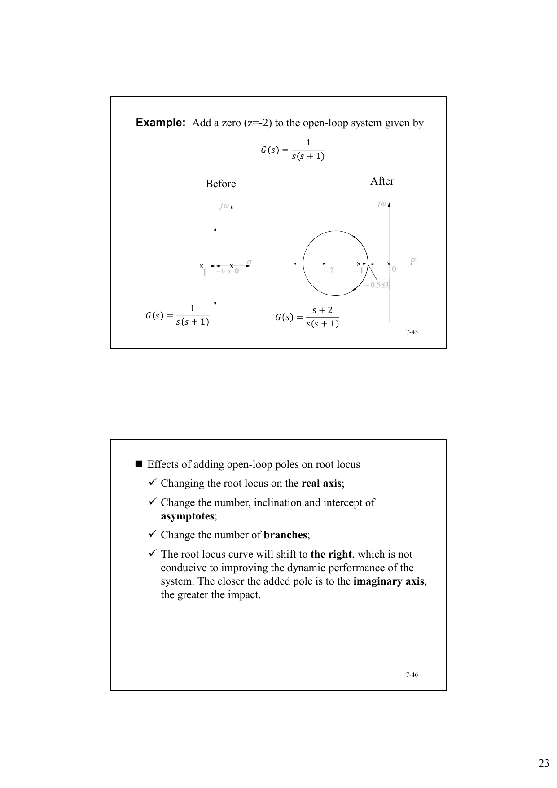

### 增加开环极点的影响

增加开环极点会：

- 改变实轴根轨迹段；
- 改变渐近线数量、角度和截距；
- 改变根轨迹分支数量；
- 将根轨迹向右推，不利于改善动态性能。

新增极点越靠近虚轴，影响越大。

讲义例子先考虑：

$$
K G(s)=\frac{K}{s(s+a)},\quad a>0
$$

再增加一个极点：

$$
K G(s)=\frac{K}{s(s+a)(s+b)},\quad b>a>0
$$

新增极点会把根轨迹推向右半平面方向。

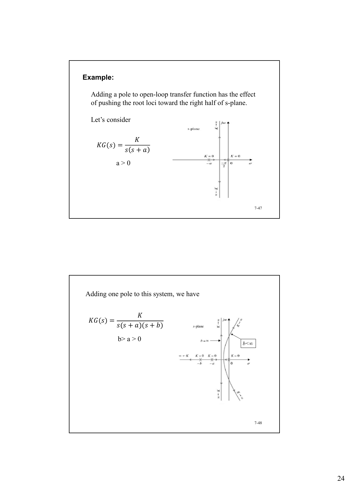

### 根轨迹稳定性分析例题

给定：

$$
G(s)=\frac{K_g(s+1)}{s(s-1)(s^2+4s+16)}
$$

要求确定参数 $K_g$ 的稳定范围。

开环极点和零点：

$$
0,\quad 1,\quad -2\pm j2\sqrt{3},\quad -1
$$

实轴根轨迹段：

$$
[0,1],\quad (-\infty,-1]
$$

由

$$
K=-\frac{s(s-1)(s^2+4s+16)}{s+1}
$$

并令

$$
\frac{dK}{ds}=0
$$

得到分离点和入射点：

$$
s=0.45,\quad s=-2.33
$$

渐近线交点：

$$
\sigma_a=
\frac{0+1+(-2+j2\sqrt{3})+(-2-j2\sqrt{3})-(-1)}{4-1}
=-\frac{2}{3}
$$

渐近线角度：

$$
\theta_a=\pm60^\circ,\ 180^\circ
$$

虚轴交点来自特征方程：

$$
s^4+3s^3+12s^2+(K-16)s+K=0
$$

讲义给出两个穿越点：

$$
A_{1,2}=\pm j1.56,\quad K=23.3
$$

$$
B_{1,2}=\pm j2.56,\quad K=35.7
$$

因此系统稳定范围为：

$$
23.3<K<35.7
$$

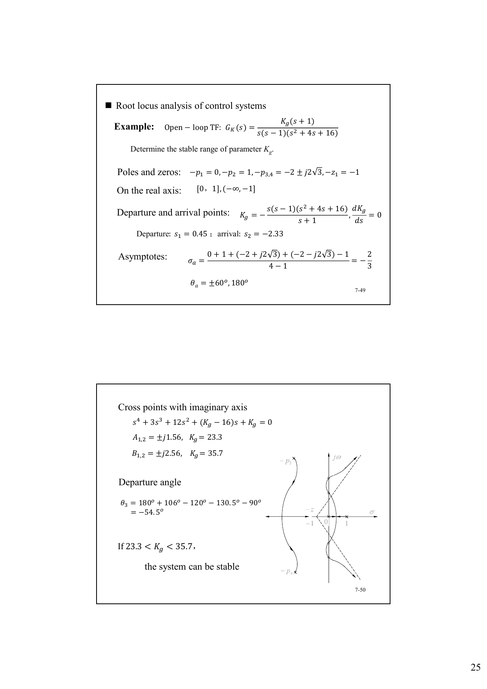

---

## 7.4 Time-Domain Response Prediction

根轨迹可用于根据闭环极点位置预测时域响应。讲义考虑：

$$
G(s)=\frac{1}{s(s+1)(s+2)}
$$

当 $K$ 变化时，闭环极点沿根轨迹移动，系统响应类型随之改变。

### 低增益：过阻尼响应

当 $K=0.4$ 时，闭环极点都是稳定实极点，系统阶跃响应为过阻尼响应。响应单调接近稳态值，不出现振荡。

### 中等增益：欠阻尼响应

当 $K=2$ 时，闭环极点中出现左半平面的共轭复极点，系统阶跃响应为欠阻尼响应。响应有超调和衰减振荡，但最终稳定。

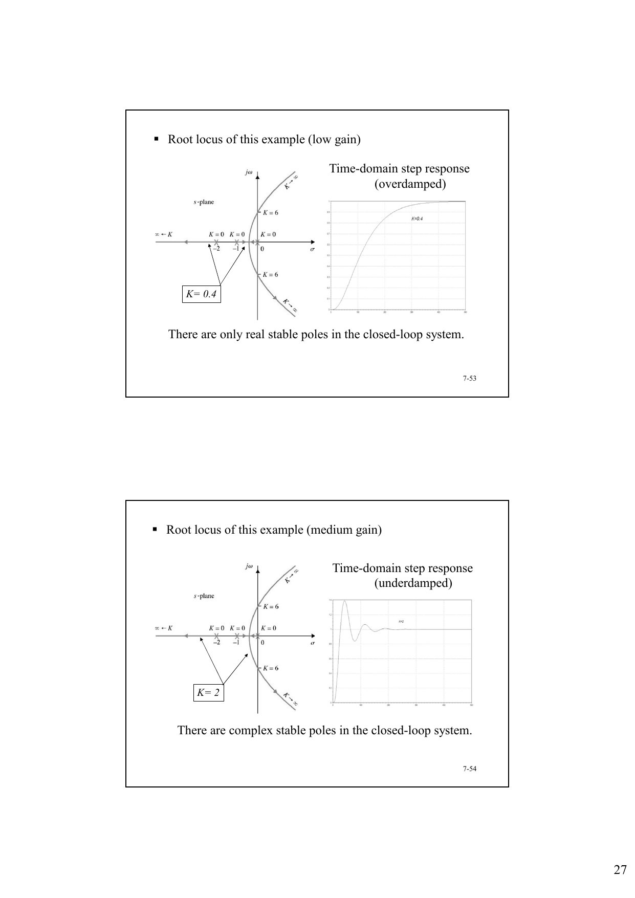

### 临界增益：等幅振荡

当 $K=6$ 时，闭环极点落在虚轴上，系统处于临界稳定状态，阶跃响应表现为持续振荡。

### 高增益：不稳定响应

当 $K=6.2$ 时，部分闭环极点进入右半平面，系统不稳定，阶跃响应发散或振荡幅值增长。

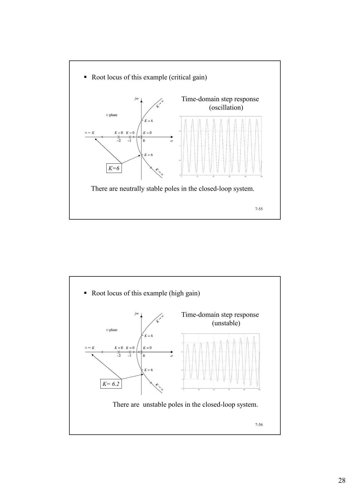

---

## 7.5 Design Using Root Locus Method

根轨迹法不仅用于分析，还可用于设计。设计思路是通过引入额外极点和零点，改变闭环根轨迹，从而获得期望的暂态性能或稳态性能。

常见用途：

- 调整增益 $K$，选择满足暂态指标的闭环极点位置。
- 引入零点和极点，改变根轨迹形状。
- 分析多个系统参数时，每次只把一个参数作为变化参数。

### 串联控制器设计

串联控制器通常放在原增益 $K$ 所在位置。设计目标是改善系统性能，同时尽量控制对已有动态行为的副作用。

### PI 控制器

PI controller 的基本思想：

- 增加一个积分环节，提高系统型别，从而改善或消除稳态误差。
- 同时增加一个零点，用来减弱积分极点对暂态响应的影响。

讲义中的例子对比了未补偿系统与 PI 补偿系统。未补偿系统在 $K=164.6$ 时有稳态误差；加入 PI 控制器后，取 $K=158.2$，稳态误差被消除，而暂态响应几乎不变。

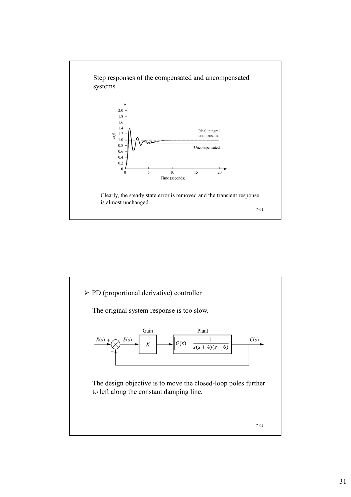

### PD 控制器

PD controller 的主要作用是改善暂态响应。若原系统响应太慢，可以通过加入零点把闭环主导极点沿等阻尼线向左移动，使系统响应更快。

讲义例子中：

$$
G(s)=\frac{1}{s(s+4)(s+6)}
$$

原系统响应太慢。设计目标是把闭环极点沿常阻尼线向左移动。

PD 控制器取：

$$
C(s)=K(s+3.006)
$$

对比结果：

- 未补偿系统：$K=43.35$。
- PD 补偿系统：$K=47.45$。
- 补偿后主导极点更靠左，暂态响应显著加快。
- 稳态误差几乎不变。

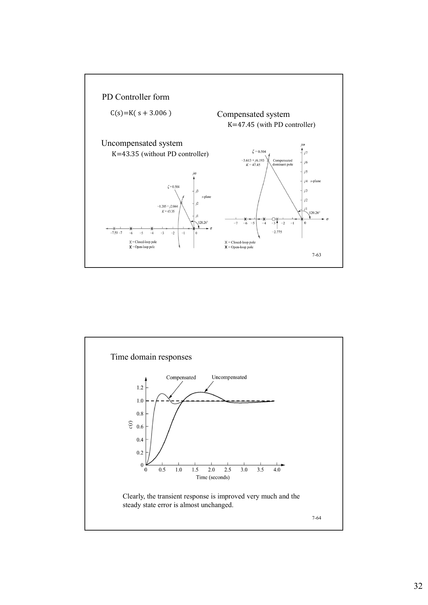

---

## 小结

根轨迹法的核心是把闭环特征方程写成：

$$
1+K G(s)=0
$$

然后研究 $K$ 从 $0$ 到 $\infty$ 时闭环极点如何移动。

最重要的作图规则：

- 分支从开环极点出发，到开环零点或无穷远结束。
- 分支数等于开环极点数。
- 实轴段由“右侧极点和零点总数为奇数”决定。
- 无穷远渐近线由 $\sigma_a$ 和 $\theta_a$ 决定。
- 虚轴交点可用 Routh 判据或令 $s=j\omega$ 求得。
- 分离点可由 $\frac{dK}{ds}=0$ 求得。
- 出射角和入射角由相角条件求得。
- 指定闭环极点对应的 $K$ 由幅值条件求得。

在控制设计中：

- 增加零点通常把根轨迹向左拉，有利于改善动态性能。
- 增加极点通常把根轨迹向右推，可能降低稳定性和动态性能。
- PI 控制器主要改善稳态误差。
- PD 控制器主要改善暂态响应。

---

## SAQ 与课后题

本节集中整理本章所有 SAQ 和课后题。课件中有两个题目都标为 SAQ 7.8，下面分别记为 SAQ 7.8A 和 SAQ 7.8B。

### SAQ 7.1

原题：For

$$
G(s)=\frac{1}{s-2}
$$

sketch the root locus of this system as $K$ changes from $0$ to $\infty$.

解答：

闭环特征方程为：

$$
1+K G(s)=0
$$

即：

$$
1+\frac{K}{s-2}=0
$$

整理得：

$$
s-2+K=0
$$

所以：

$$
s=2-K
$$

当 $K=0$ 时，闭环极点在 $s=2$；当 $K\to\infty$ 时，$s\to-\infty$。因此根轨迹是一条实轴上的直线，从 $s=2$ 出发，随着 $K$ 增大向左移动。

### SAQ 7.2

原题：In the following, which is false?

a) The root locus is the path that the roots of the characteristic equation, given by $1+K G(s)=0$, trace out on the $s$-plane as $0\le K<\infty$ varies.

b) On the root locus plot, the number of separate loci is equal to the number of poles of $G(s)$.

c) The root locus always starts at the zeros and ends at the poles of $G(s)$.

d) The root loci are symmetrical with respect to the axis $j\omega$.

解答：

a 正确。根轨迹就是特征方程的根随 $K$ 变化形成的轨迹。

b 正确。根轨迹分支数等于开环极点数。

c 错误。根轨迹从开环极点出发，终止于开环零点或无穷远处。

d 错误。根轨迹关于实轴对称，不是关于 $j\omega$ 轴对称。

因此错误选项为 c 和 d。如果按单选题理解，c 是最直接违背根轨迹起止规则的选项；但 d 也不正确。

### SAQ 7.3

原题：Calculate the location and angles of the asymptotes of the root loci of the unity negative feedback system with

$$
G(s)=\frac{s^2+2s+1}{s(s+6)(s^2+4s+4)}
$$

解答：

先分解零极点：

$$
s^2+2s+1=(s+1)^2
$$

$$
s^2+4s+4=(s+2)^2
$$

所以：

- 开环零点：$s=-1,-1$，二重零点要算两次。
- 开环极点：$s=0,-6,-2,-2$，二重极点也要算两次。
- $n=4,\ m=2$。

渐近线交点：

$$
\sigma_a=
\frac{\sum p_{\text{actual}}-\sum z_{\text{actual}}}{n-m}
$$

其中 actual 表示实际 $s$ 平面坐标。因此：

$$
\sigma_a=
\frac{[0+(-6)+(-2)+(-2)]-[(-1)+(-1)]}{4-2}
$$

$$
\sigma_a=\frac{-10-(-2)}{2}=-4
$$

渐近线角度：

$$
\theta_a=\frac{(2k+1)180^\circ}{n-m}
$$

因为 $n-m=2$，所以：

$$
\theta_a=90^\circ,\ 270^\circ
$$

也可以写成：

$$
\theta_a=\pm90^\circ
$$

### SAQ 7.4

原题：Determine the cross points with the imaginary axis and breakaway points of the root locus for

$$
G(s)=\frac{1}{s(s+3)}
$$

解答：

闭环特征方程：

$$
1+\frac{K}{s(s+3)}=0
$$

即：

$$
s(s+3)+K=0
$$

展开：

$$
s^2+3s+K=0
$$

先求虚轴交点。令 $s=j\omega$，代入：

$$
(j\omega)^2+3j\omega+K=0
$$

得到：

$$
-\omega^2+K+j3\omega=0
$$

分离实部和虚部：

$$
K-\omega^2=0
$$

$$
3\omega=0
$$

由虚部得：

$$
\omega=0
$$

代回实部：

$$
K=0
$$

所以在 $K>0$ 的根轨迹上没有真正的虚轴穿越点。$K=0,\omega=0$ 只是开环极点 $s=0$ 的起点，不是增益增大过程中的虚轴穿越。

再求分离点。由特征方程写出：

$$
K=-s(s+3)
$$

令：

$$
\frac{dK}{ds}=-(2s+3)=0
$$

得到：

$$
s=-1.5
$$

对应增益：

$$
K=-(-1.5)(-1.5+3)=2.25=\frac{9}{4}
$$

该点位于实轴根轨迹段 $[-3,0]$ 上，且 $K>0$，所以它是真正的分离点。两个根在 $s=-1.5$ 合并成二重根，然后离开实轴成为共轭复根。

### SAQ 7.5

原题：Calculate the parameter value $K_x$ at a specific root $s_x=-4$ if

$$
G(s)=\frac{s+2}{s^2+4s+5}
$$

选项：

A) $K=1$

B) $K=2.5$

C) $K=0.4$

D) $K=5/6$

解答：

由幅值条件：

$$
K_x=\frac{\prod |s_x+p_i|}{\prod |s_x+z_j|}
$$

对本题可直接写为：

$$
K_x=\frac{|s_x^2+4s_x+5|}{|s_x+2|}
$$

代入 $s_x=-4$：

$$
K_x=\frac{|(-4)^2+4(-4)+5|}{|-4+2|}
$$

$$
K_x=\frac{|16-16+5|}{2}=\frac{5}{2}=2.5
$$

答案：B。

### SAQ 7.6

原题：Sketch a root locus for the unity negative feedback system with

$$
G(s)=\frac{s+1}{s(s+2)(s+3)(s+4)}
$$

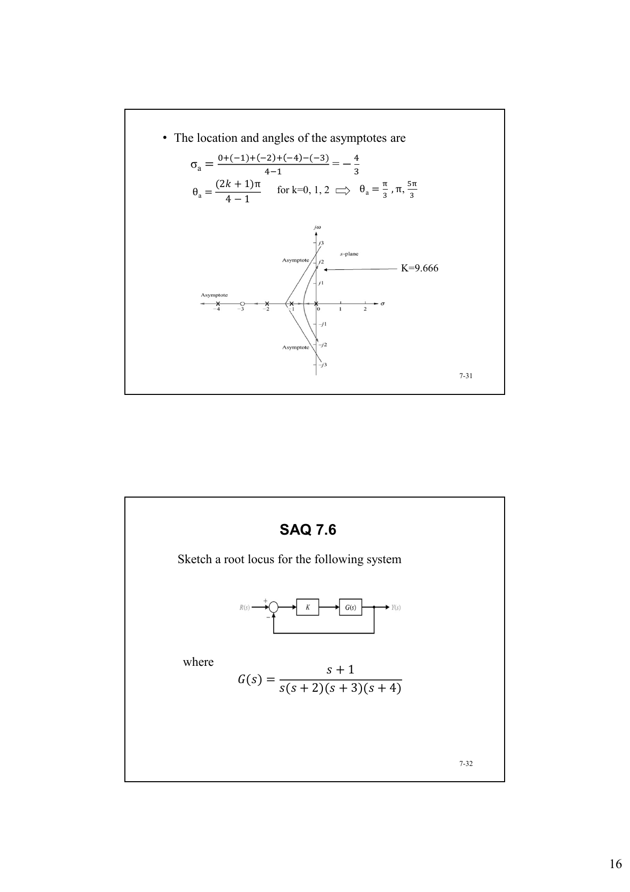

解答：

开环极点：

$$
s=0,-2,-3,-4
$$

开环零点：

$$
s=-1
$$

分支数为：

$$
n=4
$$

有限零点数为：

$$
m=1
$$

因此有 $n-m=3$ 条分支趋向无穷远。

实轴根轨迹段用奇数规则判断：

$$
(-\infty,-4],\quad [-3,-2],\quad [-1,0]
$$

渐近线交点：

$$
\sigma_a=
\frac{[0+(-2)+(-3)+(-4)]-(-1)}{4-1}
=-\frac{8}{3}
$$

渐近线角度：

$$
\theta_a=\frac{(2k+1)180^\circ}{3}
$$

所以：

$$
\theta_a=60^\circ,\ 180^\circ,\ 300^\circ
$$

即：

$$
\theta_a=60^\circ,\ 180^\circ,\ -60^\circ
$$

分离点由：

$$
K=-\frac{s(s+2)(s+3)(s+4)}{s+1}
$$

令 $\frac{dK}{ds}=0$。候选点中，实际落在根轨迹实轴段且 $K>0$ 的点约为：

$$
s\approx -2.390,\quad K\approx0.659
$$

另一实候选点约为 $s\approx-3.565$，但它不在实轴根轨迹段上，且对应 $K<0$，不是本题 $K>0$ 根轨迹的实际分离点。

虚轴交点可由特征方程求出。闭环特征方程为：

$$
s(s+2)(s+3)(s+4)+K(s+1)=0
$$

展开：

$$
s^4+9s^3+26s^2+(24+K)s+K=0
$$

令 $s=j\omega$，分离实部和虚部可得：

$$
\omega^4-26\omega^2+K=0
$$

$$
-9\omega^3+(24+K)\omega=0
$$

非零虚轴交点满足：

$$
\omega^2=\frac{17+\sqrt{385}}{2}\approx18.31
$$

因此：

$$
\omega\approx4.28,\quad K\approx140.8
$$

根轨迹草图要体现：从 $0,-2,-3,-4$ 出发，一支终止于 $-1$，三支沿渐近线趋向无穷远，并在约 $s=-2.39$ 处分离。

### SAQ 7.7

原题：Sketch a root locus for the system below.

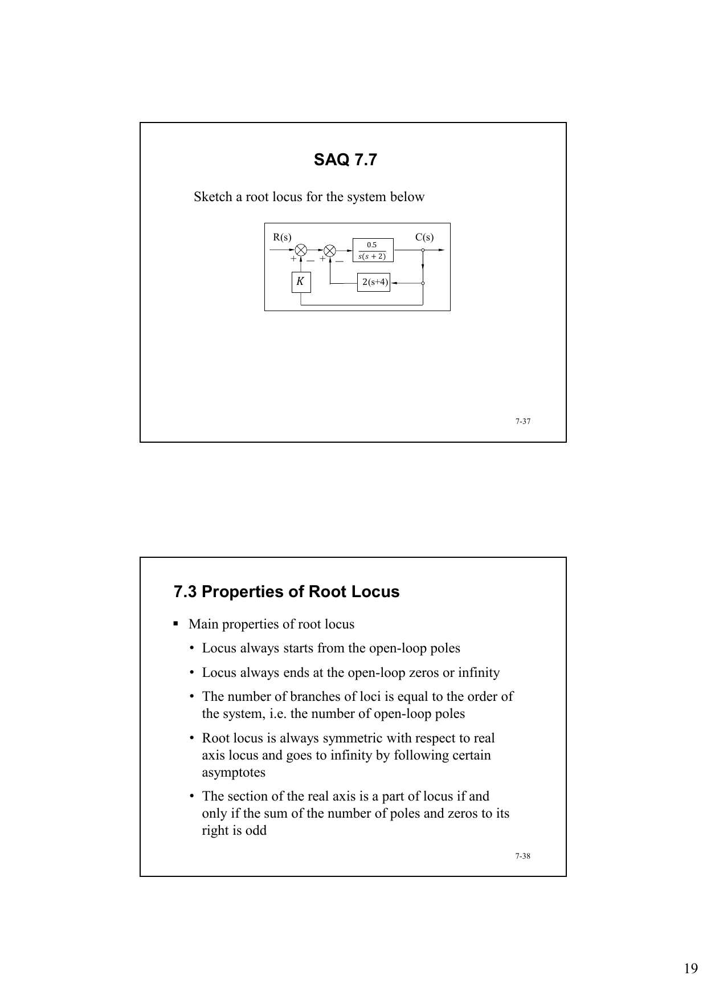

解答：

先化成关于参数 $K$ 的等效根轨迹问题。前向环节为：

$$
P(s)=\frac{0.5}{s(s+2)}
$$

内反馈环节为：

$$
H(s)=2(s+4)
$$

内环为负反馈，因此从第一个加法点输出到 $C(s)$ 的等效传递函数为：

$$
T_i(s)=\frac{P(s)}{1+P(s)H(s)}
$$

代入：

$$
T_i(s)=
\frac{\frac{0.5}{s(s+2)}}{1+\frac{0.5}{s(s+2)}2(s+4)}
$$

$$
T_i(s)=\frac{0.5}{s(s+2)+(s+4)}
$$

即：

$$
T_i(s)=\frac{0.5}{s^2+3s+4}
$$

按图中符号，外部 $K$ 通道正反馈到第一个加法点，因此闭环特征方程为：

$$
1-KT_i(s)=0
$$

即：

$$
1-\frac{0.5K}{s^2+3s+4}=0
$$

整理：

$$
s^2+3s+4-0.5K=0
$$

当 $K=0$ 时，根为：

$$
s_{1,2}=\frac{-3\pm j\sqrt{7}}{2}
$$

即：

$$
s_{1,2}=-1.5\pm j1.323
$$

随着 $K$ 增大：

$$
s_{1,2}=\frac{-3\pm\sqrt{2K-7}}{2}
$$

- 当 $0<K<3.5$ 时，根为共轭复根，实部固定为 $-1.5$，虚部逐渐减小。
- 当 $K=3.5$ 时，两个根在 $s=-1.5$ 合并。
- 当 $K>3.5$ 时，两根沿实轴分开，一支向右移动，一支向左移动。
- 当 $K=8$ 时，右移分支到达 $s=0$；再增大 $K$，系统出现右半平面极点。

因此根轨迹草图应从 $-1.5\pm j1.323$ 出发，先沿竖直线向实轴靠拢，在 $s=-1.5$ 合并后沿实轴左右分开。

### SAQ 7.8A

原题：Given the open-loop transfer function

$$
G(s)=\frac{K}{(2s+7)(2s+1)}
$$

determine the poles of the unity negative feedback control system with $\zeta=0.5$.

选项：

A) $s_{1,2}=-2\pm j0.87$

B) $s_{1,2}=-1\pm j1.7$

C) $s_{1,2}=-0.5\pm j3.4$

D) $s_{1,2}=-2\pm j3.46$

解答：

闭环特征方程为：

$$
(2s+7)(2s+1)+K=0
$$

展开：

$$
4s^2+16s+7+K=0
$$

除以 $4$：

$$
s^2+4s+\frac{7+K}{4}=0
$$

如果闭环极点为：

$$
s_{1,2}=-\sigma\pm j\omega
$$

则二阶多项式为：

$$
s^2+2\sigma s+(\sigma^2+\omega^2)
$$

与 $s^2+4s+\frac{7+K}{4}$ 对比：

$$
2\sigma=4
$$

所以：

$$
\sigma=2
$$

又因为：

$$
\zeta=\frac{\sigma}{\omega_n}=0.5
$$

所以：

$$
\omega_n=\frac{\sigma}{\zeta}=\frac{2}{0.5}=4
$$

于是：

$$
\omega=\sqrt{\omega_n^2-\sigma^2}
=\sqrt{16-4}
=\sqrt{12}
\approx3.46
$$

闭环极点为：

$$
s_{1,2}=-2\pm j3.46
$$

答案：D。

### SAQ 7.8B

原题：For

$$
G(s)=\frac{2}{(s+4)(s+2)}
$$

using the root locus method, determine the range of parameter $K$ so that the closed-loop system below is stable.

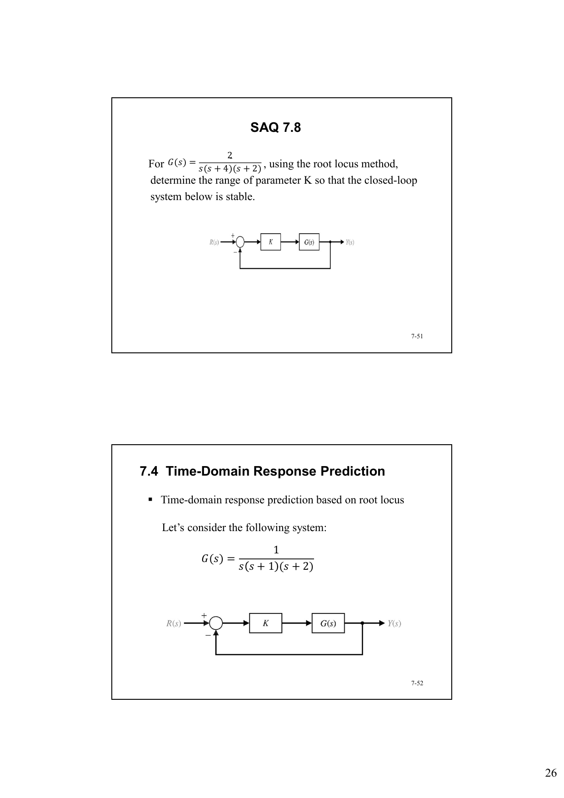

解答：

单位负反馈系统的闭环特征方程为：

$$
1+K G(s)=0
$$

即：

$$
1+\frac{2K}{(s+4)(s+2)}=0
$$

整理：

$$
(s+4)(s+2)+2K=0
$$

展开：

$$
s^2+6s+8+2K=0
$$

二阶连续系统稳定要求各项系数同号且非零。这里最高次项系数为 $1$，一次项系数为 $6$，常数项为 $8+2K$。因此：

$$
8+2K>0
$$

即：

$$
K>-4
$$

若按根轨迹常规定义只考虑 $K\ge0$，则所有 $K>0$ 都稳定。

从根轨迹也能看出：开环极点在 $-4$ 和 $-2$，无有限零点，实轴根轨迹段为 $[-4,-2]$。分离点：

$$
K=-\frac{(s+4)(s+2)}{2}
$$

令 $\frac{dK}{ds}=0$：

$$
s=-3
$$

对应：

$$
K=0.5
$$

分离后两支沿 $\operatorname{Re}(s)=-3$ 的方向离开实轴，不会进入右半平面。因此对 $K>0$ 稳定。

### SAQ 7.9

原题：For

$$
G(s)=\frac{1}{s+3}
$$

using the root locus method, what is the time response of this system when $K$ changes from $0$ to $\infty$?

选项：

A) Underdamped

B) Overdamped

C) Critically damped

D) Underdamped or critically damped

解答：

闭环特征方程：

$$
1+\frac{K}{s+3}=0
$$

整理：

$$
s+3+K=0
$$

所以：

$$
s=-(K+3)
$$

当 $K\ge0$ 时，闭环系统始终只有一个左半平面的实极点。响应是一阶单调响应，不会产生振荡。按选项分类，应归为 overdamped。

答案：B。

### SAQ 7.10

原题：Which is true in the following statements?

a) It is hard to achieve the desired transient response by choosing the gain $K$.

b) The PI controller does not change the steady state error.

c) The dynamic behavior of a closed-loop system can be shaped by introducing extra poles and zeros.

d) The PD controller improves the steady-state performance significantly.

解答：

a 错误。根轨迹法的一个重要用途就是通过选择合适的 $K$ 改变闭环极点位置，从而满足暂态响应要求。

b 错误。PI 控制器加入积分环节，主要目的就是改善或消除稳态误差。

c 正确。加入额外开环极点和零点会改变根轨迹形状，从而塑造闭环动态行为。

d 错误。PD 控制器主要改善暂态响应，对稳态误差改善通常不如 PI 显著。

答案：c。

### Exercise 7.1

原题：Consider

$$
G(s)=\frac{1}{(s+1)(s+3)}
$$

draw the root locus of the unity negative feedback system, and determine what range of $K$ will make the time response of the closed-loop system be underdamped.

解答：

闭环特征方程：

$$
1+\frac{K}{(s+1)(s+3)}=0
$$

即：

$$
(s+1)(s+3)+K=0
$$

展开：

$$
s^2+4s+3+K=0
$$

开环极点为 $-1$ 和 $-3$，无有限零点。根轨迹有两支，从 $-1$ 和 $-3$ 出发。实轴根轨迹段为：

$$
[-3,-1]
$$

渐近线交点：

$$
\sigma_a=\frac{(-1)+(-3)}{2}=-2
$$

渐近线角度：

$$
\theta_a=90^\circ,\ 270^\circ
$$

分离点：

$$
K=-(s+1)(s+3)
$$

$$
\frac{dK}{ds}=-(2s+4)=0
$$

所以：

$$
s=-2
$$

对应：

$$
K=-(-2+1)(-2+3)=1
$$

欠阻尼要求闭环极点为共轭复根。对二阶方程

$$
s^2+4s+3+K=0
$$

判别式小于 $0$：

$$
4^2-4(3+K)<0
$$

$$
16-12-4K<0
$$

$$
K>1
$$

因此，闭环响应为欠阻尼的范围是：

$$
K>1
$$

### Exercise 7.2

原题：A unity feedback system has a plant

$$
G(s)=\frac{K(s^2+3s+3.25)}
{s^2(s+1)(s+10)(s+20)}
$$

Sketch the root locus for $K>0$, and select a value for $K$ that will provide an acceptable step response.

解答：

开环极点：

$$
s=0,0,-1,-10,-20
$$

其中原点是二重极点。

开环零点由：

$$
s^2+3s+3.25=0
$$

得到：

$$
s=\frac{-3\pm\sqrt{9-13}}{2}
$$

所以：

$$
s=-1.5\pm j
$$

分支数：

$$
n=5
$$

有限零点数：

$$
m=2
$$

因此有 $n-m=3$ 条分支趋向无穷远。

实轴根轨迹段由奇数规则判断：

$$
(-\infty,-20],\quad [-10,-1]
$$

注意 $s=0$ 是二重极点，计数时算两个。

渐近线交点：

$$
\sigma_a=
\frac{[0+0+(-1)+(-10)+(-20)]-[(-1.5+j)+(-1.5-j)]}{5-2}
$$

$$
\sigma_a=
\frac{-31-(-3)}{3}
=-\frac{28}{3}
\approx-9.33
$$

渐近线角度：

$$
\theta_a=\frac{(2k+1)180^\circ}{3}
$$

所以：

$$
\theta_a=60^\circ,\ 180^\circ,\ -60^\circ
$$

根轨迹草图应体现：

- 两支从原点二重极点出发；
- 一支从 $-1$ 出发；
- 一支从 $-10$ 出发；
- 一支从 $-20$ 出发；
- 两支最终到达复零点 $-1.5\pm j$；
- 另外三支沿上述渐近线趋向无穷远；
- 实轴上只有 $(-\infty,-20]$ 和 $[-10,-1]$ 是根轨迹段。

选择 $K$ 时，需要让闭环主导极点在左半平面且阻尼不要太小。一个可接受的选择是：

$$
K=800
$$

用该值代入闭环特征方程：

$$
s^2(s+1)(s+10)(s+20)+K(s^2+3s+3.25)=0
$$

即：

$$
s^5+31s^4+230s^3+(200+K)s^2+3Ks+3.25K=0
$$

当 $K=800$ 时，闭环极点近似为：

$$
s\approx -1.717\pm j3.471
$$

$$
s\approx -2.495\pm j1.206
$$

$$
s\approx -22.575
$$

所有闭环极点都在左半平面，系统稳定；主导复极点的实部约为 $-1.7$，响应速度较快。对应阻尼比约为：

$$
\zeta\approx
\frac{1.717}{\sqrt{1.717^2+3.471^2}}
\approx0.44
$$

这个阻尼比会有一定超调，但通常比接近虚轴的低增益情形更可接受。因此 $K=800$ 可作为一个合理的可接受选择。若设计要求更小超调，需要进一步结合阶跃响应指标重新选取 $K$ 或增加补偿器。
